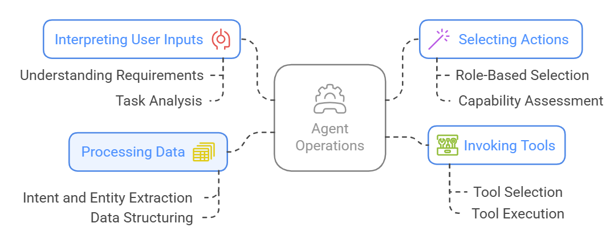

# Agents

**Agents in an Agentic App** are specialized entities designed to perform tasks or actions aligned with specific goals autonomously. They function as self-contained units of intelligence, equipped with the knowledge and resources necessary to address a wide range of scenarios effectively.

!!!abstract "Example"
    In an HR assistant application, agents can be configured as follows. 
    
    * Leave Management Agent: Manages everything related to viewing or applying for leave 
    * Policy Enquiry Agent: Handles all the employee queries related to company policies.
    * Employee Directory Agent: Provides employee information. 

An Agent perceives the environment, processes information, and takes actions to achieve specific goals. The main tasks of an agent are shown below. 

<!--
In general, Agents operations main by:

* Interpreting user inputs to understand the requirements and tasks. 
* Selecting the most appropriate action based on the predefined roles and capabilities of the defined actions.
* Extracting, structuring, and processing data needed to execute tasks.
* Invoking Tools via Tool-calling to complete the tasks.
-->

## Key Components of an Agent

Each agent is defined by its description, scope, actions, tools, and instructions, enabling the orchestrator to route user requests to the most appropriate agent. The AI agents use LLM capabilities to interact with the users and identify required entities to complete the actions. 

* **Description and Scope**: Describe the role and responsibilities of the agent. They allow the orchestrator to route user requests to appropriate agents in the app.  The scope is to set the context for what an agent needs to accomplish.

* **Actions**: Actions are the core tasks that an agent is capable of performing. These actions rely on tools that facilitate the agents to take actions like talking to external APIs, or database queries, etc.

* **Instructions**: Instructions guide the behavior and decision-making of an agent.

* **LLMs**: Agents use LLMs to understand the intent and interpret user queries, interact and engage with users, identify required entities to complete a task, design the workflow to execute a series of actions and support decision-making when required. 

## Key Features of an Agent  

* **Unique Core Functions**: Each agent is assigned a distinct set of core functions tailored to its specific purpose. These functions define the agent's capabilities and the scope of tasks it can handle, ensuring that it remains focused and efficient in addressing its designated objectives.
* **Defined Objectives and Responsibilities**: Agents operate within the boundaries of clearly outlined objectives and responsibilities. These objectives serve as guiding principles, ensuring the agent prioritizes tasks that align with the system's overarching goals or the user’s requests.
* **Equipped with Tools and Knowledge**: To enable action-taking, agents are provisioned with specialized tools, resources, and domain-specific knowledge. Depending on the tasks they are expected to perform, this could include access to APIs, external databases, computational resources, or pre-trained models.
* **Autonomy and Adaptability**: Agents are designed to act autonomously, interpreting input, analyzing situations, and deciding the best course of action. Their adaptability allows them to respond dynamically to changing conditions or unexpected challenges in pursuit of their goals.

