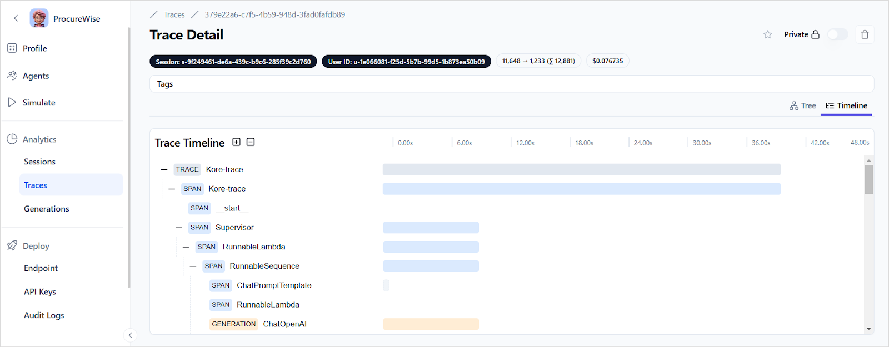
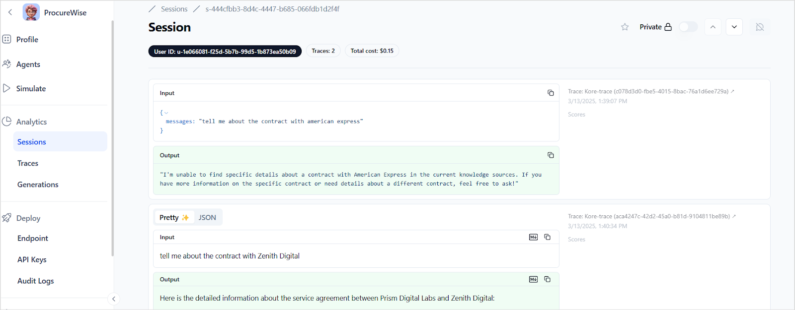
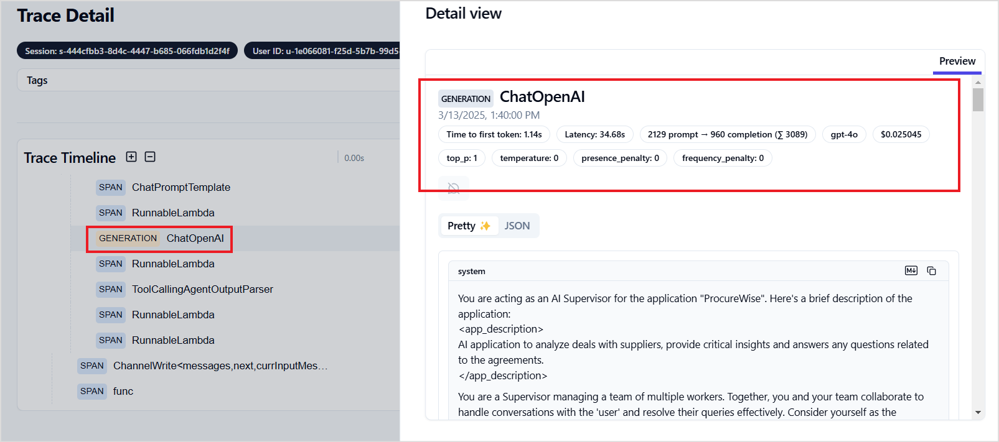

# Application Analytics

Agent Platform provides detailed traces and logs to analyze the execution of an Agentic application.

## Traces

A trace represents the lifecycle of a single request to the Agentic app. It captures all relevant events, actions, and outputs involved in handling a task, making it easier to monitor and debug workflows. Each trace can contain multiple observations to log the individual steps of the process. Each observation can be of one of the following types. 

* Event: Captures a specific occurrence (e.g., an API call or user action).
* Span: Represents a timed operation (e.g., execution time of a function).
* Generation: Stores AI-generated content or responses (e.g., LLM outputs).

Click on a trace to view the details.

The timeline view provides a chronological view of all the steps within a trace.

**How is tracing useful?**

* Transparency and Insights: Tracing provides visibility into the flow of requests and processes within the application, enabling a deeper understanding of application behavior and data handling.
* Debugging: By tracing the execution path, developers can identify the root causes of bugs or performance issues, making it easier to troubleshoot and resolve problems efficiently.
* Monitoring: Tracing enables the tracking of system usage and performance.
* Performance Optimization: With detailed tracing data, one can pinpoint bottlenecks and optimize specific components of their applications to enhance overall performance and user experience.

## Sessions

**A session** refers to a continuous interaction with the user, consisting of a series of connected traces throughout a conversation or a thread. 

Each session consists of one or more traces. The detailed view of a session shows the number of traces involved, the input and output of each trace from the session, and the total cost incurred during this session. 

## Generations 

Generation refers to a specific response or output generated by the LLM Model during the session. It is a granular entity within a trace. It helps in assessing the quality of response by the model. It also helps understand the latency, token usage, and cost implications.

**Example**: For example, when an agent presents the details of a policy, the output is recorded as a Generation within a trace.

