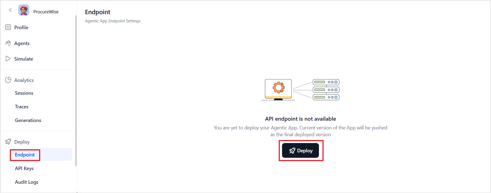
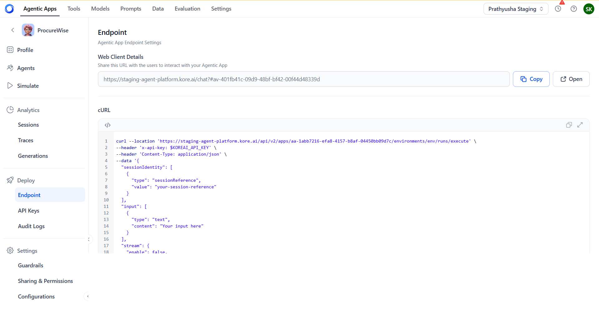

# App Deployment

When deploying an Agentic app, a unique endpoint is generated to facilitate interactions with the app from third-party applications. This documentation outlines the deployment process and guides how to interact with the app using the web client and APIs.

**Endpoint**: An API route that allows external applications to communicate with the Agentic app. This endpoint serves as the interface for making requests and receiving responses from this app. All the interactions with the app through this endpoint are synchronous.

Go to the EndPoint page and click the Deploy button. 

Deployment of the App generates a web client as well as a curl script.

**Web Client Details**: se the URL generated by the agent platform to start interacting with the app.

**API Interaction** : Use the curt script to interact with the app through the code. Construct your API requests in accordance with the given specifications. Refer to this to learn more about the APIs. 

## API Keys

API Keys are required to authenticate the requests sent to the Agentic App via APIs. Follow the steps to create a new API Key. 

* Go to the API Keys page and create a new API key. 
* Provide a name for the key and click Generate Key. This will create a unique key. Keep it confidential. For security reasons, you will not be able to view this key again once you navigate away from the page.

## Audit Logs

Audit logs provide a comprehensive record of all changes made across the account by different users. These logs are essential for tracking user activity, ensuring compliance, and pinpointing any unauthorized modifications, which enhances the overall security and accountability within the system.

