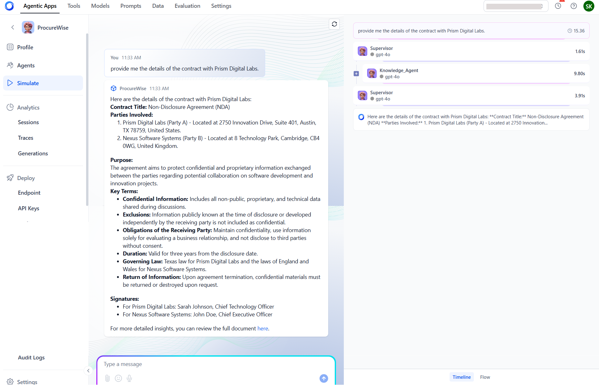

# App Simulation and Testing

Simulating and verifying the behavior of an Agentic application before it is deployed in the real world helps detect the accuracy of the response under different scenarios. This helps minimize errors, enhance user experience, and improve the effectiveness of the agent in the actual environment. 

The Simulate section provides an interactive interface for users to submit queries and observe the corresponding responses generated by the agent.

**Query Input**: Easily enter your query in the designated input field to initiate the simulation.

**Response Display**: The response from the agent is shown, allowing for immediate feedback on the input provided.

**Processing Timeline**: The right pane presents a chronological timeline detailing the processing of the user query. This includes: 

* A listing of the different agents triggered at various steps in the process.
* A record of inputs provided to, and outputs generated by, each agent.
* Reasoning Logic which is an explanation of the reasoning applied to invoke specific actions by the agents.

**Flow Diagram:** The overall process flow is visually represented in a concise diagram, making it easier to understand the sequence of operations.

This detailed layout enables users to grasp the mechanics of the system efficiently, enhancing their understanding of how queries are processed and responses generated.
