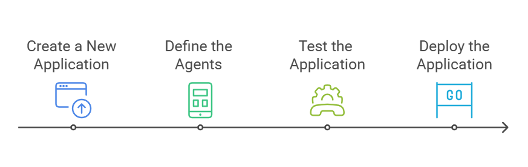
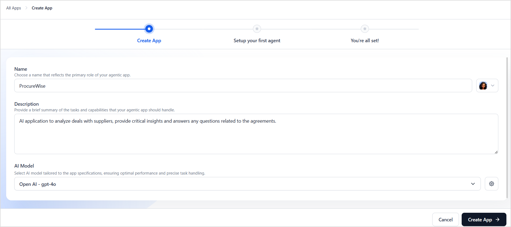

# Create an Agentic App

Prerequisites:

* Add an AI Model that supports tool-calling capabilities. The Agent Platform currently supports OpenAI, Gemini, Anthropic, and Azure OpenAI models. For more information, see [Add an External Model](./../models/external-models/add-an-external-model-using-easy-integration.md).

## Steps to Create an Agentic App

Creating an Agentic App consists of the following steps: 

### Step 1: Create an Agentic App

1. Click on the **+New App** on the **Agentic Apps** page. The Get Started wizard is displayed.  

2. Enter or select the following details:

    * **Name**: Provide a name for the app that reflects its core function.
    * **Icon**: Select an icon for the app.
    * **Description**: Write a description explaining its main features and goals. This will help to set the scope and context of the application and ensure the application does not respond to queries based on pre-trained knowledge.
    * **AI Model**: Choose an appropriate model for the application.

3. Click **Create App**.  
Once the app is created, a prompt is displayed with the following options: Skip Agent Setup or Continue. If you are ready to set up the agents, click **Continue** and follow the next step.   

---

### Step 2: Define or Set Up Agents

Configure agents with appropriate roles and responsibilities within the application.  
See [How to set up an agent](agent-overview.md).

---

### Step 3: Simulate or Test the Behavior of the App and the Agents

Simulate different scenarios to evaluate agent interactions and responses.  
See [Simulate and Test the App](app-testing.md).

---

### Step 4: Deploy the App

Finalize configurations and deploy the app for end users. See [App Deployment](app-deployment.md).

---