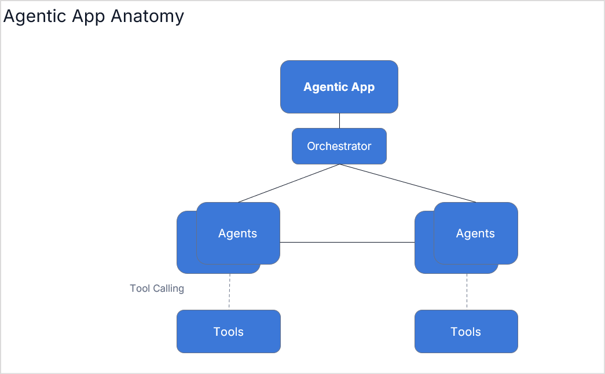
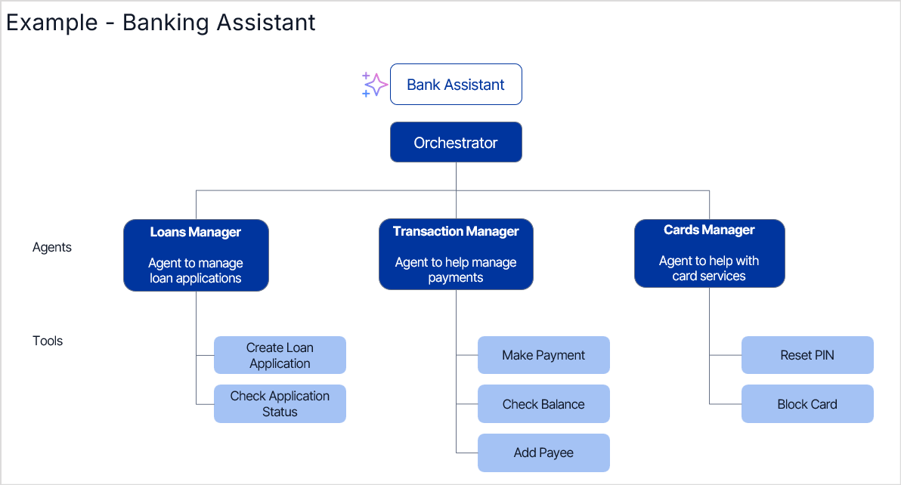

# About Agentic Apps

Agentic Apps are autonomous systems that orchestrate multiple specialized AI agents working together to accomplish complex business objectives through collaboration and decision-making.

An agentic application intelligently identifies and invokes the appropriate agents based on user queries to deliver tailored responses.

When a user submits a query, an orchestrator analyzes the input to:

* Identify the most suitable agents for the task.
* Create a plan on how to execute the task.
* Extract relevant entities from the input.
* Pass these entities to the selected agents for execution.

The agents then execute their specialized tasks and return responses, which are presented to the user. For complex queries, multiple agents may work together in sequence, with the output from one agent serving as input for another to complete the full processing chain.

## Key Components of an Agentic App

Agentic applications involve the following key components that enable autonomous decision-making and complex task execution. 

### Orchestrators

The orchestrator manages the flow of operations and coordinates interactions between different agents and users. It ensures appropriate tasks are delegated to the right agents and that they work together effectively to achieve the broader goal. The orchestrator acts as a supervisor, resolving conflicts and handling complex workflows. It interprets user input, delegates tasks to appropriate agents, and verifies responses before presenting them to the user.

For example, in a banking app, to transfer funds from savings to pay off a loan, the orchestrator fetches the information from the loan agent for the amount to be paid, checks the savings account balance using transaction manager, and pays off the loan after confirming with the user. The orchestrator ensures both actions are completed successfully and in the correct order before confirming to the user.

### Agents

In the context of the Agentic AI platform, agents are entities with the knowledge and resources to perform tasks related to a given goal. Each agent has a unique scope, which includes its core functions, objectives, and responsibilities. Actions are the building blocks of the workflows carried out by each agent. By utilizing various tools, agents can enhance their capabilities and tackle more complex tasks.

Continuing with the banking setup example, specialized agents can handle different user queries - an agent dedicated to savings accounts can process fund transfers, add new payees, display balances, and more. Each agent is tailored to its area, ensuring efficient and accurate handling of queries and actions.

### Tools 

Tools are modules or special capabilities that allow the agents to access and interact with the external environments to complete their tasks. For instance, to send a confirmation email to both the payer and payee after a funds transfer, the agent must interact with the SMTP server to send email notifications.

### State and Conversation History

State and history play a crucial role in decision-making and help make interactions user-friendly. State refers to the current environment, including information like user session details and recent operations. Agentic applications leverage conversation history to enhance interactions, improve decision-making, and dynamically optimize task execution. Unlike traditional chatbots, Agentic AI retains context, enabling it to adapt and provide better responses.

For example, in the fund transfer example, the amount is stored in short-term memory until the transfer step. The user's preferred transaction method is considered long-term memory.

## Example of an Agentic App

A **Banking Assistant** can be built as an **Agentic App**, where multiple specialized agents handle different banking tasks.

* The Orchestrator acts as the central system managing communication between users and agents.
* Specialized agents include a Loans Manager to process loan applications, a Transaction Manager to handle payments, and a Cards Manager for services like PIN reset or card blocking.
* Each agent has tools with built-in business logic to complete specific tasks.

This approach ensures an organized, automated, and scalable banking solution.
