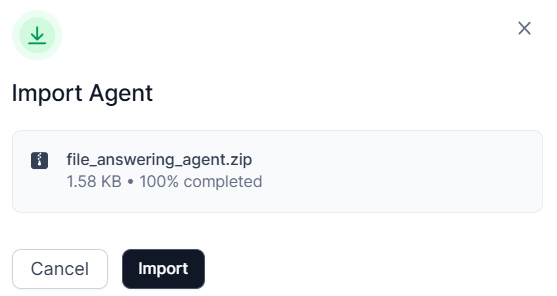

# Bot Agents

Administrators can create bot agents for users using the bot agent builder, significantly improving overall efficiency. Workflows designed on the XO Platform can be seamlessly integrated, allowing actions to be executed directly when a workflow is triggered and eliminating the need for other platforms.

For complex workflows involving multiple system integrations and logic, users can build bots using the XO Platform. These bots can be triggered through conversations using the UI or NLP intent, streamlining the entire process.

For example, consider a Fund Transfer Bot Agent. By creating this bot on the XO Platform, you can automate fund transfers to clients' designated accounts, capturing key details such as client names, account information, and transfer amounts. Once integrated with your organization’s systems, the bot allows seamless conversational interactions, simplifying fund transfer operations.

You can create a new agent or import an existing one.

-   [Import existing bot agent](#import-existing-bot-agent)

-   [Create a new bot agent](#create-a-new-bot-agent)

## Import existing Bot Agent

To import an existing Bot Agent:

1.  Click the **Import** **Agent** button located in the upper-right
    corner.

2.  Select the .ZIP file of the existing
    agent.

3.  Click **Import** to complete the process. The imported agent will appear on
    the Bot Agents page.

### Create a New Bot Agent

You can create a new Bot agent to assist users in completing various tasks by
utilizing the Bot created using the XO Platform. [Learn
more.](https://docs.kore.ai/xo/getting-started/building-a-virtual-assistant/)

To create a new Bot Agent, follow these steps:

1.  In the **Admin Console**, click **AI Agents** from the left pane, and then
    select **Bot Agents**. A list of available bot agents will be displayed.

    

2.  On the Bot Agents page, click **+Create
    Agent.**

3.  You must link your Bot built on the XO Platform with **AI for Work** and
    create a webhook channel. [Learn
    more](https://docs.kore.ai/xo/channels/add-webhook-channel/?h=webhook).
    
    To create a webhook channel on the Bot and
    complete the integration process, follow these steps:

    1.  Log in to the **XO Platform**. Open the virtual assistant or bot you
        want to add the channels to. Navigate to **Deploy \> Channels**\> **Add
        More\>Webhook**. The Webhook dialog will
        appear.

    2.  Select your required app from the **Webhook** dialog.
        

    3.  Copy the **Bot client ID** and **Bot secret ID** to use in the **AI for
        Work** platform to complete the
        integration.

    4.  Under the **Configured Channels** section, click the <**Name of the Bot**> you have created and want to integrate with **AI for Work**. The channel you have created is now enabled. For more information, see
        [Channel
        Enablement](https://developer.kore.ai/docs/bots/channel-enablement/adding-channels-to-your-bot/).

        **Note**: You can create a new client app for your app by providing the
        JWT tokens generated using the **Post URL** and **Access tokens**
        available in the **Add bot agents** dialog in the **Add Bot** section.

4. The **Prompt Agent creation** wizard will take you through the following
    steps:

    1.  [Step 1: Define and Purpose](#details)

    2.  [Step 2: Add Bot](#bot)

    3.  [Step 3: Preview](#preview)

    4.  [Step 4: Publish Bot Agent](#publish)

#### Step 1: Details and Purpose

Provide a suitable and unique name for the agent and describe its purpose. Defining the agent’s purpose enables it to accurately recognize the agent’s capabilities and effectively utilize them to respond to user queries aligned with the specified intent. It is essential to clearly outline the specific use cases for which the agent is designed.

#### Step 2: Add Bot 

The Add Bot feature enables seamless integration of a virtual assistant created
on the platform with your system. To establish this connection, ensure
that the webhook channel is enabled on the Virtual Assistant. Once
activated, follow the integration steps to complete the process:

1. In the **Add Bot** enter the following:
     
     a. **Post URL**: This field is automatically populated with the necessary endpoint.

     b. **Access Token**: This field is automatically populated with the necessary endpoint.

     c. **Webhook URL**: Enter the URL obtained from the Bot Webhook dialog. For detailed information about webhooks, [Learn more](https://docs.kore.ai/xo/channels/add-webhook-channel/?h=webhook).

     d. **Bot client ID** : Enter the client identifier retrieved from the Bot Webhook dialog.

     e. **Bot secret ID**: Enter the secret identifier retrieved from the Bot Webhook dialog.

2. Click **Connect account** to move to the next step.

#### Step 3: Preview

In the **Preview** section, a sample of queries is displayed. If necessary, you
can click the **+ Add Query** button to add any other queries. Click
**Continue** to move to the next step.

#### Step 4: Publish your agent and define access permissions and enablement.

**Specify publishing details**:

* **Publish To**: Define access permissions:
    * **Everyone in the Account**: Make the agent available to all users.
    * **Limited Users**: Grant access to specific workspace users or groups added in publish settings of workspace.
* **Enablement Type**: Configure how users interact with the agent:
    * **Always Enabled**: The agent remains active and cannot be disabled.
    * **Users Choice**: Users can enable or disable the agent as needed.

Note: The publishing options are defined in the Workspace settings. For additional information, [Workspace](../Administration/workspace.md).

The user can see this agent in the **Agents list** on the **Agents** page.

**Note**: On the Agents list page, you can click the three dots icon
corresponding to the agent's name and publish the agent later if necessary.

## User Interaction

Interacting with the Bot Agent is designed to simplify communication and task
execution. Users can initiate a conversation by typing a command. The bot
responds promptly, guiding users through the required steps. For example, if
performing a task like a fund transfer, users simply need to engage with the bot
by providing key details such as the client’s name, account information, and the
transfer amount. Once the task is completed, the bot provides a confirmation or
status update.

!!! note

    * See [Alert](./alert-task.md) that allows developers to integrate conversation hold and resume functionality within XO Bots.
    * See [Notify](./notify-bot-agent-api.md) that allows developers to send interactive notifications to the users.
