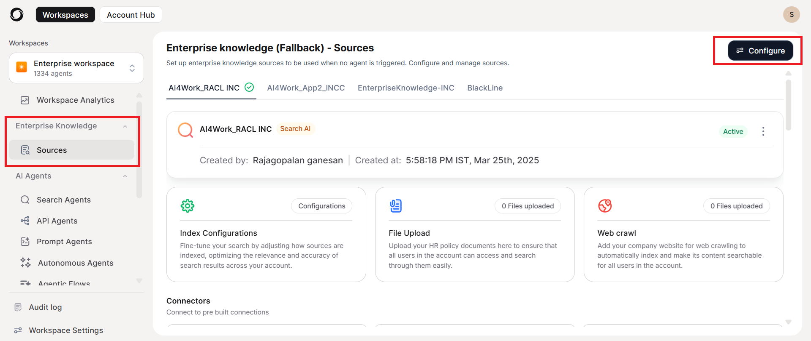

# Enterprise Knowledge

The **Enterprise Knowledge** refers to **Search AI** app and **Agentic App** that is provisioned for every AI for Work account. It serves as a fallback mechanism, ensuring a response can still be generated when no specific agents align with the user’s intent. Its role is to enhance the accuracy and relevance of responses by retrieving content from
various sources and then generating a response based on that information. It is automatically available to users when no custom or specific agents are assigned to handle a user query.

## Key Features

-   **Fallback Mechanism**: It activates when no specific agent matches the
    user’s query, ensuring the system can still provide useful responses.

-   **Multiple Data Sources**: It retrieves information from various sources,
    including webpages, local files, third-party knowledge systems, and
    structured data.

-   Generates response from retrieved information.

## How Does Enterprise Knowledge Work?

The **Enterprise Knowledge** is meant for generic use rather than a specific intent.

-   When a user asks a question, the system first checks if any specific agent (a
    customized or specialized retrieval model) is relevant to handle that query.

-   If no specific agent is found for the query, the Enterprise Knowledge is activated.

-   The Enterprise Knowledge searches through its configured content sources and
    retrieves the most relevant information related to the query.

-   Once the relevant content is retrieved, a coherent and contextual response
    is generated. This response is presented to the user as the search result.

## Enterprise Knowledge Configuration

Set up enterprise knowledge sources to be used when no agent is triggered. Configure and manage sources between either **Search AI** app or **Agentic App**.

- Configure Search AI
- Configure Agentic App

### Connect Search AI

The Search AI configuration establishes a connection to a dedicated search application that indexes your content and retrieves relevant information based on user queries. This approach excels at finding specific information across large document repositories and structured data sources.

To connect Search AI complete the following instructions:

1. Navigate to **Enterprise Knowledge** on the left pane.
2. Click **Configure** and then **Create New**.
3. Select **Search AI**.
4. The next step is to configure the Search AI app, which has the indexed content used for answer generation. Provide the following details for the connection. These details are available in the **Search AI app** on the **Credentials** page under the **Manage** tab, click **Dev Tools** and choose **Web/Mobile SDK** tab. Refer to [this](https://docs.kore.ai/xo/app-settings/dev-tools/kore-ai-web-sdk/) for more details.
    - **Source name**: Create a unique and descriptive name for this knowledge source to easily identify it in your Enterprise Knowledge configuration.
    - **Description**:  Provide a brief explanation of what this source contains and its purpose within your knowledge ecosystem.
    - **URL**: Enter the endpoint URL for the Search AI service where API requests will be sent. This is typically provided in your Search AI documentation.
    - **App ID**: Application ID of the Search AI app.
    - **Client ID**: Client credentials generated in Search AI for interaction with the RAG Agent.
    - **Client Secret ID**: A secret key generated for secure interaction.
    - **Search ID**: Unique identifier of the client generated in Search AI.
    

You need to associate four [API Scope](https://docs.kore.ai/xo/apis/automation/api-introduction/) in your XO platforms App's channel:

- Answer Generation
- Permission Entity Management
- Document Management
- Facets

!!! note

    These details are available in the **Search AI app** on the **Credentials** page under the **Manage** tab. Refer to [this](https://docs.kore.ai/xo/searchai/about-search-ai/){:target="_blank"} for more details.

#### Access associated Apps

Under the **AI search** agents, go to **Enterprise Knowledge**. Then, use the **Go to
Search AI** option to access **the associated Search AI** app.

-   [Configure the content sources](https://docs.kore.ai/searchassist/manage-content-sources/content-overview/){:target="_blank"} on the Search AI application.

-   Fine-tune configurations to get appropriate responses.

-   [Enable Answers](https://docs.kore.ai/searchassist/concepts/personalizing-results/about-answers/){:target="_blank"}.

-   Train the application.

On the following page in the Admin Console, you can view an overview
of the content sources connected to the Enterprise Knowledge, such as uploaded files,
indexed webpages, third-party content sources, etc. Each source's associated
content or connection status is also indicated. For the third-party connectors,
it also indicates the last sync time.

### Connect Agentic App

The Agentic App configuration connects your system to more specialized, action-oriented services that can perform complex operations in response to user needs. These connections allow your AI system to not just retrieve information but also potentially take appropriate actions on behalf of users.

To connect Agentic App complete the following instructions:

1. Navigate to **Enterprise Knowledge** on the left pane.
2. Click **Configure** and then **Create New**.
3. Select **Agentic App**.
4. The next step is to configure the Agentic app, which has the indexed content used for answer generation. Provide the following details for the connection by defining API fields as per the details below:

     * **URL**: Enter the endpoint URL of the app obtained from the Agentic Platform.
  
     * **Method**: Enter the type of request you want to make.
  
     * **Headers**: Specify the information that helps to customize your API request. These are like special instructions that come with your request, such as authentication tokens or specifying the type of data you're sending. You can add multiple headers as needed.
  
     * **Query String**: Specify additional information attached to the end of your URL to filter or customize your request.
  
     * **Body Type**: Enter the format of the data you are sending with your request. Common types include JSON, or Raw. This tells the API how to interpret the information you're sending.
  
     * **Content Type**: Enter a specific label that tells the API what kind of data you are sending.
  
     * **Request content**: Enter the actual data payload you want to send with your request. This contains the specific information or parameters the API needs to process your request.
     

     Curl Import: For existing APIs, use the CURL Import functionality to automatically populate API configuration:

     1. Click **Curl Import** to open the import interface.
     2. Paste your CURL command into the text box.
     3. Click **Import** to extract API details.
     

5. Click **Save** and now you can find the agentic app listed. 