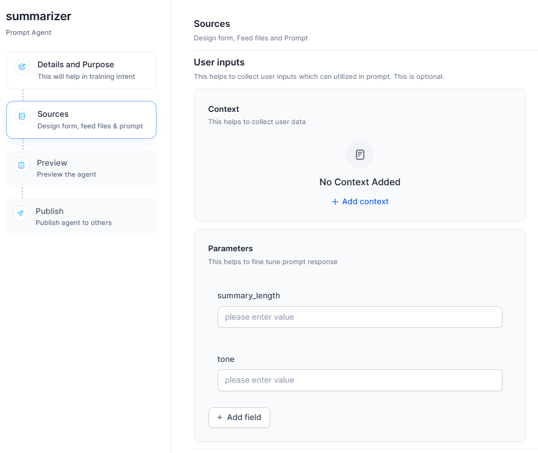

# Prompt Agents

As an administrator, you can create Prompt Agents in the prompt agent builder that users can utilize. These agents collect specific user inputs as variables to customize prompts, enabling various use cases such as content generation, language translation, and text summarization.

Prompt agents operate using two distinct components:

-   **User-Collected Inputs**: In this scenario, the user's inputs are
    incorporated into the prompt as variables to generate the required response.
    For instance, a job description (JD) can be created using user inputs
    regarding experience, responsibilities, and required skills.

-   **Administrator-Uploaded Knowledge**: In this scenario, an administrator can
    upload a file to be used as a template. For example, a JD can be generated
    based on user-provided inputs and a pre-uploaded template that the agent
    will utilize to ensure consistency and adherence to specific formatting
    guidelines.

You can create a new agent or import an existing one.

-   [Import existing prompt agent](#import-existing-prompt-agent)

-   [Create a new prompt agent](#create-a-new-prompt-agent)

## Import existing Prompt Agent

To import an existing Prompt Agent:

1.  Click the **Import Agent** button located in the upper-right
    corner.

2.  Select the .ZIP file of the existing
    agent.

3.  Click **Import** to complete the process. The imported agent will appear on the
    Agents page.    

## Create a new Prompt Agent

You can create a new prompt agent to assist users in completing various tasks by
utilizing the prompt capabilities.

To create a new Prompt Agent, follow these steps:

1.  In the **Admin Console**, click **AI Agents** from the left pane, and then
    select **Prompt Agents**. A list of available prompt agents will be
    displayed.

2.  On the Prompt Agents page, click **+Create Agent**

3.  The **Prompt Agent creation** wizard will take you through the following
    steps:

    1.  [Step 1: Details and Purpose](#details)

    2.  [Step 2: Source Configuration](#source)

    3.  [Step 3: Preview the Agent configuration](#preview)

    4.  [Step 4: Publish the Agent](#publish)

###  <a id="details">Step 1: Details and Purpose</a>

Provide a suitable and unique name for the agent and describe its purpose. Defining the agent’s purpose enables the system to accurately recognize the agent’s capabilities and effectively utilize them to respond to user queries aligned with the specified intent. It is essential to clearly outline the specific use cases for which the agent is designed, as all the fields, queries, and prompts are auto-generated based on the purpose provided. 

To change the agent icon, click on the agent logo located above the agent's name. You can choose from a list of predefined logos or upload a custom logo.  Once you're ready, click **Continue** to proceed to the next step.

### <a id="source">Step 2: Source</a>

In the Sources section, you can configure the following fields 

-  [User Input](#userinput)
-  [Knowledge](#knowledge)
-  [Prompts](#prompts)
-  [Multiprompt](#multiprompt)
-  [Multiresponse](#multiresponse)

 The parameters fields are provided based on the purpose of the agent you provided in
the previous step. For example, if the purpose is "summarization", fields might
include Word Count, Summary Format
etc.

#### <a id="userinput">User Input </a>

To configure user input, follow the steps outlined below:

1.  Click on the **+Add context**.
    

2.  Enter context name and any placeholder text in the **placeholder text**
    field if required. The placeholder text will appear in the form field before the end user provides input.
    

3.  Select the **Field type** from the list for each field. You can select a
    single-line, multiline, single-select, multi-select, number, file upload, or
    URL based on the fields.

4.  Click the mandatory toggle button ON if you want the field to be mandatory
    and click **Done**.

5.  In the parameter section,  parameter fields are prepopulated based on the agent’s purpose. Enter parameter details and click on  **+ Add field** if
    required.

6.  Enter a name and any text in the **placeholder text** field and in **Description**, enter a detailed description of the field to ensure automated field population when the LLM processes natural language queries and matches entities to their corresponding fields.

    For example, if you need a field that captures organizational departments, rather just naming it as *Division*, include a description explaining that this field accepts internal department names, helping the LLM identify the department name from the user's query and pre-populate it in the *Division* field.  
    

7.  Select the **Field type** from the list for each field. You can select a
    single-line, multiline, single-select, multi-select, number, file upload, or
    URL based on the fields.

8.  Toggle the **Allow Upload Files** or **Allow URL Content** option to ON to
    enable file uploads or retrieval from URLs. This option is available only
    for Single-line and Multiline text field types.
    

9.  Click the mandatory toggle button ON if you want the field to be mandatory
    and click **Done**.

#### <a id="knowledge">Knowledge</a>

1. Click the **+ Upload** button to upload a file containing knowledge that the
    Prompt agent can use to generate responses. This uploaded information may also
    be utilized in prompts. For example, if you uploaded a “Sample JD template”
    file, you can write a prompt that says, “Create a JD which is in the same
    format as in the Sample JD template file.”
    

    !!! note

        If the file size exceeds the context size limitation, it impacts the models, and an error message is displayed along with a list of models. Only a limited amount of information is used as context for generation. However, when the file limit is exceeded, all uploaded knowledge files are referenced for answering but not for generation.

2.  Select the model required from the **Model selection** drop-down list, which
    displays all the integrated
    models. To know more about model integration, click
    [here](../llm-configuration/general-purpose.md#custom-llm-integration).
    

3. Toggle the **Show to users** button to display this prompt to the user. After switching the toggle to ON, you can choose between **Read-only** or **Editable** modes.
    

#### <a id="prompts">Prompts</a>

A default prompt is automatically generated based on the purpose defined earlier
and can be customized using variables. For example, if the purpose is "Job
Finder," the default prompt might include, “Company Name, Job Title,
Responsibilities etc”

Enable the Show to users toggle button to show this prompt to the user. Once you click the toggle button to ON, you can select whether you want it in **Read-only** or **Editable**.

#### <a id="multiprompt">Multiprompt</a>

For a multi-prompt setup within the agent builder, users can generate multiple prompts and select one from the prompt selector option field based on the specific context. 

To add another prompt, click on the **+ Add another prompt** button. You can rename prompts and use drag-and-drop to reorder them. Click on the **Generate prompt** button to
generate a prompt based on your form’s purpose and field values.

Once you add multiple prompts, the prompt option will appear under the prompt selector.

1.  Click on the edit option or anywhere within the prompt area to expand it and view the available options
    

2.  For the prompt selector, you can edit field name and any placeholder text in
    the **placeholder text** field if
    required

    Note: The Mandatory toggle field is enabled by default and cannot be modified by the user

3.  The prompt options display a list of all the prompts created, allowing you
    to drag and drop them to change their order.

4.  Click **Done**

#### <a id="multiresponse">Multi Response</a>

To allow users to generate multiple responses,

1. Enable the **Allow users to generate multiple responses** toggle button in
    the output settings.  

2. Enable **Skip Form Display** to automatically bypass forms. This feature intelligently prevents conflicts with Multi-Response and shows messages for incompatible settings. Smart query analysis now identifies when all required entities are present initially, and forms will only appear if mandatory fields are missing.
 

3. Click **Continue** to move to the next step.

### <a id="preview">Step 3: Preview</a>

In the **Preview** section, a list of sample queries are displayed. If needed,
you can add additional queries by clicking the **+ Add Query** button. Once
you're ready, click **Continue** to proceed to the next
step.

### <a id="publish">Step 4: Publish Prompt Agent</a>

Publish your agent and define access permissions and enablement.

**Specify publishing details**:

* **Publish To**: Define access permissions:
    * **Everyone in the Account**: Make the agent available to all users.
    * **Limited Users**: Grant access to specific workspace users or groups added in publish settings of workspace.
* **Enablement Type**: Configure how users interact with the agent:
    * **Always Enabled**: The agent remains active and cannot be disabled.
    * **Users Choice**: Users can enable or disable the agent as needed.

Note: The publishing options are defined in the Workspace settings. For additional information, [Workspace](../Administration/workspace.md).

## User Interaction

Users initiate their interaction by submitting simple queries, such as
requesting topic summaries. The agent processes these inputs and provides
concise, contextually relevant responses.

Users can also leverage the file upload and URL features, which support multiple
formats such as .pdf, .docx, .csv, and .xls. Once a file is uploaded, the system
processes its contents and generates the desired output, such as summaries,
reports, or insights, based on the data within the
file.

When multi-response is enabled, users can use this feature by selecting the
**Additional Response** option. Each prompt is pre-configured, but can be
customized to meet specific requirements using a dropdown menu. Users have the
flexibility to define the input source for each response, either by using the
**initial input** or by selecting the output from a previous response as input
for subsequent responses. This configuration allows for a continuous flow of
information, making it ideal for scenarios requiring multiple perspectives or
formats.

  

