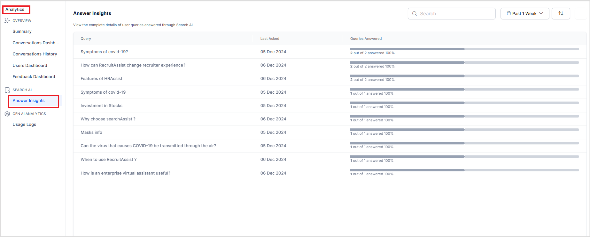
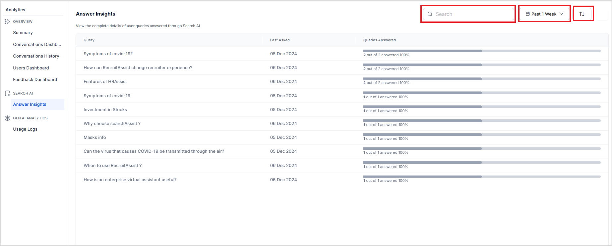
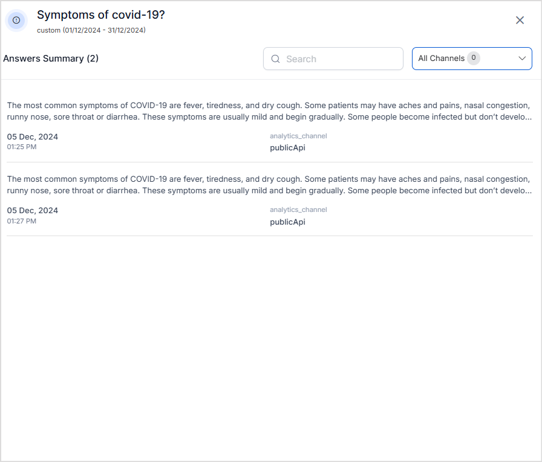
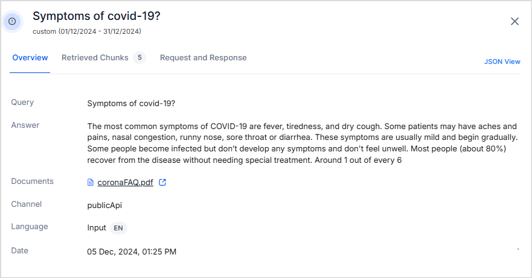
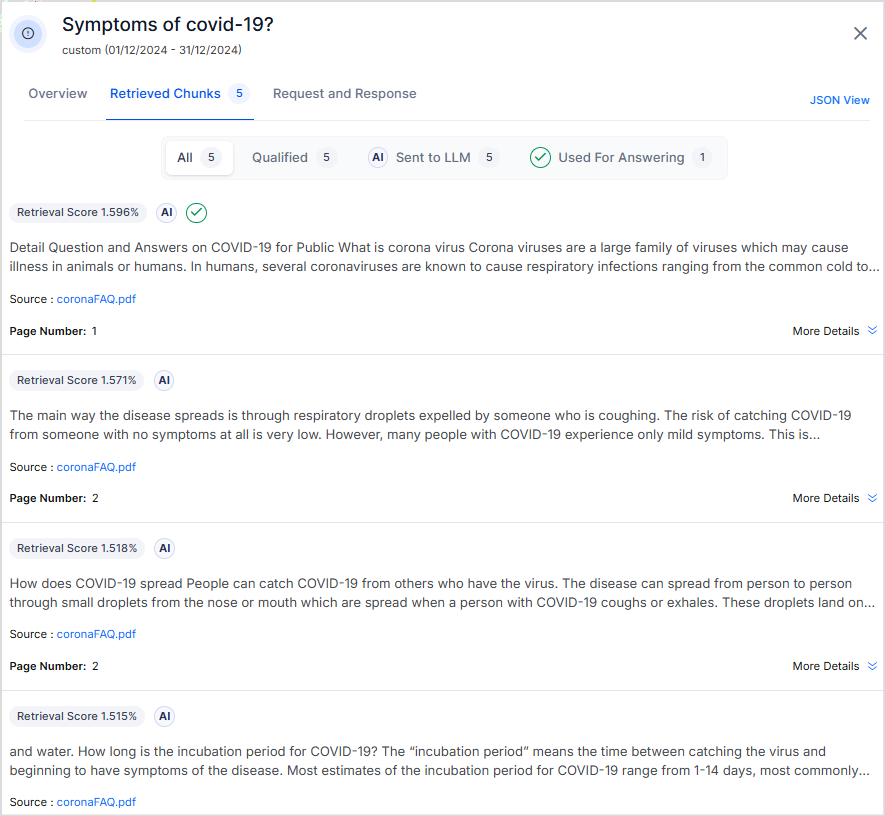
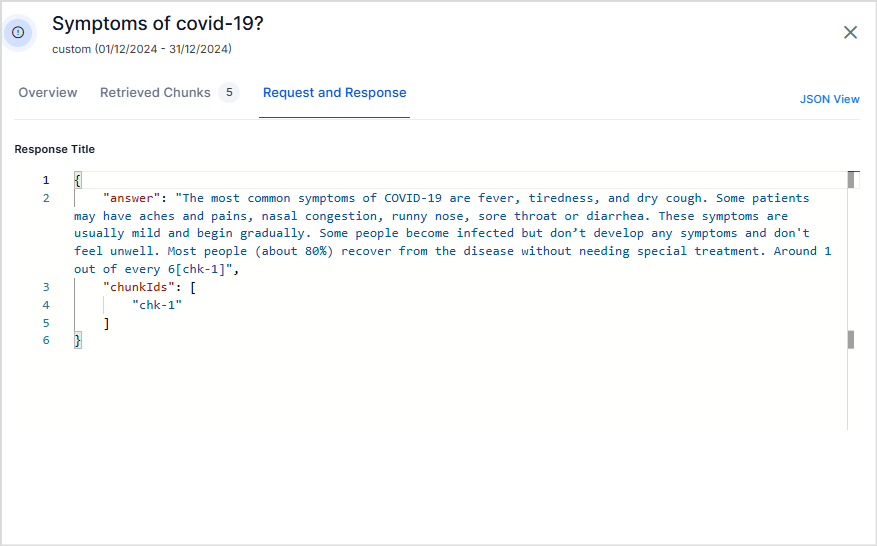

# Answer Insights

**Answer Insights** provides detailed analytics for each query-answer interaction within the Search AI application. This section offers an intuitive interface to view and analyze answer-related data, enabling a deeper understanding of user behavior and common query patterns. The insights can be leveraged to debug issues, identify areas for improvement, and fine-tune the application to deliver more accurate and relevant responses.

Go to the **Analytics** page under Automation AI and select **Answer Insights** under Search AI. 

This report captures the following key metrics:

* **Queries**: Displays the specific questions or search terms submitted by users.
* **Answer Count**: Indicates the number of times a query received a response.
* **Timestamp**: Records the date and time when the query was made.

It helps administrators and content managers evaluate the effectiveness of the application in addressing user needs by identifying popular queries and the response rate.

You can also the analysis using the following features:

* **Search**: Quickly locate specific queries by entering keywords.
* **Sort**: Arrange queries based on query count or answer count like most asked, least asked, most answered and least answered. 
* **Filter**: Narrow down results based on query time, enabling focused insights for specific timeframes. You can select preset time intervals like this week, this month, etc or you can provide custom dates for filtering. Note that the custom date range cannot exceed 30 days. 

## Detailed information on each Query

For every query, you can access detailed insights, including the generated answer and retrieved chunks. This helps assess the application's response accuracy and behavior.

Click on a query record to see a list of answers generated each time the query was posted.

Click on any answer record to view additional details. The information is displayed in three tabs:

**Overview**: Displays the query, the generated answer, and metadata such as when and how the query was posted.

**Retrieved Chunks**: Lists the relevant retrieved chunks, the top chunks sent to the LLM for answer generation, and the specific chunks used in the final response. This helps evaluate retrieval accuracy.

**Request and Response**: Shows the response in JSON format. 

To view all the above details in JSON format, click the **JSON View** link in the top-right corner.
