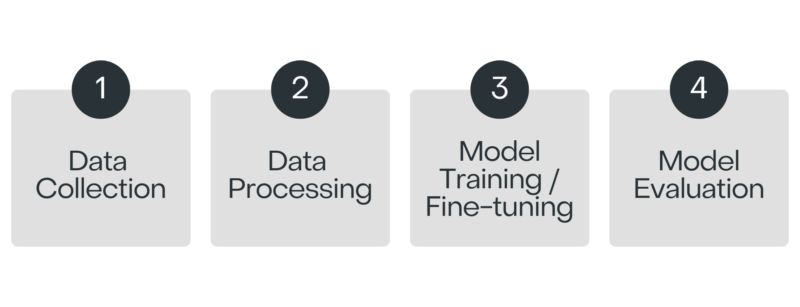

# Kore.ai XO GPT Model Specification

 

## XO GPT Model - Live Versions

The following XO GPT Live Models are available for various supported features.

| XO GPT Model                  | Supported Feature            | Model Version | Base Model            | Languages Supported                      | Deployed Region | Deployment Date |
|-------------------------------|------------------------------|---------------|-----------------------|------------------------------------------|-----------------|-----------------|
| Answer Generation Model       | Answer Generation            | [Version 2.0](../generative-ai-tools/xogpt-answer-generation-model.md#version-20)   | Llama 3.1 8B Instruct | English                                  | US      DE      EU         | 9th Dec 2024    9th Dec 2024   9th Dec 2024   |
| Conversation Summarization Model | Conversation Summarization | [Version 2.0](../generative-ai-tools/xogpt-conversation-summarization-model.md#version-20)   | Mistral 7B Instruct v0.2 | English, French, Spanish, German, Japanese, Turkish |  US      DE      JP  | 19th Dec 2024   20th Dec 2024   20th Dec 2024 ||                             
| Response Rephrasing Model     | Rephrase Dialog Responses    | [Version 1.0](../generative-ai-tools/xogpt-response-rephrasing-model.md#version-10)   | Mistral 7B Instruct v0.2 | English                                  |  US      DE             | 1st Jun 2024     3rd Sep 2024    |
| User Query Paraphrasing Model | Rephrase User Query          | [Version 1.0](../generative-ai-tools/xogpt-user-query-paraphrasing-model.md#version-10)   | Mistral 7B Instruct v0.2 | English                                  |  US      DE              | 1st Jun 2024     3rd Sep 2024     |

## XO GPT - Model Building Process

The model-building process consists of several key stages that form the backbone of AI system development.

### Data Collection

In the initial phase of developing our summarization model, we gather extensive conversations from various domains, such as healthcare, banking, e-commerce, IT support, Finance, and more. This collection is crucial as it forms the foundation of the information our model will use to generate accurate summaries. Ensuring the quality and relevance of this data is key to the model's overall effectiveness.

#### Training Data Source

The training data for fine-tuning and evaluating the model is created using the following stages:

1. Synthetic data is generated using the Azure OpenAI GPT 4 model.
2. Human experts manually develop data based on the problem, challenges, and expected outcomes. 
3. Another set of human annotators evaluates the data generated from the previous steps. Evaluation includes checks for relevancy, coverage of various scenarios, correctness, etc. 
4. No customer data is used to create the training data or evaluate the model’s performance. 

#### Training Data Profile

The training data consists of multiple samples for **each language** across various categories and use cases. Subsequent sections of this document provide more details about the model's accuracy for different use categories. 

The complete training data is versioned and available in Kore.ai’s XO GPT Data Repository. This data is proprietary to Kore.ai. Access to it is restricted to Kore.ai and can be made available to specific customers/partners/prospects only if needed.   

### Data Processing

Once the data is collected, it is cleaned to 

* Remove any irrelevant or noisy content 
* Standardizing formats 
* Ensure the text is ready for use

We also perform tokenization and normalization to make the data compatible with the base model’s requirements. By carefully preparing the data, we aim to enhance the model’s ability to generate relevant summaries.

Training the summarization Generation model is an intricate process that we approach with careful consideration of several factors. We use the prepared dataset to train the model. Training data is selected to ensure it covers a broad spectrum of conversations and domains. Throughout the training process, we adjust hyperparameters such as learning rate, batch size, and the number of epochs to optimize the model’s performance. This iterative process involves frequent evaluations to ensure the model is learning effectively.

The XO GPT model underwent a rigorous fine-tuning process to optimize its performance for summary generation tasks. Our approach leveraged several advanced techniques in machine learning and natural language processing:

* **Memory Efficiency:** We implemented 4-bit precision loading and double quantization to reduce memory usage while maintaining model accuracy. This enables efficient deployment across various hardware configurations.
* **Low-Rank Adaptation (LoRA)**: We applied LoRA to specific model layers, carefully tuning parameters such as rank, scaling factor, and dropout rate. This technique enables effective fine-tuning while minimizing the risk of overfitting.
* **Optimized Training Parameters**: The fine-tuning process uses a set of carefully selected general parameters. These include an appropriate learning rate, batch size, and number of epochs, all chosen to balance efficient training with optimal performance. The model is configured to handle substantial input sequences, ensuring it can process complex queries and context.
* **Advanced Optimization Techniques**: We employed a state-of-the-art optimizer designed for large language models. We considered additional techniques such as warm-up steps, early stopping, and learning rate scheduling to enhance the training process and model stability.
* **Task-Specific Adaptation**: The model is explicitly fine-tuned for causal language modeling tasks, focusing on its summarizing capabilities. This targeted approach ensures that the XO GPT model is well-suited for generating accurate and contextually relevant summaries.

### Model Evaluation 

The following section describes the criteria used to evaluate the mode, the evaluation process, and the evaluation results. 

#### Model Evaluation Criteria

To assess the model’s performance, we use key evaluation metrics such as accuracy, fluency, hallucinations, robustness, AI safety, and bias. Validation techniques like cross-validation and hold-out validation ensure generalization to unseen data. Performance benchmarks help identify areas for improvement.

#### Model Evaluation Process

We evaluate the summarization model using synthetic data generated by GPT models and human experts. The dataset includes diverse topics and challenging conversation types, such as typos, poor grammar, and profanity, to test the model’s ability to handle imperfect inputs. We compare the model's performance against multiple models, focusing on contextual accuracy and resilience under less-than-ideal conditions.

#### Important Notes about Evaluation

While internal testing shows strong performance, real-world results may vary due to external factors. The evaluation process includes comparisons with other models, though findings are based on specific synthetic benchmarks and may not generalize to all scenarios. Additional testing is required to assess performance on complex or domain-specific queries. Latency measurements depend on factors like hardware, network conditions, and implementation. We remain committed to improving XO GPT through ongoing testing, incorporation of real-world data, and user feedback.

### Model Benchmarks

This section highlights the features, updates, and changes that vary between different versions of the XO GPT Model. It provides version-specific information that can help identify what is unique to each version. 

* To view the Answer Generation Model benchmarking details, click [here](../generative-ai-tools/xogpt-answer-generation-model.md).
* To view the Conversation Summary Model benchmarking details, click [here](../generative-ai-tools/xogpt-conversation-summarization-model.md).
* To view the Response Rephrasing Model benchmarking details, click [here](../generative-ai-tools/xogpt-response-rephrasing-model.md).
* To view the User Query Paraphrasing Model benchmarking details, click [here](../generative-ai-tools/xogpt-user-query-paraphrasing-model.md).

### Model Roadmap

#### Model Maintenance

The model is regularly reviewed, updated, and retrained to stay effective and relevant. Bug fixes and performance improvements are addressed as needed, while new features are added quarterly.

#### Model Expansion

* **Multilingual Proficiency**: New languages beyond English, French, Spanish, Japanese, Turkish, and German will be introduced as Beta models and refined through expert feedback.
* **New Summary Templates**: Custom templates like Stepwise and PRA (Problem-Resolution-Action) will be developed on demand.

Executing the roadmap depends on adapting to technological advancements and market demands and overcoming potential challenges in priorities and implementation.

**FOR EVALUATION PURPOSES ONLY**

This document contains proprietary information of Kore.ai Inc. and is provided exclusively for evaluation. This document does not grant any licenses, rights, or permissions regarding our intellectual property.

**DISCLAIMER**

XO GPT is an advanced AI model that may require improvements over time. Its outputs may occasionally be unpredictable, inaccurate, biased, or unexpected. Developers should thoroughly test the model and adjust it to fit their specific use cases.
