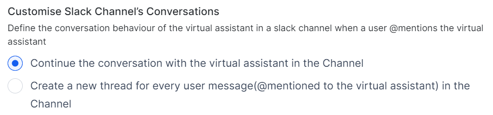

# Platform Services Updates

This document provides information on the feature updates and enhancements introduced in the **Platform Services** of XO v11.x releases.

## v11.11.1 March 15, 2025

<u> Patch Release </u>

This update includes enhancement and bug fixes. The key enhancement included in this release is summarized below.

### Voice Gateway (v0.9.3-8)

#### Enhanced Diagnostics for Comprehensive Participant Tracking and Quality Metrics

The Agents tab provides Agents and Supervisors with comprehensive call analytics. It displays key information for all participants, including their status (In-Call/Left), timestamps, and quality metrics (MOS, jitter, packets lost). This enhances troubleshooting by showing detailed call exit reasons and descriptions for each participant. Active participants are indicated with "NA" in the End Timestamp field, while External Agents are labeled with an "External Agent" tag, improving visibility and simplifying the debugging process. [Learn more :octicons-arrow-right-24:](../../analytics/contact-center/interactions.md#agents)

## v11.11.0 March 04, 2025

<u> Minor Release </u>

This update include enhancement and bug fixes. The key enhancement included in this release is summarized below.

### LLM & Generative AI

#### Azure OpenAI GPT-4o Mini and OpenAI GPT-4o Mini Support

The Platform now supports the GPT-4o mini model for various [Co-Pilot](../../generative-ai-tools/co-pilot-features.md#model-and-supported-features) and [Dynamic Conversations](../../generative-ai-tools/dynamic-conversations-features.md#model-and-supported-features) features. The model provides similar responses to GPT-4o at a lower cost and latency, balancing performance and efficiency for real-time applications. The integration does not include system prompts, but it can be used with custom prompts.

### Getting Started

#### Optimized Workspace Switching Experience

The "Browse Workspace" feature has been optimized for a faster and more responsive user experience. Users can easily switch between their existing workspaces, which they are part of, or browse for other workspaces in the same domain and request access to a workspace. [Learn more :octicons-arrow-right-24:](../../getting-started/accessing-the-platform.md#join-a-workspace)

### Flows and Channels

#### Voice-to-Chat Deflection

The new Voice-to-Chat Deflection feature allows platform users to create conversation flows that seamlessly transition from voice interactions to chat-based interactions within the same context. This feature works only with Kore Voice Gateway Channels (Phone number or SIP Transfer).

Key changes

* The "Deflect to Chat" option is added to the Dialog Builder's "Return to Flow" property with two deflection types - ‘Automation’ and ‘Agent Transfer’.
* The Flow Builder now includes a dedicated "Deflect to Chat" connection path and node type to handle the transition from voice to chat.

Key benefits

* Enhanced customer experience through optimal channel selection.
* Shorted resolution time by offering chat-based interactions when voice queues are long.

Backward compatibility:

* The feature is fully backward-compatible with existing voice implementations.

[Learn more :octicons-arrow-right-24:](../../automation/use-cases/dialogs/node-types/working-with-the-user-intent-node.md#connections-properties)

### Voice Gateway (v0.9.3-8)

#### Spanish Language Support for ElevenLabs Text-to-Speech

Added Spanish language support through ElevenLabs Text-to-Speech integration. This enhancement expands our language capabilities and provides users with high-quality Spanish voice synthesis options.

The ElevenLabs TTS engine option is available in the following locations when Spanish language is selected:

* Start Flow
* Manage Preferences within the Voice Preferences section
* Start node

Voice Library Expansion

* Added comprehensive Spanish/Latin American voice portfolio
* All ElevenLabs Spanish voices are now available in the voice selection dropdown

#### Voicemail Notification & Recording and Call Metadata Using the 'Utility’ Function

A voicemail notification can be sent using the `voiceutils`, enabling automated customer notifications for voicemail events.

* **message**: Before the voicemail is recorded, a customizable prompt, such as "Please leave your voicemail now," is played to customers.
* **beepRequired**: It controls whether a beep sound plays after the prompt, signaling to customers that the voicemail recording is starting.
* **transcriptionRequired**: Enables/disables automatic voicemail transcription. When enabled, it generates text transcription upon recording completion.
* **notifyUrl**: Endpoint for receiving voicemail notifications.  
  Format: `https://your-domain/endpoint`
* **metaInfo**: Customizable metadata included in notifications. [Learn more :octicons-arrow-right-24:](../../channels/kore.ai-voice-gateway/utility-functions.md#voicemails)

#### Voicemail Recording API

A new public API endpoint has been introduced to retrieve voicemail recordings. [Learn more :octicons-arrow-right-24:](../../apis/contact-center/fetch-voicemail-recording.md)

#### Simplified Parameter Updates for ASR/TTS Configuration

When modifying language settings or ASR/TTS parameters in Call Control Parameters, users can now specify the fields to be updated using the minimal required parameters. The system retains all existing parameters. This simplified approach applies to Node-Level and Channel-Level Call Control Parameters, reducing redundancy and streamlining the configuration process. [Learn more :octicons-arrow-right-24:](../../channels/kore.ai-voice-gateway/call-control-parameters.md#channel-level-call-control)

#### Improved Audio Handling During Hold State

This update optimizes audio processing and storage during hold periods. The existing behavior remains unchanged for Consult calls, Conference calls, and Multi-party interactions.

During hold periods, the system:

* Suspends transcription generation for customer audio.
* Suspends transcription generation for agent audio.
* Automatically resumes transcription when the hold state ends.

When a customer is on hold (self-initiated or agent-initiated):

* Temporarily stops recording customer-side audio.
* Temporarily stops recording agent-side audio.
* Automatically resumes recording when the hold state ends.

[Learn more :octicons-arrow-right-24:](../../analytics/contact-center/interactions.md#insights-to-logs)

#### Answering Machine Detection (AMD) for Inbound Calls

The AMD capability is extended to include inbound call detection, matching the existing functionality available for outbound calls. This feature enables the automatic detection of fax machines during inbound calls.

The AMD detection can now be configured in Dialog Task (first node), Channel override templates, and Bot response configurations.

#### Recording Control for Outbound Calls

The Transcribe utility function now supports the following when integrated with external agent transfers via SIP Invite:

* Start/Stop recording control
* Pause/Resume functionality

[Learn more :octicons-arrow-right-24:](../../analytics/contact-center/interactions.md#call-recording)

#### SIP Trunk Availability Monitoring

Added an "Option Ping" checkbox in the SIP Trunk configuration for outbound calls that enables automatic verification of SIP Termination IP address accessibility. [Learn more :octicons-arrow-right-24:](../../channels/kore.ai-voice-gateway/configure-kore-voice-gateway.md#sip-trunk-setup)

#### Show Multiple SIP URIs While Configuring SIP Trunk

While configuring the SIP trunk, multiple SIP URIs are now displayed for Contact Center AI and Agent AI. Users can view the list of SIP URIs configured by the Kore backend team and copy them to update third-party applications. [Learn more :octicons-arrow-right-24:](../../channels/kore.ai-voice-gateway/configure-kore-voice-gateway.md#sip-trunk-setup)

#### Display 'Call Control' Options During the Dialing Stage

The Keypad and Mute options are accessible even when a call is being dialed. This enhancement ensures uninterrupted user interaction with IVR systems, even if the CALL_CONNECTED event and 200 OK status are not received from the AudioCodes SBC.

Key benefits

* Allow seamless IVR navigation without waiting for connection confirmation.
* Reduce disruptions caused by delayed network responses.
* Enhance agent experience by maintaining essential call controls at all times.

[Learn more :octicons-arrow-right-24:](../../console/interacting-with-customers.md#outbound-dialer)

#### Audit Log for SIP Trunk Configuration Changes

An audit log for all SIP Trunk configuration changes is maintained. This feature enables developers and administrators to track modifications, including who made the change and when.

## v11.10.0 February 12, 2025

<u> Minor Release </u>

This update include enhancement and bug fixes. The key enhancement included in this release is summarized below.

### LLM & Generative AI

#### Support for Provider's New LLM in the Out-of-box Integration Framework 

With this update, platform users can leverage the latest LLMs as soon as they become available. The XO Platform now enables the immediate addition of new language models as system models within the out-of-box Pre-built Integration framework.

Key benefits

* Quickly access newly launched language models without waiting for the platform to make the new models available.
* Create custom prompts for new models from scratch or by importing an existing prompt from another model.
* Maintain platform security and authentication standards while eliminating integration delays.

[Learn more :octicons-arrow-right-24:](../../generative-ai-tools/models-library.md#providers-new-llm-integration)

#### Answer Generation Guardrails

The platform now supports answer generation guardrails to ensure the safety and appropriateness of answers generated by LLMs. Input guardrails check the user input, and Output guardrails verify the generated answer prior to sharing it with users.

[Learn more :octicons-arrow-right-24:](../../generative-ai-tools/guardrails.md)

### Getting Started

#### Simplified Onboarding Journey and Customizable App Icons 

The XO Platform now offers a streamlined onboarding experience with simplified product selection, an improved signup flow, and an easy-to-follow Quick Start & Setup Guide. These changes help platform users get started faster, focus on what matters, and see value sooner.

In addition, the platform allows users to personalize their app icons. They can select from a dropdown of preset icons and colors or upload a custom PNG or JPG icon up to 80x80 pixels in size.  

[Learn more :octicons-arrow-right-24:](../../getting-started/guided-onboarding.md)

### Billing & Payments

#### Usage Trends Enhancements for Improved Billing Insights

The Usage Trends section now includes a new Billing Session Widget. This widget provides key metrics to help app users easily understand and manage their apps’ usage.

The Widget includes

* Consolidated view of billing sessions, voice sessions, and agent counts.
* Filtering by date range (24 hours, 7 days, 30 days, or custom).
* Clear graphical representation of usage trends.
* Hover tooltips for detailed data points.

Metrics tracked

* Automation AI Billing Sessions: 15 minutes of bot/app interaction.
* API Requests: Each triggered request is counted as a session.
* Voice Gateway Sessions: 15 minutes of voice interaction.
* Agent Count: Concurrent Agent Seats that the customers have subscribed to for the given time.  

[Learn more :octicons-arrow-right-24:](../../manage-assistant/plan-and-usage/usage-plans.md#usage-trends)

### Kore Voice Gateway (v0.9.3-1)

#### Audit Log for 'SIP Trunk Configuration' Changes and Proper Failure Reasons

The audit logs now record the following information when the SIP trunk configuration is updated.

* Updated Time Stamp along with Time Zone
* Updated by

Whenever a SIP Trunk or Phone Number configuration fails—whether during the setup of a new one or deletion of an existing one—the system displays the relevant failure reasons.

#### Mask PII Data in Debug Logs

The user input's Personal Identifiable Information (PII) data will be masked in the debug logs.

## v11.9.1 January 25, 2025

<u> Patch Release </u>

This update include only bug fixes.

## v11.9.0 January 05, 2025

<u> Minor Release </u>

This update include enhancement and bug fixes. The key enhancement included in this release is summarized below.

### LLM & Generative AI

#### Enhanced Usage Logs for Guardrails

The Usage Logs now provide more comprehensive insights into guardrails performance and token consumption. These insights enable platform users to better track and analyze the effectiveness of their configured guardrails, identify patterns in breaches, optimize costs, and streamline the debugging process.

Key enhancements

* Failed guardrail tracking with identifiers and failure explanations.
* Analytics table for configured guardrails, outcomes, and risk scores
* Input and output token count monitoring.
* Expanded export columns, including guardrail risk scores and token counts.

[Learn more :octicons-arrow-right-24:](../../analytics/genai-analytics/llm-usage-logs.md)

#### Optimized Conversation Context Management

The platform has introduced a Redis-based caching solution to significantly improve conversation context management. This enhancement optimizes the storage and retrieval of conversation history for LLM interactions, reducing latency and resource usage while maintaining context integrity.

### Admin Console

#### Enhanced Get Bots API
The Get Bots API now includes crucial authentication and security metadata for each bot, enabling better management and auditing.

Key updates

* Added fields to bot objects in API response: clientId, clientSecret, jtiClaimEnforced, and jweEncryptionEnforced.
* No changes to endpoint structure (backward compatible).

Key benefits

* Comprehensive bot details, including auth credentials.
* Visibility into per-bot security configurations.
* Streamlined management and compliance workflows.

[Learn more :octicons-arrow-right-24:](../../apis/automation/get-bots.md)

### App Settings

#### Auto-Save for App Profile Settings
The platform now ensures consistent Auto-Save behavior across all configurations in the App Profile menu of the App Settings page. This update aligns the App Settings page with other areas of the platform, such as the Property Panel and NLP Training Configurations, offering users a seamless and intuitive experience.

Key updates

* Auto-save on blur for App Name, App Description, and other settings.
* Toaster messages to confirm the successful saving of changes.
* Special handling for renaming published apps.
* Removal of the Save button at the bottom of the page.

[Learn more :octicons-arrow-right-24:](../../app-settings/app-profile.md)

### App Language

#### Japanese and Korean Language Support in the App (Beta)
The platform has enabled Japanese and Korean language selection for the App, allowing platform users to access the app in their native language.

Key updates

* Language selection dropdown added to Profile, Login, and Signup pages.
* The "BETA" tag indicates the feature's beta status.
* Dynamic translation of UI elements and content based on selected language.

Key benefits

* Improved accessibility for Japanese and Korean users.
* Consistent language selection across the app.
* Leverages existing backend localization for seamless translation.

[Learn more :octicons-arrow-right-24:](../../getting-started/navigating-the-platform.md#the-top-menu)

## v11.8.1 December 19, 2024

<u>Patch Release</u>

This update includes bug fixes.

## v11.8.0 December 11, 2024

<u> Minor Release </u>

This update include enhancement and bug fixes. The key enhancement included in this release is summarized below.

### LLM & Generative AI

#### Zero-Shot Enhancements

The Zero-Shot intent detection model has been significantly enhanced to improve contextual understanding and intent-matching accuracy, addressing challenges related to large intent sets and false positives. 

Key Updates

* Expanded Input: The enhanced model now incorporates intent descriptions, conversation history, list of intents, and user utterances for more accurate intent recognition.
* New Prompt Structure: A new prompt, "Zero-Shot-V2," is available for XO v10 and v11, enabling platform users to input additional contextual components.
* System Prompts: Pre-built system prompts are provided for out-of-the-box integrations (Azure OpenAI and OpenAI), allowing the users to leverage the enhanced Zero-Shot Model without crafting custom prompts.
* Custom Prompts: Platform users can create custom prompts linked to system models for Zero-Shot, offering full control over prompt design to tailor them to specific features, contexts, and user needs.
* Custom LLM Support: The Zero-Shot ML model can now be used with the Bring Your Own Model (BYOM), enabling platform users to define prompts and leverage the enhanced capabilities with their custom LLMs.

These enhancements significantly improve the Zero-Shot model's ability to accurately identify intents, particularly in complex or nuanced conversational scenarios, while maintaining compatibility with existing configurations.  
[Learn more :octicons-arrow-right-24:](../../generative-ai-tools/dynamic-conversations-features.md#zero-shot-ml-model)

#### Rephrase User Query feature is now extended to Search AI

The platform now supports contextual rephrasing of user input for Search AI. The feature is available using the XO GPT model.  
[Learn more :octicons-arrow-right-24:](../../generative-ai-tools/dynamic-conversations-features.md#rephrase-user-query)

### Bot Admin Console

#### Consolidated Billing Session Widget

The Bot Admin Console now includes a Billing Session Widget, providing admins with a consolidated view of key billing metrics across all apps in their workspace. This graphical widget displays:

* Billing Sessions: Total number of completed sessions.
* Voice Sessions: The count of Voice Sessions in a conversation consumed in an App; calculated as every 15 minutes of interaction with the Virtual Assistant or an Agent.
* Agent Count: The count of agents subscribed to the plan for each app.  

[Learn more :octicons-arrow-right-24:](../../administration/billing.md#usage)

### App Settings

#### Change Log Improvements: Module Field and Detailed Views

The Change Logs feature has been updated to provide better context and more detailed information about configuration changes made within XO 11.

Key Improvements

* Module Field: Each log entry has a new "Module" field indicating which XO 11 module the change originated from. Possible module values include Automation AI and Global (for changes related to Settings, User Management, Deployment, Billing, Experience Flows, Channels, and GenAI Configs).
* Detailed Views: Log entries now include a "Details" link whenever additional information is available. The link opens a side panel displaying a JSON view of the full change details. It helps access the complete technical information for each change without cluttering the main log view.  

[Learn more :octicons-arrow-right-24:](../../app-settings/change-logs.md)

## v11.7.1 November 18, 2024

<u> Patch Release </u>

This update includes bug fixes.

## v11.7.0 November 03, 2024

<u> Minor Release </u>

This update include enhancement and bug fixes. The key enhancement included in this release is summarized below.

### LLM & Generative AI

#### Amazon Bedrock Integration

XO Platform now offers Amazon Bedrock as an out-of-box (OOB) integration. This integration lets platform users access Amazon Bedrock's models directly from the XO Platform. The users can create custom prompts for their specific use cases and use the connected models across all Co-Pilot and Dynamic Conversations features. Note that while Amazon Bedrock is available as an OOB integration, XO Platform does not provide any system prompts or templates. Users can only make use of the model with the help of custom prompts.

Key features:

* Amazon Bedrock Connection: Connect to multiple Amazon Bedrock models securely using your AWS credentials and IAM role authentication.

* Integration Setup: Configure the integration by providing an integration name, model details, endpoint, and IAM role credentials.

* Custom Prompts: Create model-specific prompts for all Co-Pilot and Dynamic Conversations features with complete control over prompt design and optimization.

* Security: End-to-end encryption with secure temporary credential management through Amazon STS.

Key benefits:

* Access to Amazon's advanced language models.

* Seamless integration with existing XO Platform features.

* Flexible prompt customization.

* Enterprise-grade security.

[Learn more :octicons-arrow-right-24:](../../generative-ai-tools/models-library.md#amazon-bedrock-llm-integration-framework)

### Channels

#### Netcore WhatsApp Business Integration

The Platform now supports WhatsApp business messaging using Netcore as a new channel. This integration enables businesses to connect their WhatsApp Business account through Netcore to send text, media, and interactive messages using Virtual Assistants.

Key features:

* Single API Integration: Manage all WhatsApp conversations and virtual assistants through one API.

* Rich Messaging Capabilities: Send text messages, share media files, and add interactive buttons and quick replies.

* Secure Interactions: Built-in end-to-end encryption for secure message delivery.

#### Email Management Enhancements

##### Domain Configuration

The enhanced email configuration options allow users to configure both Kore and custom domain email addresses to maintain brand consistency:

Key updates:

* Add multiple email addresses for Kore domains.

* Set up verified custom domains.
 
* Attach experience flows to specific addresses.

##### Email Blacklisting

The new Email Blacklist option helps protect your email reputation with administrator controls.

Key features:

* Block problematic email addresses.

* Prevent automated responses to blacklisted addresses.

* Maintain standard processing for verified contacts.

[Learn more :octicons-arrow-right-24:](../../channels/add-email-channel.md)

### Web SDK

#### Webchat Theme Enhancement

The XO Platform's Webchat interface now offers enhanced theme management capabilities. The users can preview themes before applying them and customize them to match their brand requirements.

Key updates:

* Theme Preview and Management: Create, customize, and preview themes before applying them to your webchat interface. Choose from pre-designed templates or customize them as per brand requirements.

* Theme Options: Create new custom themes, Copy existing themes, Edit theme settings, Preview before applying, and Delete unused themes.

* Theme Application: Preview themes in the test environment before applying. Changes take effect in live chat after publishing, with a clear indication of your active theme.

Backward compatibility: 

* Available for XO v11 while preserving all existing themes and settings.

## v11.6.1 October 21, 2024

<u> Patch Release </u>

This update include enhancement and bug fixes. The key enhancement included in this release is summarized below.

### Bot Admin Console
#### Enhanced Audit Report

The Audit Report is enhanced to provide better user tracking and accountability. A user email column is added to the audit logs table along with the existing user name as a unique identifier and is also included in the exported audit report. Column names are updated for consistency across the UI and exported files. These enhancements allow for more precise identification of users who made changes, improving traceability and simplifying troubleshooting processes.

Backward compatibility: User email will be available only for new audit entries, not for existing data.

[Learn more :octicons-arrow-right-24:](../../administration/analytics.md){:target="_blank"}

## v11.6.0 September 28, 2024

<u> Minor Release </u>

This update includes enhancements and bug fixes.

### LLM & Generative AI

#### **Dynamic Variables for LLM Integration** 

XO Platform now supports dynamic variables for integration with Language Models. It allows platform users to use content, context, and environment variables when configuring system and custom LLMs. It helps create more adaptable and secure virtual assistants that can easily adjust to different needs and settings.

Key features:

* Use content and environment variables for Co-pilot features and all variable types for Dynamic Conversation features.
* Configure API keys, endpoints, authentication settings, etc., using variables.
* Test LLM configurations using sample values.

Key benefits:

* Adapt LLM settings across different environments.
* Enhance security by storing sensitive information as environment variables.
* Simplify configuration management and updates.
* Improve testing and development processes.
* Enable flexible deployment for multi-tenant applications.

[Learn more :octicons-arrow-right-24:](../../generative-ai-tools/models-library.md#llm-integration-using-dynamic-variables)

#### **Enhanced Guardrails Framework for GenAI**

This update significantly improves the Guardrails framework, enhancing safety and reliability in GenAI deployments. With optimized screening, better reporting, and broader LLM support, platform users can create more secure and effective AI solutions while improving overall system performance.

Key updates:

* Optimized screening process for faster responses.
* Detailed fallback reporting with specific breach information.
* Improved logging for better visibility into guardrail activities.
* Extended support for custom LLMs.

Key benefits:

* Increased safety and reliability in GenAI deployments.
* Improved developer experience with clearer logging and debugging.
* Faster response times due to optimized screening processes.
* Consistent guardrail enforcement across all LLM types.

Backward compatibility:

* This update applies to all existing bots, ensuring a seamless transition to the improved framework.

[Learn more :octicons-arrow-right-24:](../../generative-ai-tools/guardrails.md)

#### **Enhanced PII Protection in LLM Interactions**

XO Platform now protects sensitive data in LLM calls by adding placeholders. For example, phone numbers are replaced with "[Phone Number]". This enhances privacy and security, reducing the risk of exposing personal information to external LLM services.

#### **Terminology Updates for Improved Clarity**

This update includes an important terminology change on the platform:

* Zero-shot Model Naming Consistency: Standardized the name to 'Zero-shot Model' across the platform, eliminating confusion caused by inconsistent naming; for example, ‘Zero-shot Model with OpenAI’ was used under ML > Network Type.

### Getting Started

This update includes significant enhancements to the initial user experience, focusing on three key areas: onboarding, signup process, and workspace management. These enhancements make it easier for users to navigate through the initial setup of their Apps, ensuring a smoother start with our platform's AI-powered features.

Onboarding and Setup Guide: 

* Optimized layout and readability.
* Improved visibility of critical components.
* Renamed "Guided Onboarding" to "Express".

Email Signup Process:

* New signups are restricted to business email addresses.
* Personal emails can join invited workspaces but can't create new ones.
* Existing users are unaffected.

Workspace Invite UI:

* Redesigned for a more intuitive and efficient experience.
* Modern, cohesive look aligned with overall platform design.

### Channels

#### **Sinch Conversational API Integration**

XO Platform now supports **Sinch** as a new channel. Sinch offers a new omnichannel integration that allows developers to enable virtual assistant interactions across multiple channels, eliminating the need to set up and manage each channel individually.

Key features:

* **Omnichannel Support**: Manage conversations seamlessly through a single API and deploy virtual assistants across multiple channels, including WhatsApp, Facebook Messenger, Instagram, Viber Bot, Viber Business Messages, Telegram Bot, KakaoTalk, LINE, WeChat, RCS, SMS, MMS, and Sinch Chat.

* **Rich Messaging Capabilities**: Send text messages, media, and rich content across various channels. Maintain consistent user interactions with conversation management.

* **Template Compatibility**: Ensure compatibility between selected templates and the configured delivery channel in Sinch.

Key benefits:

* Simplify development and deployment with a unified API for multiple messaging platforms.
* Create seamless and engaging user experiences across various channels.
* Enhance security and user authentication in messaging interactions.  

[Learn more :octicons-arrow-right-24:](../../channels/add-sinch-channel.md)

### Web SDK

#### **Enhanced Webchat Configuration - From SDK to UI**

Previously, configuring certain Webchat features required SDK modifications. This update brings key SDK Webchat functionalities into the user interface, allowing for a more unified and user-friendly approach to bot customization.

Key updates:

* Manage Webchat settings directly from the UI without using SDK.
* New UI-configurable parameters include location sharing, Google Maps API integration, Chat history management, Paginated scrolling, Typing indicator customization, Emoji shortcut controls, and Speaker and Send button toggles.
* SDK Override Option to prioritize UI configurations over SDK settings. This option is disabled by default to render the existing customizations and can be enabled for seamless transitions.

Key benefits:

* Faster and simpler Webchat setup and modification process.
* Greater control over Webchat features without SDK knowledge.
* Flexibility to switch between UI and SDK configurations.

Backward compatibility:

* Existing SDK configurations remain intact until the override option is enabled in the UI.

[Learn more :octicons-arrow-right-24:](../../channels/add-web-mobile-client.md#virtual-assistant-theme--design)

### App Settings

#### **Change Default App Language via API**

The XO platform now allows users to update the default language of their existing apps using a public API, providing greater flexibility and control over their chatbot configurations.

Key updates:

* Public API for default Language Change.
* Change your app's default language at any time without creating a new bot.
* Enable any published language in the bot as your default bot language.

Key benefits:

* Adapt your chatbot to changing language requirements effortlessly.
* Save development time and resources by modifying existing bots.
* Easily manage multilingual bots within a single app instance.

!!! note

     The changes made via the API are instantly reflected in both In-development and Published copies of your app.

[Learn more :octicons-arrow-right-24:](../../apis/automation/change-default-language.md)

### Marketplace

#### **Deprecation of Azure OpenAI and OpenAI from Marketplace Integrations**
The Prebuilt Dialog Templates using OpenAI and Azure OpenAI are discontinued. These templates were originally provided to explore the art of possibility when LLMs were relatively new. However, they used older models that the model providers no longer support. Our customers are already exploring the full power of GenAI-powered conversational experiences using the [GenAI Node](../../automation/use-cases/dialogs/node-types/genai-node-v2.md) and [GenAI Prompt](../../automation/use-cases/dialogs/node-types/genai-prompt.md) node.

## v11.5.1 September 14, 2024

<u> Patch Release </u>

This update includes bug fixes.

## v11.5.0 September 01, 2024

<u> Patch Release </u>

This update includes enhancements and bug fixes. Key enhancements included in this release are summarized below.

### LLM and Generative AI
#### Azure OpenAI GPT-4 Turbo and GPT-4o Support for LLM & Generative AI Features
The Platform now supports two new Azure OpenAI models for various [Co-Pilot](../../generative-ai-tools/co-pilot-features.md#model-and-feature-support-matrix){:target="_blank"} and [Dynamic Conversations](../../generative-ai-tools/dynamic-conversations-features.md#model-and-feature-support-matrix){:target="_blank"} Features:

* GPT-4 Turbo: It’s a high-speed, accurate model ideal for real-time applications like chatbots, virtual assistants, and content generation.
* GPT-4o: It’s the most advanced multimodal model, which can accept both text and images as input, offering improved efficiency and cost-effectiveness compared to GPT-4 Turbo.

#### Apps Versioning for GenAI & LLM
The platform now includes GenAI and LLM settings in app versioning, including Model Integrations, Custom Prompts, Feature & Model Prompt mapping, and Safeguards. It allows platform users to manage and track GenAI & LLM configuration changes across different bot/app versions, enhancing control and customization of GenAI features. 

### Analytics
#### Enhanced Rate Limit API Response 
This update helps API users understand which specific rate limit they've hit, allowing them to plan their request strategies more effectively and reduce errors in API usage.

Specific error messages:

* Per-minute limit: "You've exceeded the per-minute rate limit. Please wait for some time before retrying."
* Hourly limit: "You've exceeded the hourly rate limit. Please wait for some time before retrying."

[Learn more :octicons-arrow-right-24:](../../apis/automation/rate-limit.md){:target="_blank"}

### App Management

#### App Deletion Feature Update 

The platform now allows the deletion of published apps. It provides more flexible app management, improving control over app lifecycles while maintaining data security and user accountability.

Key updates:

* Soft Deletion:
    * Initiated by app/bot owners from App Settings.
    * Requires email verification.
    * 30-day restoration window.
* Post-Deletion:
    * The App is invisible in the main interface.
    * Runtime features cease.
    * Configurations are retained for 30 days.
* Restoration:
    * Available in the admin console for 30 days.
    * Restores all pre-deletion configurations.
* Notifications:
    * Emails to all admin role users.
    * Reminders before permanent deletion.
* Data Management:
    * Secure storage during soft deletion.
    * Permanent deletion after 30 days.
* Subscribed App:
    * Deletion is not allowed during an active subscription.
    * Restoration after the billing date requires a re-subscription.
* Admin Features:
    * New BAC section for deleted apps.
    * Audit logs for app restoration.
    * New role permission for deleted apps view.  

[Learn more :octicons-arrow-right-24:](../../app-settings/delete-app.md){:target="_blank"}

### Channels
#### Customizable VXML Error Threshold in IVR Voice Call Properties
This update removes the restriction of having a fixed VXML Error Threshold at the environment level that applies to all bots, with no option for customization. Platform users now have the flexibility to set the number of retries at the bot level, tailoring it to the specific needs of their system.

Key updates:

* Customizable Error Threshold: Set retry limits based on the system that is being used. 
* Default and Custom Options: Choose the default setting or customize the number of retries.
* Retry Range: Customizable range from 1 to 3, 3 being the default.

Backward Compatibility:

* Existing bots default to the Use Default option, which is also included in the bot export/import processes.

[Learn more :octicons-arrow-right-24:](../../automation/use-cases/dialogs/node-types/voice-call-properties.md#voice-call-settings-field-reference){:target="_blank"}
    

#### Update or Delete Delivered Bot Messages in MS Teams

Bot messages in Microsoft Teams can now be updated or deleted even after they have been delivered to users. This feature provides greater flexibility and control, allowing platform users to disable or remove template messages after a user has taken action on them.

Key updates:

* New ‘channelActionMetadata’ object:
    * Captures MsTeams ActivityID, ConversationID, and KoreMessageID.
    * Only stores metadata for the latest bot message.
* New channel utility functions:
    * channelUtil.getActionMetadata(): Retrieves metadata.
    * channelUtil.executeAction(): Updates or deletes messages.
* Automatic updates:
    * Chat history updates for modified messages
    * Message tags emitted for updated/deleted messages

[Learn more :octicons-arrow-right-24:](../../channels/add-microsoft-teams-channel.md#ms-teams-chat-features){:target="_blank"}

### Getting Started

#### Enhanced Workspace Switcher Experience 

The enhanced Workspace Switcher has a more cohesive, modern experience, making workspace switching more intuitive and efficient for platform users.  

[Learn more :octicons-arrow-right-24:](../../getting-started/accessing-the-platform.md#using-workspace){:target="_blank"}

#### New Signup Journey Update for Custom Setup

This update helps bridge the gap in the new user Signing up using the Custom Onboarding journey for both Automation AI and Contact Center AI. This Custom Onboarding Journey now automatically triggers a new App creation process, improving the overall onboarding experience.

Key updates:

* Data Persistence:
    * Product selection (Automation AI or CCAI) is now saved.
    * The onboarding type ("Custom") is recorded.
* Streamlined App Creation:
    * The new App creation journey skips product type and journey type selection.
    * Uses data from initial onboarding steps.
* Continuous Journey:
    * The process now continues directly to the "Naming the App" screen.  

[Learn more :octicons-arrow-right-24:](../../getting-started/guided-onboarding.md){:target="_blank"}

## v11.4.1 August 11, 2024

<u> Patch Release </u>

This update includes bug fixes and minor enhancements.

### LLM and Generative AI

#### Multi-language Support for System and Custom LLMs

The platform now supports all bot languages for both system and custom LLMs.

Key updates:

* Language-specific responses: LLMs can now generate responses in bot languages that LLMs also support.
* Preserved sentiment: Responses maintain original sentiment.
* Expanded language options: Available for all LLM features and prompts.

Key benefits:

* Improved accuracy in non-English interactions.
* Enhanced user experience for global audiences.

[Learn more :octicons-arrow-right-24:](../../generative-ai-tools/introduction.md){:target="_blank"}

#### Custom LLM Framework Update for GenAI Node

The platform has significantly enhanced the GenAI Node’s custom prompt creation flow. It now supports dynamic variables in the prompt definition, gives full control over the prompt structure, and dynamically defines prompt definitions using JavaScript. These updates provide greater flexibility, better conversation context control, and more sophisticated prompt engineering capabilities, allowing platform users to create more advanced and tailored GenAI applications with improved custom LLM integrations.

Key updates:

* Dynamic variables improvements: Conversation history is redefined as an array of objects. New variables are introduced for Required Entities, Collected Entities, and Conversation History Length.
* Variable support: Context, Environment, and Content variables are now supported in prompts and scripts.
* JavaScript mode: Ability to create prompts using JavaScript and preview option for script validation.

[Learn more :octicons-arrow-right-24:](../../automation/use-cases/dialogs/node-types/genai-node-v2.md){:target="_blank"}

### App Settings

#### Update App Name Post-Publication

Administrators or workspace owners can now modify an app’s name even after publishing it. This helps keep app names current and relevant without disrupting system operations or user experiences.

Key updates:

* There is a new Edit icon for the app name on the App Settings page.
* The app's unique identifier (UUID) remains unchanged, so there will be no impact on the existing integrations and functionalities.
* A new log is added to the Change Logs to highlight the change. For e.g., "App Name is updated from *Old_Name* to *New_Name*”.

[Learn more :octicons-arrow-right-24:](../../app-settings/app-profile.md#app-profile){:target="_blank"}

### Channels

#### MS Teams Modal Dialog Support

The platform now supports Microsoft Teams Modal Dialogs, enhancing the interactive capabilities of virtual assistants deployed on the MS Teams channel. This support allows platform users to handle the 'Invoke' action-type messages used by MS Teams for Modal Dialogs.

Key updates:

* New “Modal Dialogs” toggle: The new toggle is introduced in the channel configuration and is off by default.
* Custom URL configuration: When enabled, platform users can set a Custom URL to which the platform forwards Modal Dialog messages for processing.
* Message handling: The platform maintains the conversation context when handling Modal Dialog messages. It forwards these messages with pre-context to the Custom URL for processing, then relays responses back to the user, maintaining a seamless interaction.

Key benefits:

* Enhanced interactivity: Enables form-based experiences in Teams.
* Seamless integration: Preserves conversation context throughout.
* Improved user experience: Supports more complex interactions.

Backward compatibility:

* This update is available to all existing apps, and it’s disabled by default. If enabled, the app needs to be republished to make these changes take effect.

[Learn more :octicons-arrow-right-24:](../../channels/add-microsoft-teams-channel.md){:target="_blank"}

### Admin Console

#### IP Address Restriction Enhancement

The Admin Console now supports Regex patterns for IP address restrictions. The regex support makes it easier for administrators to manage access across extensive IP ranges.

Key updates:

* Administrators can enter IP ranges using regex patterns when IP Address restriction is enabled. 
* Account access is limited to IP addresses matching the provided regex patterns.

Key benefits:

* Reduced manual entry.
* Greater precision in identifying IP addresses through pattern matching.
* Streamlined administration for large IP ranges.

[Learn more :octicons-arrow-right-24:](../../administration/security-and-control/security-settings.md/#ip-address-restriction){:target="_blank"}

## v11.4 July 27, 2024

<u> Patch Release </u>

Key features and enhancements included in this release are summarized below.

### LLM & Generative AI Framework

#### OpenAI GPT-4 Turbo and GPT-4o Support for LLM & Generative AI Features
The Platform now supports two new OpenAI models for various [Co-Pilot](../../generative-ai-tools/co-pilot-features.md#model-and-feature-support-matrix){:target="_blank"} and [Dynamic Conversations features](../../generative-ai-tools/dynamic-conversations-features.md#model-and-feature-support-matrix){:target="_blank"}.

* GPT-4 Turbo is a high-speed, accurate model ideal for real-time applications like chatbots, virtual assistants, and content generation.
* GPT-4o is an advanced multimodal model that can accept both text and images as input, offering improved efficiency and cost-effectiveness compared to GPT-4 Turbo.

### Admin Console
#### Usage Information for Enterprise Accounts

Enterprise users can now view consolidated usage data for all their Bots and Apps in the Bot Admin Console. 

Key updates:

* The new Billing menu in the Admin Console left navigation.
* Combined XO10 and XO11 usage statistics on a single page.
* Detailed usage trends are accessible via the Manage button.  

[Learn more :octicons-arrow-right-24:](../../manage-assistant/plan-and-usage/usage-plans.md){:target="_blank"}

### Deploy Management

#### Import, Export, and Publish GenAI and LLM Settings

A new 'GenAI and LLM' option is now available under the 'Settings' section for Import, Export, and Publish operations. 

The setting includes:

* Integrations
* Prompts and Requests Library
* Feature Mappings
* Guardrails (for v11 only)

Key benefits:

* Deploy GenAI and LLM features across multiple bots.
* Enhance flexibility in managing GenAI-related settings.
* Ensure seamless operation of runtime features for end-users.

Full vs. Incremental Import:

* Full Import
    * Deletes existing models and prompts in the target app.
    * Overwrites with models, prompts, and GenAI features from the import file.
    * Retains model configurations if a model exists in both source and target
    * Replaces all feature mappings, custom instructions, and guardrails.
* Incremental Import 
    * Keeps existing prompts, only adds new ones.
    * Replaces all feature mappings, custom instructions, and guardrails.
* Both import types:
    * Preserve existing integrations.
    * Import XO-GPT integration as-is.
    * Enable imported features with warnings.
    * Handle "Azure Open AI by Kore.ai" integration based on token status.

Backward compatibility:

* Existing bots in the Configured state are copied to the Published state.

These changes aim to streamline the deployment and management of GenAI and LLM features across multiple bots and ensure the seamless operation of runtime features for end-users. [Learn more :octicons-arrow-right-24:](../../deploy/bot-management.md){:target="_blank"}

### Channels

#### SMS Channel Configuration

The Platform now offers SMS channel configuration for various service providers. The SMS Channel enables customer communication via text messages. It supports inbound, outbound, or bidirectional messaging on the digital platform. This addition empowers businesses to conduct SMS campaigns and expand their customer communication options. [Learn more :octicons-arrow-right-24:](../../channels/add-sms-channel.md){:target="_blank"}

#### Instagram Channel Support

The XO Platform has added Instagram as a new channel option. Users can enable and deploy their virtual assistants on Instagram. [Learn more :octicons-arrow-right-24:](../../channels/add-instagram-channel.md){:target="_blank"}

### APIs

#### SDK Push Notifications Management APIs

The platform has introduced a new set of SDK Notifications APIs to enhance control over push notifications for mobile devices using the Web/Mobile SDK channel.

Key updates:

* A new API scope is added to the Bot builder - "SDKPushNotification”.
* Three new APIs have been introduced:
    * DeviceSubscription API: Subscribe the device to SDK push messages and receive subscription status and device details.
    * Subscribed User Devices API: Lists all the mobile devices subscribed to SDK push notifications and their OS types.
    * DeviceUnsubscription API: Unsubscribes SDK push messages for specific or all devices of a user.

Key benefits:

* Improved user control: Manage users’ push notification preferences more effectively.
* Enhanced flexibility: Manage device subscriptions programmatically.

[Learn more :octicons-arrow-right-24:](./../../apis/automation/manage-sdk-push-notifications.md){:target="_blank"}

#### Public API for SSO Configuration Management 

The platform has introduced public APIs for managing Single Sign-On (SSO) configurations. This new API complements existing bot creation and publishing APIs, allowing for a more comprehensive automation of account setup processes. It significantly enhances the platform's capabilities for enterprise customers who require frequent audits or automated deployments.

Key updates:

* Public API for SSO configuration management:
    * Fetch the SSO Meta API: Returns the existing SSO configuration along with the URLs.
    * Enable SSO API: Enables the SSO configuration for an account.
    * Disable SSO API: Dsables the SSO configuration for an account.
    * Update the SSO Configuration API: Updates the SSO configuration for an account.
* Support for SAML protocol.

Key benefits: 

* Streamlined automation: Customers can now fully integrate SSO configuration into their CI/CD workflows.
* Reduced manual effort: Simplifies the audit process by allowing automated SSO setup.
* Increased flexibility: Account administrators can programmatically manage SSO settings.
* Improved efficiency: Facilitates faster and more consistent SSO deployment across accounts.

[Learn more :octicons-arrow-right-24:](../../apis/automation/enable-and-manage-sso-configuration.md){:target="_blank"}

## v11.3.1 July 13, 2024

<u> Patch Release </u>

This update includes bug fixes.

## v11.3.0 June 29, 2024

<u> Patch Release </u>

### LLM & Generative AI Framework

#### Free LLM Tokens for Generative AI Features

Free LLM tokens are now allocated to each newly created app, enabling the exploration of our generative AI capabilities. These tokens allow immediate access to AI-driven tools like Co-pilot and dynamic conversations without initial setup. Once an app's free tokens are exhausted, users can seamlessly transition to their own LLM configuration. The platform provides clear token usage notifications and an intuitive activation interface. This feature aims to boost AI tool engagement and streamline onboarding for new users. This is available only for the apps created in the Standard workspaces/accounts.  
[Learn more :octicons-arrow-right-24:](../../generative-ai-tools/llm-tokens.md){:target="_blank"}

### Channels

#### Discontinuation of the Google Business Messages Channel
Google announced the discontinuation of the Google Business Messages channel from July 31, 2024. This channel will be phased out in the coming weeks. If you have alternative chat channels, consider inviting your customers to continue conversations there.  
For more details, refer to the [Google announcement](https://developers.google.com/business-communications/business-messages/resources/release-notes/update-on-gbm?hl=en){:target="_blank"}.

## v11.2.1 June 15, 2024

<u>Patch Release</u>

This update includes bug fixes.

## v11.2 June 01, 2024

<u>Patch Release</u>  

Key features and enhancements included in this release are summarized below.

### LLM & Generative AI Framework

#### Improved Discoverability of Generative AI Tools

The platform has made it easier to discover and manage the Generative AI capabilities across products. The new Generative AI menu will be available in the primary navigation bar of Automation AI, Search AI, and Agent AI products. 

Key updates include:

* Added a new top-level "Generative AI" menu within the Product Switcher, Automation AI, Search AI, and Agent AI areas. This provides quick access to Generative AI settings and tools. 
  
* Reorganized the Generative AI tools into four clear sub-categories:
    * Models Library: Access the Models Library (LLM integrations).
    * Prompts Library: Access the Prompts Library (default prompts and custom prompts).
    * GenAI Features: Enable and configure Co-pilot and Dynamic Conversations capabilities. The available options will be automatically filtered based on which product area the users access this from.
    * Safeguards: Manage data privacy with assistant-level and LLM-level anonymization of PII & sensitive data. Set up Guardrails to enforce appropriate AI outputs.
* Smart filtering in the Features section is based on the context from which the users access the Generative AI menu. This will only show the relevant feature options for that product (e.g., Automation, Search, Agent). The users can easily add/remove this filter as needed.  
  

#### Introducing Custom Prompts for Pre-built Models

The platform now supports custom prompts for the prebuilt LLM integrations. This will be in addition to the current support of default prompts. This new capability delivers a consistent prompt engineering experience across custom and pre-built models, making crafting the prompts for various features easy.
 

[Learn more :octicons-arrow-right-24:](../../generative-ai-tools/prompts-library.md){:target="_blank"}

#### Answers Module Details in the Debug Logs

The Debug Logs presented while testing the app now include detailed logs for the responses from the Search AI product. This includes information on the various stages, response times, and LLM outputs. This enhancement streamlines testing, improves debugging and provides deeper insights into the Search AI performance.  
 

[Learn more :octicons-arrow-right-24:](../../searchai/testing-and-debugging-answers.md){:target="_blank"} 

## v11.1.1 May 11, 2024

<u>Patch Release</u>

This update includes bug fixes.

## v11.1.0 April 27, 2024

<u>Minor Release</u>  

Key features and enhancements included in this release are summarized below.

### LLM and Generative AI
    
#### Custom LLM Integration Support for Rephrase Dialog Responses  

Rephrase Dialog Responses now supports Custom LLMs in addition to commercial LLMs. This allows platform users to use the rephrasing feature with their own custom-trained language models and create customized prompts tailored to their specific use cases, models, and linguistic contexts, providing greater flexibility and control over the rephrasing process and conversational experiences.  
[Learn more :octicons-arrow-right-24:](../../generative-ai-tools/dynamic-conversations-features.md#rephrase-dialog-responses){:target="_blank"}

#### Custom LLM Integration Support for Answer Generation 

In addition to pre-built commercial LLMs, the Answer Generation now supports Custom LLMs. It allows platform users to craft personalized prompts to unlock the full potential of the Answer Generation and deliver uniquely tailored conversation experiences for their users. [Learn more :octicons-arrow-right-24:](../../generative-ai-tools/dynamic-conversations-features.md#answer-generation){:target="_blank"}

#### Kore.ai XO GPT Supports Vector Generation and Answer Generation (Beta)

Kore.ai XO GPT now supports Answer Generation and Vector Generation. The XO GPT provides a range of models, including the fine-tuned Mistral-Answers Model for Answer Generation and E5, Labse, and MPNet embedding models for Vector Generation. [Learn more :octicons-arrow-right-24:](../../generative-ai-tools/xo-gpt-module.md){:target="_blank"}

### Flows & Channels

#### Updated Default Start Flow

All fields of the default Start Flows can now be edited except the associated channel.  
[Learn more :octicons-arrow-right-24:](../../flows/create-flows.md#the-start-flows){:target="_blank"}

#### Support for Thread Handling for Virtual Assistants in Slack Channels

The Platform now offers native support for threaded conversations in the Slack channel. Users can initiate a new thread from any message within a Slack channel or direct message group.

Additionally, the platform provides extended functionality for developers. It can automatically create a new thread whenever a user \@mentions the virtual assistant in a Slack channel. This behavior is configurable, giving developers control over this feature.  

[Learn more :octicons-arrow-right-24:](../../channels/add-slack-channel.md){:target="_blank"}
