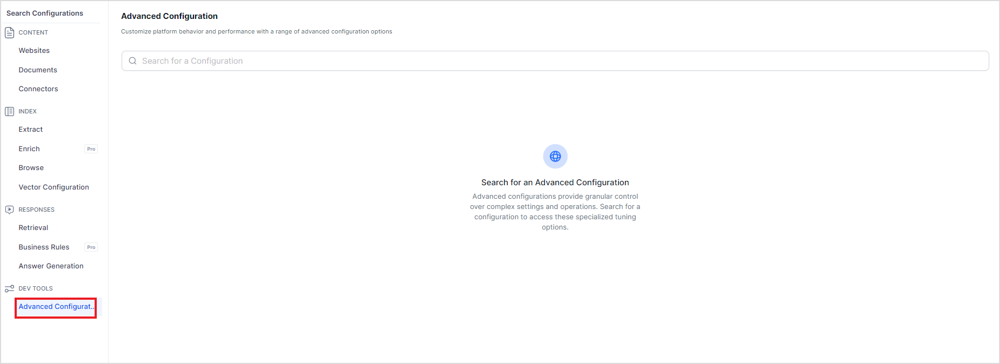

# Advanced Configurations

SearchAI offers advanced configurations that allow you to optimize the answers according to your specific requirements. The following are some of the features and corresponding configurations available in Search AI. To configure these features, go to the **Advanced** **Configurations** page under **Dev** **Tools**.

Search for the config you want to set and select or provide its values. 

The following table lists the supported configurations. 

| **Configuration** | **Description** |
| -------- | ------- |
| [Re-Rank Chunks](reranking-chunks.md) | Used to select the reranking feature and select the Re-Ranker model.  |
| [Re-Rank Chunk Fields](reranking-chunks.md) | Used to select the fields used to rerank the chunks.  |
| [Maximum Re-Rank Chunks](reranking-chunks.md) | Used to set the maximum number of chunks to be sent for reranking.  |
| [Enable Exact KNN Matching](knn-matching.md) | Used to enable the Exact KNN Matching.   |