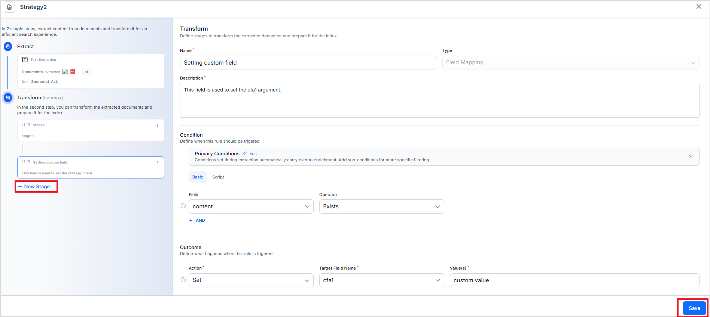
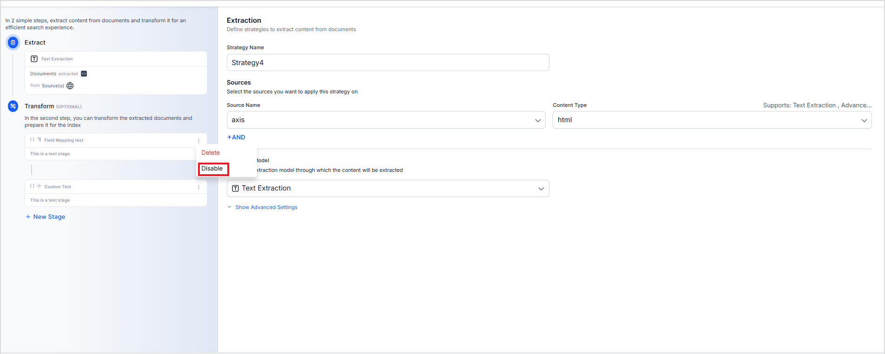
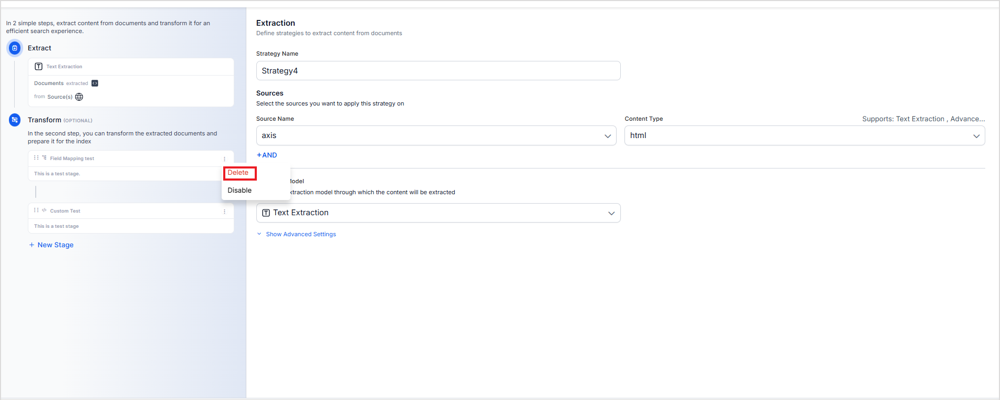

# Content Transformation

## Overview

SearchAI's content transformation process transforms raw extracted text into high-quality data that ensures better searchability, understanding, and usability. This enrichment occurs after the extraction phase, allowing users to enhance the data while maintaining the structural and contextual integrity of the original content. The raw ingested content often requires further processing to make the data accurate, contextual, and useful. Issues such as incomplete metadata, formatting inconsistencies, or missing context can hinder the effectiveness of search and retrieval systems. This process addresses these issues by refining the extracted content.

Content Transformations, immediately after extraction, ensure that the noise and irrelevant information from raw data is removed and input to vectorization is clean and optimized for retrieval and analysis. This vectorized data is then given to the AI models for processing, resulting in optimum and accurate results. 

Search AI allows you to add multiple different types of stages to the transformation process to input content. The stages are processed in sequence such that the output of one is the input of the next. There are currently two types of stages offered. 

1. Field Mapping 
2. Custom Script


## Benefits

* **Improved Data Quality**
    Fix errors, standardize fields, and add contextual information to enhance the overall quality of the processed data. High-quality input directly translates to better query results and user experience.
* **Enhanced Control and Customization**
    Adapt the enrichment process via multiple stages to specific business needs, making the tool suitable for diverse industries and applications. 
* **Bulk Transformation**
    Define rules to select all the content on which the transformation is to be applied. This allows users to make changes to the applicable content at once. 

## Example

Consider a scenario where a blog website is being crawled. Each blog page contains the main blog content but also includes additional elements such as:

* Advertisements inviting users to try products.
* References to recent posts.
* Author information, appended at the end of the blog post.

While these elements are important for the website's functionality, they can introduce noise during search operations. For example, references to recent posts may cause irrelevant results when users search through blog content; embedding author information within the main blog content instead of storing it in a separate metadata field reduces the content's structure.

These issues can be resolved through transformations after extraction. 

* Remove Redundant Sections: Add a stage to delete irrelevant parts of the webpage, such as advertisements and recent posts references, ensuring that only the core blog content is processed.
* Map Author Information: Introduce a field mapping stage to extract the author information from the blog content and map it to a new metadata field.

**Note that types of content transformation stages vary depending on the extraction strategy. Refer to the table below to learn more.**

## Transformation Stages and Configuration

Currently, Search AI offers two types of stages for transformation at this step. 

1. Field Mapping Stage

    This stage is used to add, update, or delete specific fields from the input content.  For instance, if some pages are missing a title, you can use this stage to add a relevant title to such pages based on predefined rules or extracted content. This ensures uniformity across all pages, making the content more structured and improving its discoverability during search operations.

	To add this stage, provide the following details.

    * **Name**:  Provide a unique name for stage identification.
    * **Type**: Set it to Field Mapping. 
    * **Description**: Describe the purpose of adding this stage. 
    * **Condition**: The rules or criteria for selecting the content on which the transformation is to be performed. You can add one or more rules to filter specific content. There are two ways of defining the condition for the mapping: **Basic** and **Script**. When using the Script, you can provide a custom script to add the condition for filtering content for transformation. When using the Basic method, you can define a condition using the following two properties.
        * Field Name: Fields of ingested content on which the rule is applied.
        * Operator: Condition to be applied on the selected field.
        * Value: Depending on the operator, this field is used to specify the value of the field. 	
    * **Outcome**: The transformation to be performed on the content selected using the above conditions.
        * Action: Action to be taken if the above condition is true. This can take the following values:
            * Set - Sets the given value as the value of the target field.
            * Delete - Deletes the target field.
            * Copy - Copies the value of one field into another.
        * You can define one or more actions to be taken on the selected content.  \

2. Custom Script Stage

    Custom Script Stage offers the flexibility to implement custom changes to the content, allowing you to process the data according to your specific business needs. For example, if you wish to prepend the title of all the content extracted from a particular source, you can write a **Painless script** to do the same. 
    
    Use the following properties to configure this stage.

    * **Stage Type:** Set this field to Custom Script
    * **Stage Name**: Provide a unique name for the stage.
    * **Condition**: Define a condition for selecting the content using Painless Scripts. For example, if you want to process only file content, use the following script as the condition.

    ```javascript 
    if(ctx.sys_content_type.equals("file"))
        { 
        return true;
        }
    else 
        {
        return false;
        }
    ```

    * **Outcome**: Define the outcome of the stage using the Painless script. For example, if you want the count of the total number of pages in a given file and add it as another field, you can write a script as shown below.

    ```javascript
    int temp_total_pages = 0;
    if(ctx.file_content_obj != null){
        for (def item: ctx.file_content_obj) {
            if (item!="") {
                temp_total_pages = temp_total_pages+1;
                }
        }
    }
    ctx.total_pages = temp_total_pages;
    ```
## Stages available for different Extraction Strategies


<table>
  <tr>
   <td>
   </td>
   <td>Text Extraction
   </td>
   <td>Advanced HTML Extraction
   </td>
   <td>Layout Aware Extraction
   </td>
  </tr>
  <tr>
   <td>Field Mapping
   </td>
   <td>Yes
   </td>
   <td>Yes
   </td>
   <td>NA
   </td>
  </tr>
  <tr>
   <td>Custom Script
   </td>
   <td>Yes
   </td>
   <td>Yes
   </td>
   <td>NA
   </td>
  </tr>
</table>


## Adding a New Stage

To add a new stage, click the **+New Stage** link in the left, configure the stage as required and click on **Save**.  By default, when a stage is added, it is enabled. Hence, the transformation process through the stage happens on the next application training. 



## Enabling/Disabling a Stage

To enable or disable a stage, click on the ellipsis icon on the right of the stage, and select enable or disable option. When a stage is disabled, the output of the previous stage in the sequence is directly sent as input to the next stage without deleting the current stage. This can be used for testing or troubleshooting the content transformation process. 



## Deleting a Stage

Deleting a stage permanently deletes it from the application. To delete a stage, click the ellipsis icon and select Delete option. 



## Sequencing the Stages

The content is processed in the order of the stages. The processed document at the end of one stage is given as input to the next stage. Hence, the outcome of the stages is affected by the sequence in which the stages are designed. To change the order of execution of the stages, use the draggable dots icon to move and place the stage as required.
