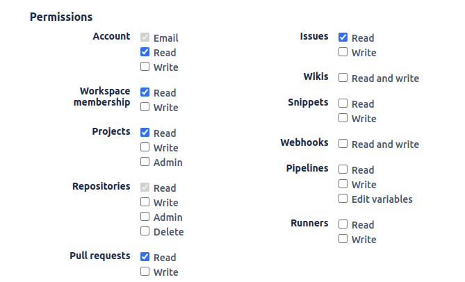

# BitBucket Connector

Bitbucket is a web-based version control repository hosting service primarily used for source code management. It is designed to help teams collaborate on code efficiently, manage version control, and streamline software development workflows.

Integrating BitBucket with Search AI enhances search capabilities by enabling users to search across **pull requests (PRs) and the associated comments on** the repositories in a workspace. 

<span style="text-decoration:underline;">Specifications</span>

<table>
  <tr>
   <td>Type of Repository 
   </td>
   <td>Cloud
   </td>
  </tr>
  <tr>
   <td>Content Supported
   </td>
   <td>Pull Requests
   </td>
  </tr>
  <tr>
   <td>RACL Support
   </td>
   <td>Yes
   </td>
  </tr>
  <tr>
   <td>Content Filtering
   </td>
   <td>No
   </td>
  </tr>
</table>


## Prerequisites

To enable integration of Search AI and BitBucket, set up an **OAuth Consumer** in BitBucket.  The client credentials generated for the OAuth consumer are used to configure the BitBucket Connector in Search AI. 


## Set up OAuth Consumer in BitBucket

OAuth Consumers are specific to the workspaces in BitBucket. [To create a new consumer](https://support.atlassian.com/bitbucket-cloud/docs/use-oauth-on-bitbucket-cloud/#Create-a-consumer), take the following steps. 

1. Select the **Settings** icon on the top navigation bar.
2. Select **Workspace settings** from the Settings dropdown menu.
3. On the sidebar, under **Apps and Features**, select OAuth consumers.
4. Click the **Add consumer** button and provide the following information:
   * **Name**: The display name for your consumer. This must be unique within your account.
   * **Description**: An optional description of what the consumer does.
   * **Callback URL**: Set the callback to one of the following, depending upon your region or deployment.
    * JP Region Callback URL: https://jp-bots-idp.kore.ai/workflows/callback
    * DE Region Callback URL: https://de-bots-idp.kore.ai/workflows/callback
    * Prod Callback URL: https://idp.kore.com/workflows/callback
5. Under **Permissions**, enable the permissions as shown in the following image. 


6. Click **Save**. BitBucket generates a key and a secret. 


## Configure BitBucket Connector in Search AI

1. Navigate to the **Connectors** Page in Search AI.
2. Click **Add Connector** and select BitBucket from the list of available connectors.
3. Provide the following configuration details.
    * **Name**: Unique name for the connector
    * **Authorization Type**: This connector supports OAuth 2.0. 
    * **Grant Type**: Set this to Client Credentials.
    * **Client ID**: Provide the client credentials generated for the OAuth Consumer above. 
    * **Client Secret**: Provide the client credentials generated for the OAuth Consumer above. 
    * **Workspace Name**: Name of the workspace in Bitbucket from where content will be ingested. 
4. Click **Connect** to authenticate and establish the connection.


## Ingesting Content

After successfully connecting the Search AI connector to the BitBucket account, go to the **Configuration** tab and set up content synchronization. For immediate sync, use the **Sync Now** option and the **Schedule Sync** option to set up a scheduler to sync the content in the future. 

Upon synchronization, Search AI ingests **Pull Requests and the comments on the pull requests** from all repositories across all Projects in the workspace.

!!! note
    Only content added or updated in the last 30 days will be ingested into the Search AI application during sync. Existing content in Search AI remains unchanged.


## RACL Support

For data ingested from **Bitbucket**, **SearchAI** utilizes the **Project ID** to enforce user access control. This ensures that users can only access content associated with the projects they have permission to view in Bitbucket. For instance, if the project ID for a given project is 54321, the `sys_racl` field for all the associated PRs would be 

```
"sys_racl": [ "54321"]
```
This is stored in the Search AI index as a permission entity. For effective implementation of access control on this ingested content, associate suitable users to this permission entity using the [Permission Entity APIs](../../../apis/searchai/permission-entity-apis.md). 
