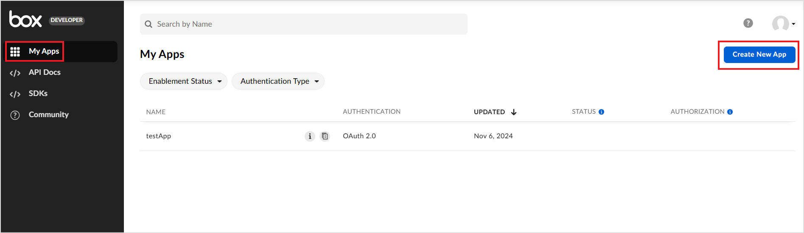
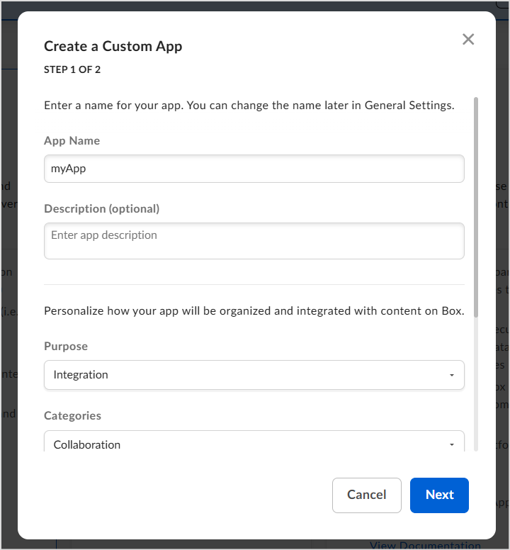
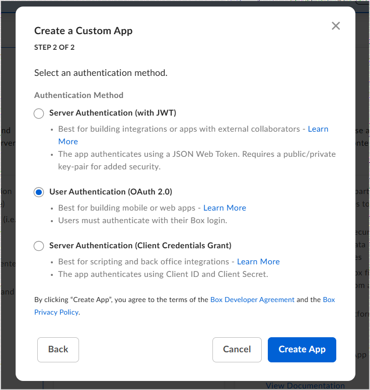
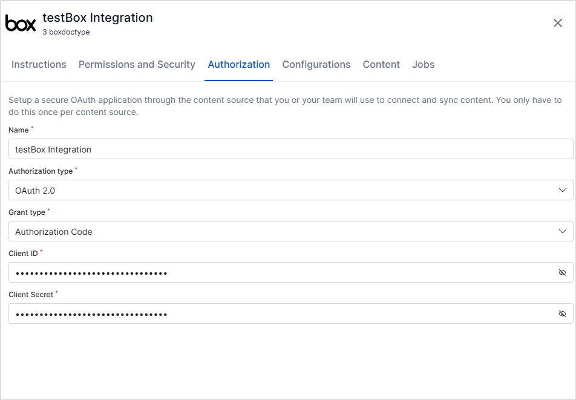

# **Box Connector**

To enhance the search capabilities for your content stored in Box, configure the following connector in Search AI. This integration allows for a streamlined and efficient search experience. 

Specifications

<table>
  <tr>
   <td>Type of Repository 
   </td>
   <td>Cloud
   </td>
  </tr>
  <tr>
   <td>Content Supported
   </td>
   <td>The following file formats are supported for content ingestion:
<ul>

<li><strong>PDF</strong>: <code>.pdf</code></li>

<li><strong>Word Documents</strong>: <code>.doc</code></li>

<li><strong>Text Files</strong>: <code>.txt</code></li>
</ul>
   </td>
  </tr>
  <tr>
   <td>RACL Support
   </td>
   <td>Yes
   </td>
  </tr>
  <tr>
   <td>Content Filtering
   </td>
   <td>No
   </td>
  </tr>
</table>

## Authorization Support

Search AI  uses the **OAuth 2.0 authorization code grant type** to access the resources on the Box account. 

## Integration Steps

To enable content ingestion from the Box account, perform the following steps: 

* Create an OAuth application in Box
* Configure the Box connector in Search AI

### Creating an OAuth application in Box Account

* Log in to the developer console in your [Box account](https://app.box.com/developers/console). 
* Go to **My Apps** and click **Create New App**. 

* Create a Custom App.
    * On the first step of the app creation wizard, provide the basic details of the app, such as name, description, purpose, etc.   
    

    * On the next step, select **User Authentication(OAuth 2.0)** and click **Create App**. 
    

* Go to the **Configuration** tab of the newly created app. 
    * A client ID and secret are generated automatically. These client credentials are used for connector configuration in Search AI.
    * Go to the **OAuth 2.0 Redirect URIs** section and provide the following redirect URIs per your region or deployment. 
        * JP Region Callback URLs: https://jp-bots-idp.kore.ai/workflows/callback
        * DE Region Callback URLs: https://de-bots-idp.kore.ai/workflows/callback
        * Prod Callback URLs: [https://idp.kore.com/workflows/callback](https://idp.kore.com/workflows/callback)
    * Go to the Application Scopes section and enable the following scopes:
        * Read all files and folders stored in Box: Required to access the content in Search AI. 
        * Write all files and folders stored in Box: Required to download the content from Search AI. 
    * Save the changes. 

### Configuring the Box connector

* Go to the **Connectors** page in the Search AI application. 
* Select the **Box Connector** and provide the following configuration details as shown below. 
 
 
    * Name - Provide a unique name for the connector. 
    * Authorization Type - Set it to OAuth 2.0. Currently, this is the only supported mechanism. 
    * Grant Type - Set it to Authorization Code. 
    * Client ID - Provide the Client ID generated above. 
    * Client Secret - Provide the Client Secret generated above. 
* Click **Connect**. This will require user permission to access the box account. Login and grant access. 
* Upon successful authentication, the Box Connector is connected to the Box account and ready for use. 

## Content Synchronization

Content Synchronization fetches all the content accessible in the box account, including files and files within folders, and ingests it into the Search AI application. 

Go to the **Configuration** tab and click **Sync Now** to immediately synchronize content between the box account and the Search AI application. You can also set up a scheduled sync at a future time using the **Schedule Sync** option.

## RACL Support

Box connector fetches access information from the Box account and accordingly allows only specific users to access a resource. 

When the **Permission Aware** option is enabled, the access information is fetched from the account and stored in sys_racl field of the ingested content. For a file, the owner of the file is always listed in the sys_racl field by default. If there are other collaborators on a file, all the users are also listed in the sys_racl field. 

When the permissions are set to **Public Access**, the ingested content is available to everyone. 
