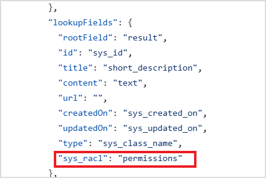

# Custom Content Connector

Search AI enables content ingestion from diverse sources, including web pages, files, and third-party applications, using built-in crawlers and connectors. For applications that do not have a pre-built connector in Search AI, the **Custom Content Connector **provides a flexible solution. The Custom Content Connector enables seamless integration with unique data sources, allowing organizations to bring in specialized content for a comprehensive, centralized search experience. This flexibility empowers users to access and utilize information from virtually any application.

This Custom Content Connector leverages the application’s REST APIs to index content, facilitated by the **Custom Connector Service** provided by Search AI.

## Custom Connector Service 

The custom connector service acts as a middle layer between Search AI and the third-party application. It retrieves content from the application and converts it into an indexable format for Search AI. To fetch the content, the service must be configured with the necessary details, such as REST API endpoints, authorization details, etc. A reference implementation of this service is available for download, providing a base for integrating with third-party applications.

The custom connector service implementation is a basic implementation and serves as a template for integration.  It can be enhanced as per your requirements. The current implementation of the service only supports basic authentication. 

## Setup

Follow the steps listed below to get started. 

1. **Download the Service**:
    * Obtain the skeleton custom connector service from [here](https://github.com/Koredotcom/SearchAssist-Toolkit/tree/master/Utilities/customConnectorService).
2. **Service Configuration**:
    * Modify the config.json file to include the application configuration details and the content fields. 
    * A basic auth mechanism is used to enable communication between Search AI and the service. The current implementation of the service requires the password to be set in the .env file in the root folder of the service. You can rename the existing .env.sample file available in the root folder to the .env file and add your Auth value to the *Authorization* key. 
3. **Service Implementation Changes:**
    * Make changes to the service implementation, if required. Refer to the [readme](https://github.com/Koredotcom/SearchAssist-Toolkit/blob/master/Utilities/customConnectorService/readme.md) file available with the service for more details. 
4. **Host the Service**:
    * After configuring and making necessary changes to the service, host the service on your preferred platform.

## Configure Custom Content Connector on Search AI

* Navigate to the **Connectors** page.
* Select **Custom Connector** and configure it with the following details:
    * **Name**: A unique name for the connector.
    * **Endpoint**: The URL of the hosted service. This is the endpoint of the API that provides the content. Also, specify the HTTP method for the API. For the default implementation of the Connector Service, the endpoint is \
GET http://&lt;serverip>/getContent
    * Under the **Headers**, add the following key and value. The value is the auth value set in the .env file in the service. This is required to establish secure communication with the service. For the default implementation of the service, use it as it is. If there is a change in the auth mechanism in the service, change it accordingly.
        Key: Authorization.
        Value: &lt;Your-Auth-Key>
    * Click on **Connect** to complete the setup. 

## Content Synchronization

To synchronize content, follow these steps:

1. Navigate to the **Configurations** tab of the custom connector configuration page.
2. Click **Sync Now**.
    * The service retrieves batches of 30 documents from the third-party application and sends them to Search AI.
    * Search AI processes each batch and indexes the content. Synchronization is complete when all batches are processed. 

##  Access Control

Search AI also enables RACL on the content ingested via the custom connector. Search AI learns about the permissions-related field in the custom connector using the ***sys_racl*** field in the config file in the Connector Service. The data fetched from the field specified as sys_racl field in the config file is saved as the permission entity. To add any user to the permission entity, use the Permission Entity APIs. 

For instance, if the access information is in the permissions field for your content, set the sys_racl field as shown below in the Connector Service Config. 

A permission entity is created for every value fetched from the permissions field in the content. Use the Permission Entity APIs and add the users to the permission entity. Only users added to a given permission entity will have access to the content specific to that permission entity. 

To enable RACL in the Custom Connector, go to the **Permissions and Security** tab and select **Permission Aware**. If **Public Access** is selected, all the content from the connector is available to everyone. 
