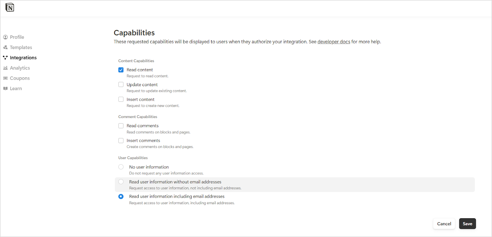

# Notion Connector

Notion is a productivity and collaboration application that combines features for note-taking, project management, task tracking, knowledge sharing and more. SearchAI enables seamless ingestion of **Posts** from Notion **Workspaces**, making it easily searchable. This integration ensures that content is indexed for efficient retrieval. By leveraging SearchAI’s advanced search capabilities, users can quickly locate information, enhancing productivity and streamlining collaboration across teams.

<span style="text-decoration:underline;">Specifications</span>

<table>
  <tr>
   <td><strong>Type of Repository </strong>
   </td>
   <td>Cloud
   </td>
  </tr>
  <tr>
   <td><strong>Supported Content Type</strong>
   </td>
   <td> Pages
   </td>
  </tr>
  <tr>
   <td><strong>RACL Support</strong>
   </td>
   <td>Yes
   </td>
  </tr>
  <tr>
   <td><strong>Content Filtering</strong>
   </td>
   <td>No
   </td>
  </tr>
</table>


## Authorization Support 

SearchAI enables interaction with **Notion** through two authentication mechanisms: [**Internal Integration Token and OAuth 2.0.**](https://developers.notion.com/docs/authorization?_gl=1*1lxqhtn*_gcl_au*MzgzMDU4OTQ1LjE3MjcyNjA5Mzc.*_ga*MTUxOTU0MzMzNy4xNzI3MjYwOTM4*_ga_9ZJ8CB186L*MTcyNzI2MDkzNy4xLjEuMTcyNzI2MTAxMS40OC4wLjA.#what-is-authorization)

* **Public Integration**: Public integrations leverage the OAuth 2.0 protocol, ensuring secure and streamlined authentication for user accounts. For detailed instructions on configuring this integration type, refer to the setup guide [here](https://developers.notion.com/docs/authorization?_gl=1*1lxqhtn*_gcl_au*MzgzMDU4OTQ1LjE3MjcyNjA5Mzc.*_ga*MTUxOTU0MzMzNy4xNzI3MjYwOTM4*_ga_9ZJ8CB186L*MTcyNzI2MDkzNy4xLjEuMTcyNzI2MTAxMS40OC4wLjA.). Use one of the following redirect URLs while configuring this type of public integration. 
    * JP Region Callback URL: https://jp-bots-idp.kore.ai/workflows/callback
    * DE Region Callback URL: https://de-bots-idp.kore.ai/workflows/callback
    * Prod Callback URL: https://idp.kore.com/workflows/callback

    Generate the client credentials and an access token for this integration.  

* **Internal Integration**: This method uses an internal integration token to establish a direct connection. 
    * Create your integration in the [integration’s settings page](https://www.notion.so/profile/integrations).
    * While creating an internal integration, ensure that the following capabilities are enabled under the Configuration tab of the integration. 
    * Retrieve the integration token from this tab. This will be used for authentication of the API requests.


!!! note
    Ensure that the Notion workspace pages are shared with the integration so that the content can be ingested into the SearchAI application. Refer to [this](https://www.notion.com/help/add-and-manage-connections-with-the-api#add-connections-to-pages) to learn more about enabling access to the integration.


## Configure Notion Connector in SearchAI

Provide the following fields to configure the connector. Some fields are used for authentication with the application, and some fields are used to map the searchable fields and metadata fields of the content that is to be ingested from the application. 


* **Name**: Unique name for the connector
* **Authorization Type**: Select Personal Access Token(Internal Integration) or OAuth 2.0(Public Integration) as required.  Depending on the type of auth mechanism selected, provide the access token or the client credentials.

There are some more fields that are used to map the content in Notion to that of the corresponding fields in Search AI. Currently, only standard fields are supported. Hence, it is not mandatory to provide the values of those fields.   

## RACL Support 

Currently, access control is implemented for the Notion Connector using the Page ID of the page. The page ID is used as the unique permission entity for the page. For instance, if page ID is “a1b2c3”, the `sys_racl` field for the corresponding page would be:

```
"sys_racl":["a1b2c3"]
```
Use the [Permission Entity APIs](../../../apis/searchai/permission-entity-apis.md) to associate users with this permission entity. 
