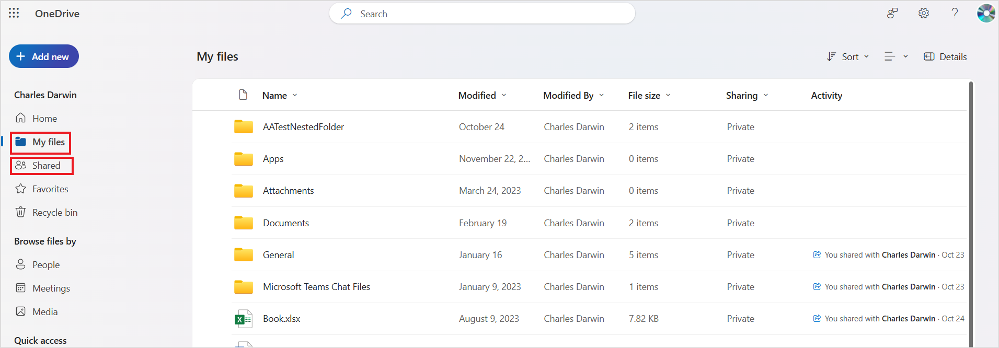
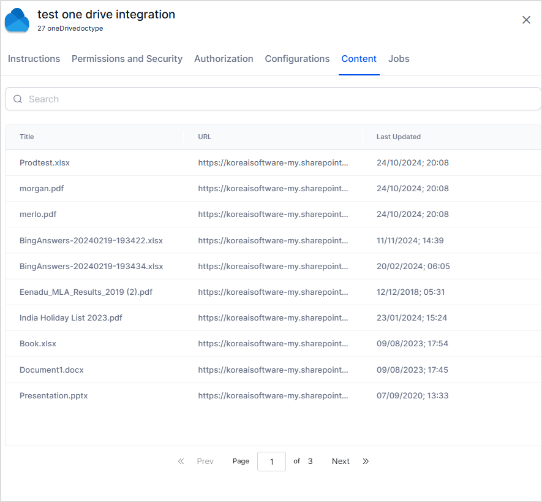
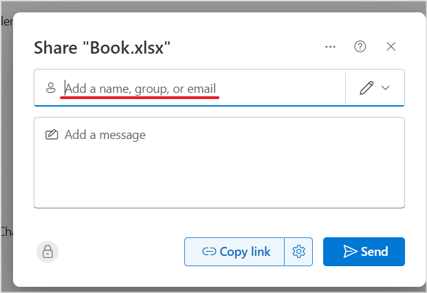
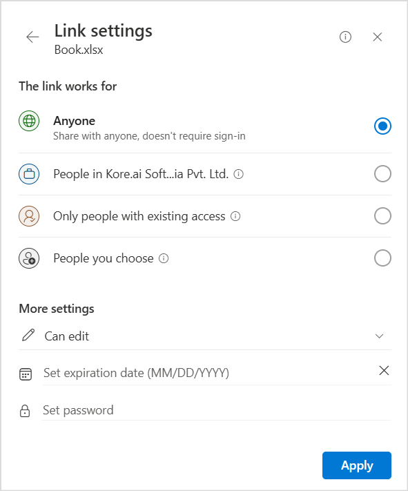

# OneDrive Connector

Configure the OneDrive connector if you're using OneDrive to manage your content and want to make your existing content searchable with SearchAI. Configuring OneDrive as a content source requires:

* **Registering a multi-tenant app in Azure Platform**
* **Configuration of the OneDrive connector in SearchAI**

<table>
  <tr>
   <td>
Type of Repository 
   </td>
   <td>Cloud
   </td>
  </tr>
  <tr>
   <td>Extractive Model for Answer Generation
   </td>
   <td>Yes
   </td>
  </tr>
  <tr>
   <td>Generative Model for Answer Generation
   </td>
   <td>Yes
   </td>
  </tr>
  <tr>
   <td>Supported Content Type
   </td>
   <td>Extractive Answers - .pdf, pages/articles(.aspx), .html, .xhtml.
   Generative Answers - pages/articles (.aspx), .doc, .docx, .ppt, .pptx, .html, .xhtml, .txt, .pdf
   </td>
  </tr>
  <tr>
   <td>Access Control Support 
   </td>
   <td>Yes
   </td>
  </tr>
</table>


## Authorization Support

Search AI uses **OAuth 2.0 Authorization Code Grant Type** mechanism for integration with OneDrive.


## Registering a multi-tenant app in Azure Platform

App registrations are required to access resources programmatically. Registering an application establishes trust between the SearchAI application and the identity provider, the Microsoft identity platform. To register, 

* Log in to the [Azure Platform Portal](https://portal.azure.com/#home) and go to Manage **Azure Active Directory**.
* Register a new application. To do so, go to **App Registrations** under **Applications** and click on **New Registration.**
* Enter the application's name. Create a multi-tenant account and set the account type to ‘Accounts in any organization directory’. Set the Redirect URL and click ***Register***. You can use one of the following URLs according to your region or deployment.
    * JP Region Callback URL: https://jp-bots-idp.kore.ai/workflows/callback
    * DE Region Callback URL: https://de-bots-idp.kore.ai/workflows/callback
    * Prod Callback URL: https://idp.kore.com/workflows/callback
* This will generate a client ID, which will be used to identify the application uniquely in the  Microsoft Identity Platform. Save the ***ClientId*** and ***TenantId*** from the ***Overview*** section.
* Next, [Generate a client Secret for the registered app](https://learn.microsoft.com/en-us/azure/active-directory/develop/quickstart-register-app#add-a-client-secret) under the **Certificates and Secrets** tab.
* Enter a description and set the expiration time to 24 months. Click ***Add***. 
* Save the client secret generated. The client secret cannot be seen again on switching the tabs. 
* The next step is to set up the application's required permissions. Go to **API Permissions** and click ***Add a permission***. 
* Add the following delegated permissions found under **Microsoft Graph**. 
    * Files.Read
    * Files.Read.All
    * Offline_access
* After adding all the permissions, click ***Grant Admin Consent*** to grant the permissions to the application.
* To configure the OneDrive connector in SearchAI, use the client ID, client secret, and tenant ID generated above. 

For more details, refer to [this](https://learn.microsoft.com/en-us/azure/active-directory/develop/quickstart-register-app).


## Configuration of the OneDrive Connector 

Go to the **Connectors** page and add **OneDrive Connector**. On the Authorization page, select the auth mechanism as OAuth 2.0 and the grant type as Authorization Code. Then, enter the **Client ID**, **Tenant ID**, and **Client Secret** generated during the application registration in the Azure portal. Click **Connect**.

This will authenticate and enable the Search AI connector to interact with OneDrive for content ingestion.


## Content Ingestion

Once the authorization process is complete and the connector is configured, the next step is to ingest the content and make it searchable. Go to the **Configuration** tab and click on **Sync Now** to perform an immediate sync operation with the application. You can also **schedule a sync** to be performed at a future time. 

A sync operation ingests content from the application, which is then chunked and indexed according to the configuration of the Search AI application. When a sync operation is performed for the first time, all the supported content is ingested into the application. When a recurrent sync is performed, only the updated content is ingested from the application. In this case, the chunks corresponding to the updated content are deleted and recreated. 

Note that all the supported files under the **My Files and Shared Files** are ingested into the Search AI application. If there are any folders, content under the folders is also ingested into the application. 



Following is a screenshot of the corresponding content ingested after ingestion via the Search AI connector. 

## Access Control

OneDrive Connector offers RACL support for the ingested content, allowing only users with access to the content in OneDrive to see answers from the content in Search AI.

Go to the **Permissions and Security** tab in the OneDrive Connector. Set the access as required. 
* **Permission Aware:** When this is selected, the content ingested via the connector honors the permissions granted to the content in OneDrive. Only users having access to specific content in OneDrive can see answers from the content. 

On enabling this option, the connector fetches the access information for the content along with other details and stores as **sys_racl **field. This information is then used to identify users and grant access to the indexed content. Find more details about it below. 
    
* **Public Access**: When this is selected, all the content ingested via the connector is available to everyone on Search AI. When this is selected, the application does not fetch the access information for the content from OneDrive.

### Understanding Permissions in OneDrive

By default, when a file or folder is created in OneDrive, it is private, and only the **owner** of the file can access it. The files and folders can be shared with other team members using the Share option in OneDrive, which can be used to share it with one or more internal or external users or user groups.



It can also be shared as a link as follows. 



### Handling Permissions in Search AI Connector

* The owner of the file is automatically added to the sys_racl field of the content. 
* The users to which the file is shared are also added directly to the sys_racl field of the content. 
* The user groups to which the file is shared are added as permission entities to the sys_racl field. Corresponding users( part of the user groups) must be added manually using the Permission Entity APIs. 
* If the link is shared to a domain, the users of the given domain are automatically identified using the domain name.

For instance, if Charles is the owner of a file and he shared it with a user group ‘[searchassist@Kore.com](mailto:searchassist@Kore.com)’ and an external user ‘[xyz@example.com](mailto:xyz@example.com), the sys_racl field would be like:


```
"sys_racl": [
    "E083437f-d330-4ad7-8a02-87018187be46", //permission entity id corresponding to the user group.
    "charles@koraqa1.com" //owner of the file
]
```

If Charles also allowed all the employees of his organization to access the file, the sys_racl field would be as shown below. 

```
"sys_racl": [
  "koreaisoftware.onmicrosoft.com",
  "koraqa1.com",
  "kora.ai",
  "e083437f-d330-4ad7-8a02-87018187be46",//permission entity id corresponding to the user group.
  "charles@koraqa1.com" //owner of the file
]
```

