# Salesforce Connector

To enable efficient searching of your content managed by Salesforce, configure the Salesforce connector in SearchAI and start benefiting from seamless integration.

Specifications

<table>
  <tr>
   <td>Type of Repository 
   </td>
   <td>Cloud
   </td>
  </tr>
  <tr>
   <td>Supported API version
   </td>
   <td>API v57.0
   </td>
  </tr>
  <tr>
   <td>Extractive Model for Answers
   </td>
   <td>Not supported
   </td>
  </tr>
  <tr>
   <td>Generative Model for Answers
   </td>
   <td>Knowledge articles managed by Salesforce.
   </td>
  </tr>
  <tr>
   <td>RACL Support
   </td>
   <td>Yes
   </td>
  </tr>
  <tr>
   <td>Content Filtering
   </td>
   <td>Yes
   </td>
  </tr>
</table>

## Prerequisites

* Salesforce Admin account. If a different account is used, ensure the account used to ingest content has API access to all necessary objects.

## Authorization Support

Search AI  uses the following authentication methods to access Salesforce resources.

* OAuth 2.0  authorization code grant type.
* OAuth 2.0 password grant type.

## Integration Steps

Configuring ServiceNow as a content source in SearchAI requires:

* Creating an OAuth application in Salesforce
* Configuration of the Salesforce connector in SearchAI

## Creating an OAuth application in Salesforce

Login to the [Salesforce application](https://login.salesforce.com/). Click on the **Setup icon** and go to the Setup.

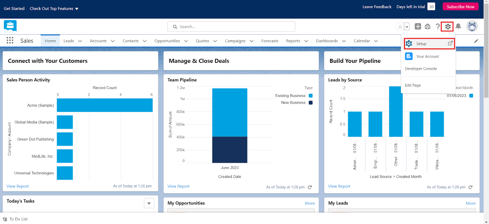

This will open the **Object Manager** home page as shown below.

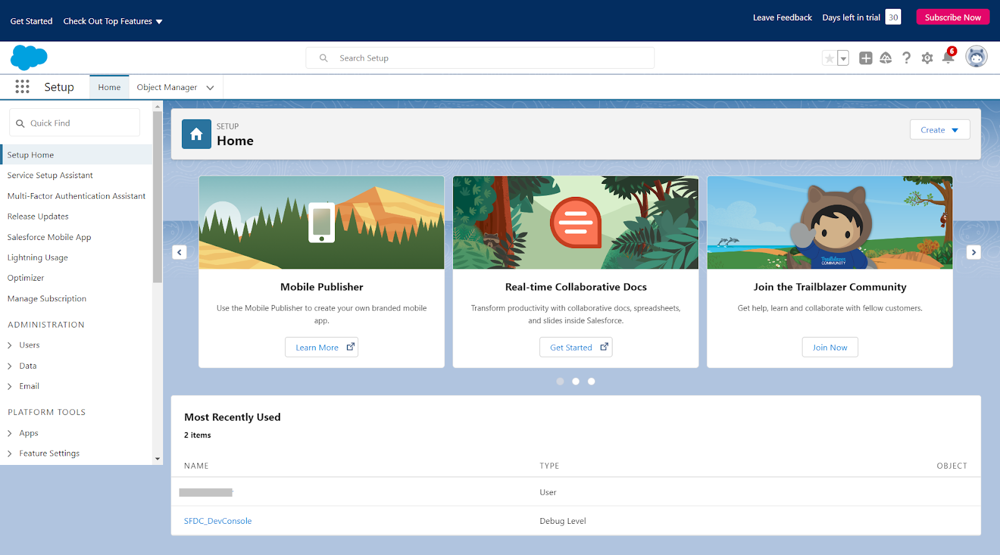

Go to the **App Manager** and click on **New Connected App**.

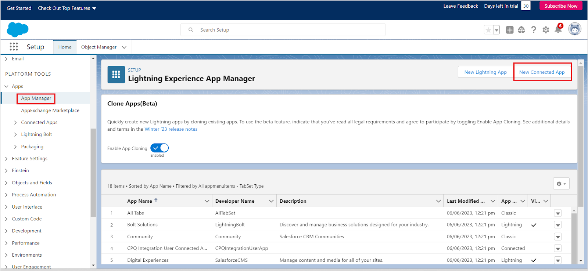

Provide the details for the app. Provide basic information about the application like the name, email address, logo, icon, etc. 

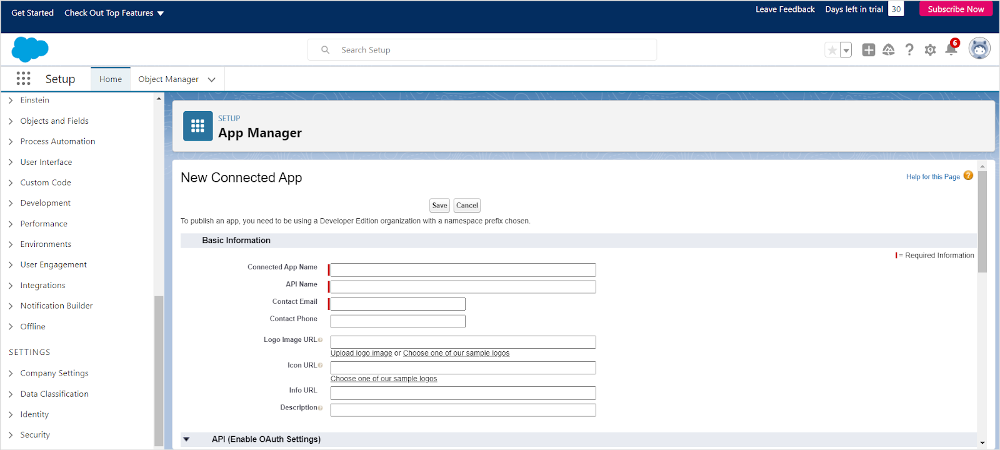

**Enable OAuth settings** for API Integration under the **API** section and provide the callback URL. You can use one of the following callback URLs as per your region or deployment.

  * JP Region Callback URLs: https://jp-bots-idp.kore.ai/workflows/callback
  * DE Region Callback URLs: https://de-bots-idp.kore.ai/workflows/callback
  * Prod Region Callback URLs: https://idp.kore.com/workflows/callback

Select and add the following to the **Selected OAuth Scopes**. 
  
  * Full access (full)
  * Perform requests at any time (refresh_token, offline_access)

Note that currently, Search AI does not support the PKCE Salesforce feature; hence **disable the field ‘Require Proof Key for Code Exchange (PKCE).**

Leave other settings as default and click **Save** and **Continue**. The summary page for the application will be displayed as shown below. 

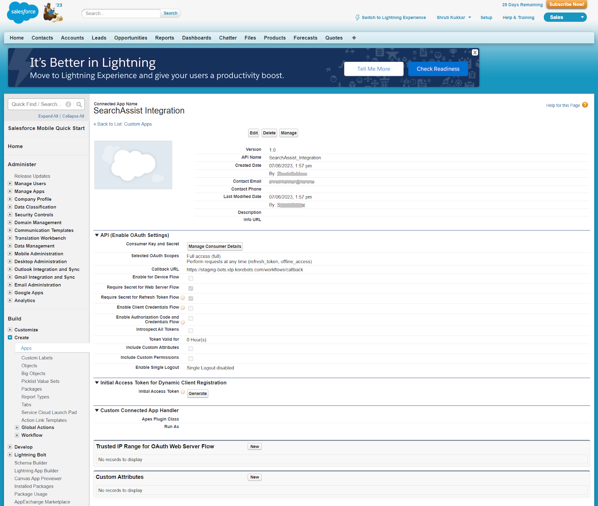

Click **Manage Consumer Details** to generate the consumer ID and secret from this page. Save this information to complete the connector integration in the next step.

## Configuring the Salesforce connector

The next step is to configure the Salesforce connector in SearchAI. Go to the **Connectors** tab under **Sources** and select **Salesforce** from the list of available connectors. On the Authorization tab, enter a name for the connector, provide the Consumer ID and Consumer Secret Key, generated in the previous section, select the type of source, and click **Connect**. The field **Type** can take the following values:

* **Cloud**- Production environment/instance
* **Sandbox**- Test environment/instance. 

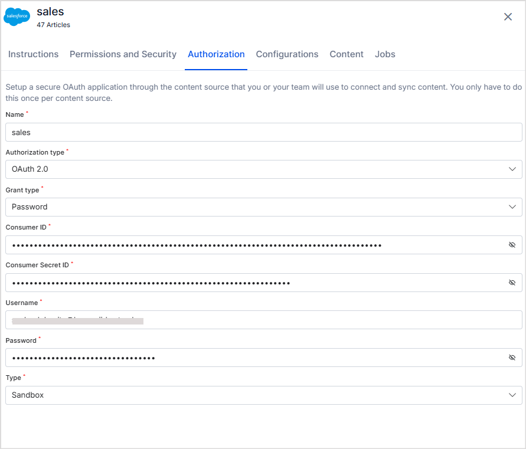

After the connection is successfully established, the connector is marked as **Connected** and is ready for content ingestion. You can ingest all the content available in your Salesforce account or filter content for ingestion. 

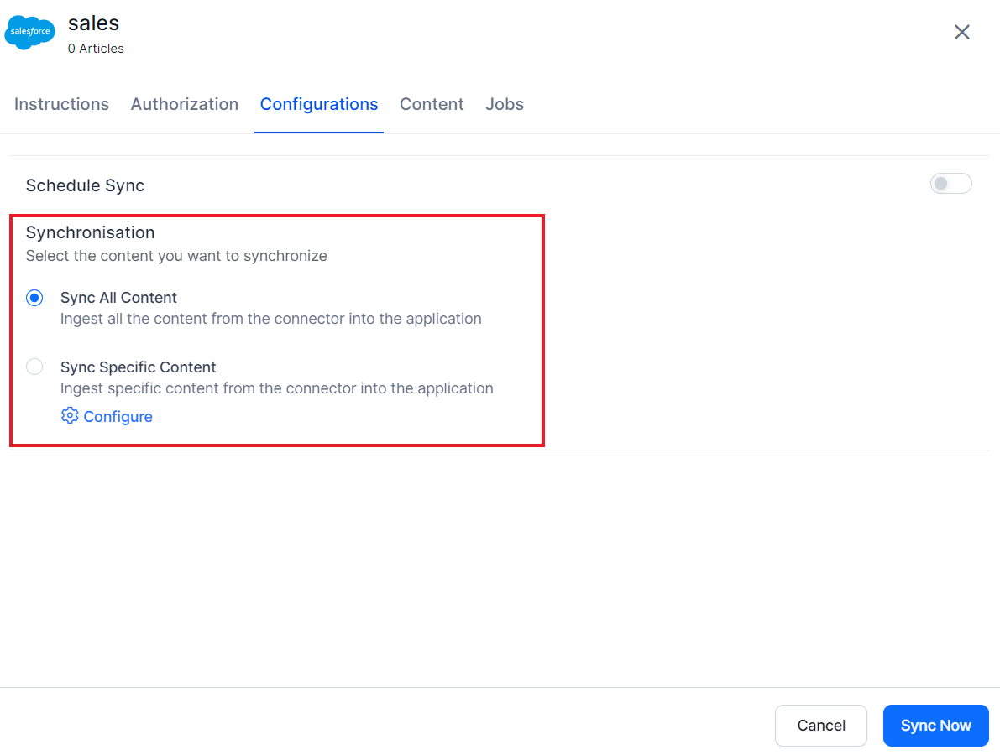

## Content Filters

Salesforce Connector allows selective ingestion of content. To set content filters, select **Sync Specific Content** and click on the **Configure** link. The following page allows you to define rules for selecting the content. Each rule can be defined using a parameter, operator, and its value. 

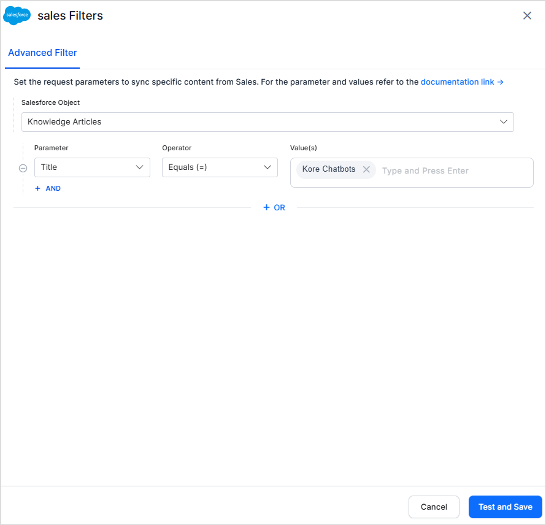

The most commonly used **Parameter** fields are listed in the dropdown. You can also add new parameters if the content supports those fields using the **+Add** option. 

The **Operator** field can take different values depending upon the parameter selected like equals to, not equals to, contains, etc. 

The **Value** field is used for setting the expected value of the parameter.

Refer to the complete list of supported fields and the values that the fields can take [here](https://developer.salesforce.com/docs/atlas.en-us.knowledge_dev.meta/knowledge_dev/sforce_api_objects_knowledgearticleversion.htm). 

For instance, to select all the knowledge articles published on a certain date set the filter as shown below. 
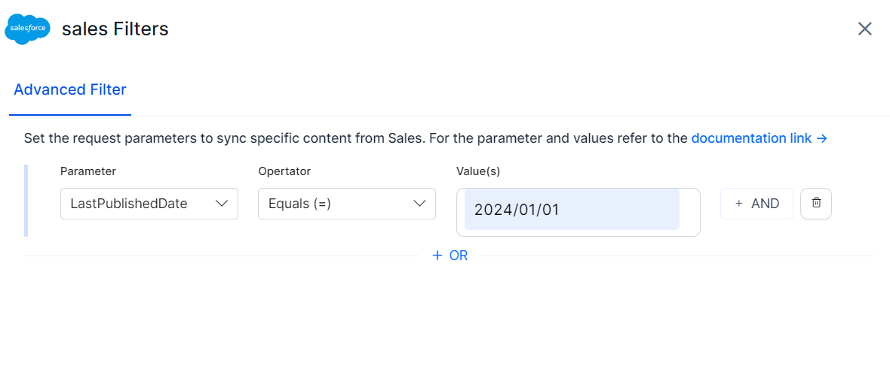

Similarly, to selectively ingest only the articles with a specific title and author, you can configure the filter as shown below. 

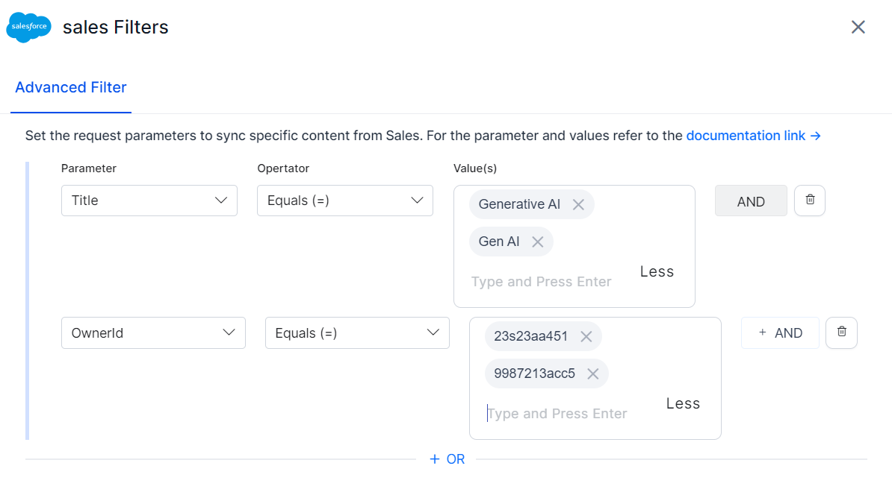

## Custom Object Ingestion

The Salesforce Connector enables the ingestion of Custom Objects from Salesforce into the Search AI application. To configure Custom Object ingestion, follow these steps:

1. Select Custom Object – When setting up the Advanced Filter, choose Custom Object.
2. Specify the Object Name – Enter the exact Custom Object name in the Object Name field. This must match the name used in Salesforce to ensure accurate data retrieval.
3. Data Retrieval – By default, the connector fetches all available information for the specified Custom Object using Salesforce APIs.
4. Additional Data Ingestion (Optional) – If additional information related to the Custom Object needs to be ingested:
    * Provide Endpoint for Fetching Custom Object field: This should point to the API endpoint, which returns the additional information about each record in the Custom Object along with the content. 
    * This endpoint is invoked for each record, using its unique identifier, to fetch additional metadata and content.
5. Apply Filters (Optional) – You can define parameters and values to filter and ingest only specific custom objects. Use the Add button to add a particular parameter and its values. The parameter name should exactly match the field names of the custom object in the Salesforce application.

**Example Configuration**

To ingest a custom object named my_custom_object, use the following setup:

* Enter my_custom_object in the Object Name field.
* Provide the API endpoint URL that fetches metadata for this custom object.

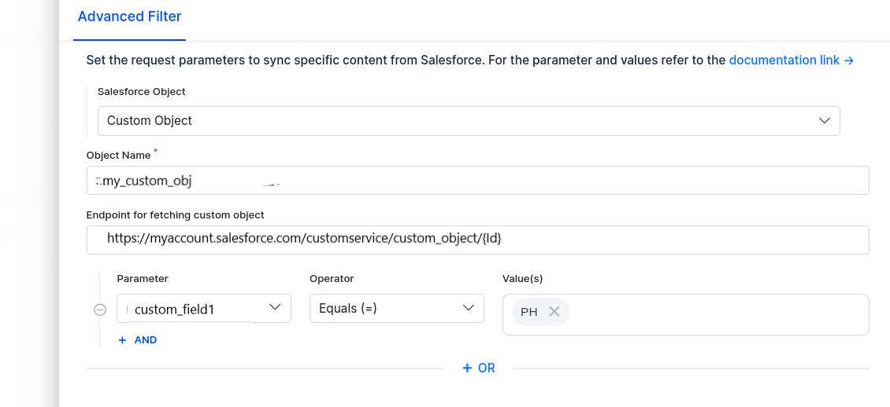

## RACL Support

Salesforce provides multi-level access control to ensure users can only access the data they are authorized to view. This is managed through various mechanisms, including User Profiles, Permission Sets, Permission Set Groups, Direct User Permissions, and Data Categories.

The Search AI Connector currently supports access control using the following:

* User Profiles – Define the baseline permissions for users based on their assigned role within an organization. These profiles control object-level and field-level access.
* Permission Sets – Grant additional permissions beyond the standard profile, allowing more flexibility in assigning access without modifying user profiles.
* Permission Set Groups – Combine multiple permission sets into a group, simplifying permission management for users with complex access requirements.

Currently, the Search AI Connector does not support the following access control methods:

* Direct User Permissions – Custom access granted at an individual user level to override profile-based or permission-based restrictions.
* Data Category-Based Access Control – Used primarily in Salesforce Knowledge, this method restricts access based on predefined data categories, ensuring that users can only view relevant knowledge articles.

For each object in the Salesforce application, Search AI populates the **sys_racl** field with permission entities corresponding to the using **permission sets, Permission Set groups, and user profiles** that have access to an object. For some of the objects like Case, Opportunities, Tasks, Contacts, Accounts,  additionally, the owner email ID is also included in the sys_racl field. 

Use the Permission Entity APIs to associate users with the entities. 
