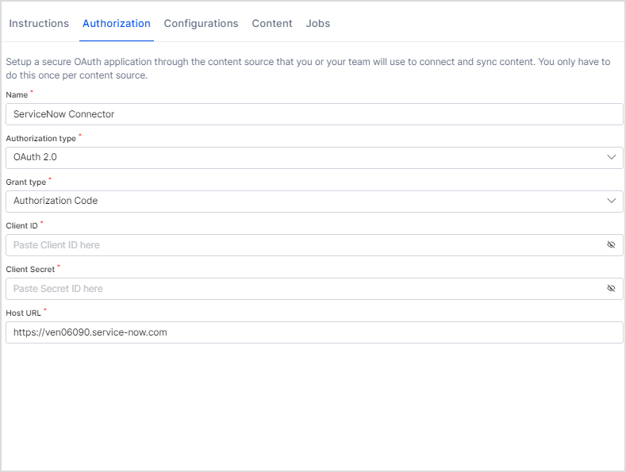
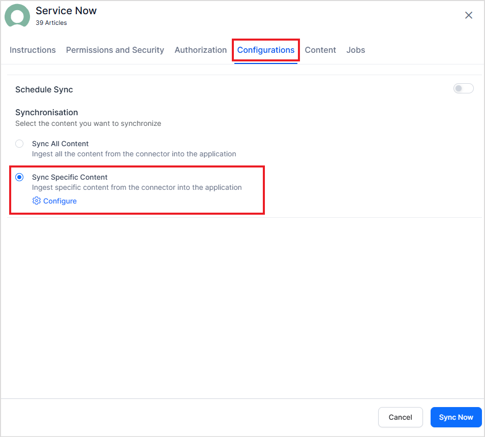
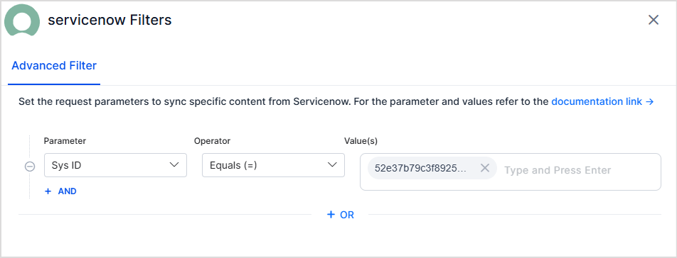
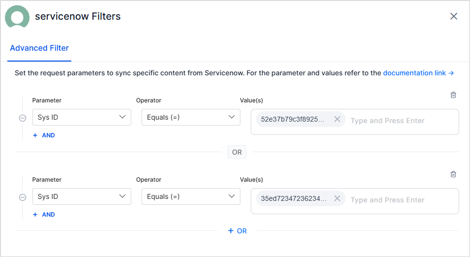
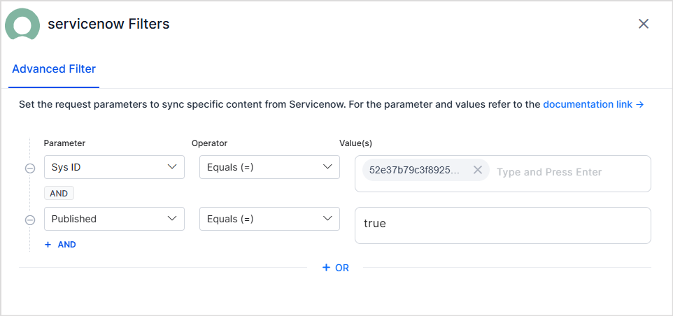
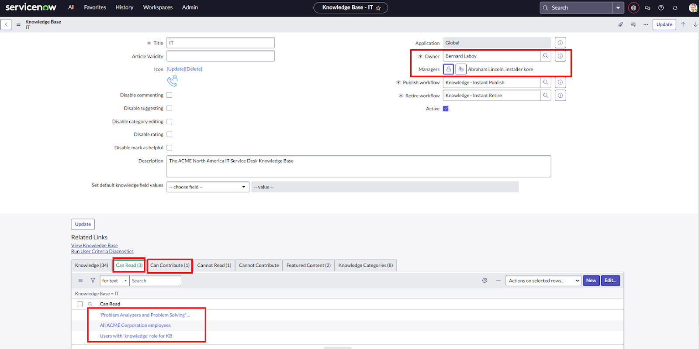
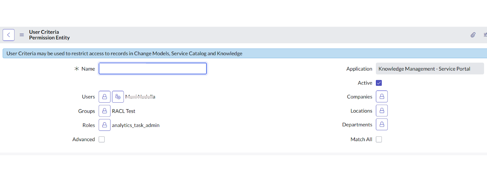
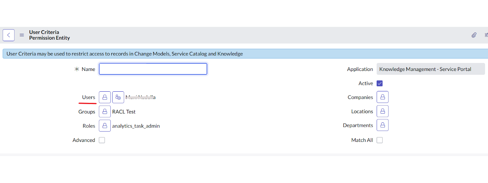

# ServiceNow Connector

You can connect to the ServiceNow application to enable users to fetch query results using the knowledge articles managed by ServiceNow.

**<span style="text-decoration:underline;">Connector Specifications</span>**


<table>
  <tr>
   <td>Type of Repository 
   </td>
   <td>Cloud
   </td>
  </tr>
  <tr>
   <td>Answer Support
   </td>
   <td>
    <ul>
      <li>Knowledge Articles</li>
      <li>Incidents</li>
      <li>Catalog Items</li>
    </ul>
   </td>
  </tr>
   <tr>
   <td>RACL Support
   </td>
   <td>Yes.
   </td>
  </tr>
   <tr>
   <td>Content Filtering
   </td>
   <td>Yes
   </td>
  </tr>
  </table>

To configure the ServiceNow connector, follow the steps listed below.


## **Step 1: Configure an OAuth endpoint in ServiceNow**

If you are using **Basic authentication**, you can skip this step. To use **OAuth 2.0** for authentication, set up an OAuth endpoint in your ServiceNow instance. Refer to[ this documentation](https://docs.servicenow.com/bundle/washingtondc-platform-security/page/administer/security/task/t_CreateEndpointforExternalClients.html) for step-by-step instructions to do the same. Use one of the following Redirect URLs as per your region and deployment. 
* JP Region Callback URL: [https://jp-bots-idp.kore.ai/workflows/callback](https://jp-bots-idp.kore.ai/workflows/callback)
* DE Region Callback URL: [https://de-bots-idp.kore.ai/workflows/callback](https://de-bots-idp.kore.ai/workflows/callback)
* Prod Callback URL: [https://idp.kore.com/workflows/callback](https://idp.kore.com/workflows/callback)

## **Step 2: Configure the ServiceNow connector in Search AI**

* Select the ServiceNow connector from the list of available connectors. 
* Go to the **Authorization** tab and enter the following details:



* **Name**: Give a unique name to the connector
* **Authorization Type**: Search AI supports two types of authentication: **Basic** and **OAuth 2.0**.
* **Grant Type**: For OAuth 2.0, Search AI supports the following two Grant Types for Service Now:
  * **Authorization Code**: If you are using this grant type, enter the client ID and client secret, generated in the above step.
  * **Password Grant Type**: If you are using this grant type, enter user credentials along with the client ID and client secret, generated in the above step.

* **Host URL**: Host of your ServiceNow instance

Click the **Connect** button to initiate authorization with the application. After the connection is established, go to the **Configurations** tab and click **Sync Now** to ingest content to the application.

## Advanced Filters

Search AI enables users to set up advanced filters for content ingestion. Currently, filtering is supported exclusively for Knowledge Articles. You can selectively ingest content by using various properties of knowledge articles, such as status, type, number, knowledge base, and source. To set up advanced filtering, go to the **Configuration** tab, select **Sync Specific Content,** and click the **Configure** link.  



Use the Parameter, Operator, and Value fields to add a filter. The commonly used parameters are listed in the drop-down menu. You can also add other parameters. Refer to [this ](https://developer.servicenow.com/dev.do#!/reference)for the complete list of parameters. 
For instance, to ingest articles with a given sys ID, use the filter as shown below. 



Click on **Test and Save** to enable the filter. The filter is used on the next scheduled or manual sync with the ServiceNow application. 

Note:

* You can define one or more rules to create a filter. Content that satisfies any one of the rules in the filter is selected for ingestion. For instance, the following filter can be used to select articles where sys ID is either of the list.



* Every rule can have one or more conditions. The conditions in a rule are linked with a logical AND which suggests that specific content is selected for ingestion when all the conditions in the rule are satisfied.  For instance, the following filter can be used to select published articles with a given Sys Id.



## RACL Support

### Knowledge Articles
SearchAI offers access control for content ingested from ServiceNow Knowledgebases. Currently, **SearchAI enforces access control at the knowledge base level.**

To learn the basics of RACL in SearchAI, refer to this. 

**Understanding User Permissions in ServiceNow**

In ServiceNow, user access to knowledge base articles can be defined in three ways:

1. Owners of the Knowledgebase
2. Managers of the Knowledgebase
3. User Criteria with specific access permissions (Can Read and Can Contribute) \



User Criteria in ServiceNow is a method to group users based on specific conditions. Users can be added directly or included based on conditions such as department, role, etc. \


**Handling User Permissions in SearchAI**

By default, SearchAI grants access to the following:

* **Owners** of the Knowledgebase – This list of owners will be added directly in the racl field in the indexed content.
* **Managers**of the Knowledgebase – This list of managers will be added directly in the racl field of the indexed content.
* **Individual users** listed under each **User Criteria** with Can Read and Can Contribute permissions.  



Each User Criteria is retrieved as a Permission Entity. The permission entity ID is added and is visible in the racl fields of the indexed content. Only users directly listed in the criteria are retrieved as part of the Permission Entity by default.  Users associated with other conditions (e.g., department or role) are not automatically included. Therefore, these users cannot access articles unless they are explicitly added to the permission entity using the Permission Entity APIs. For instance, if the owner of a knowledgebase is John@example.com and the knowledgebase can be accessed by users who fulfil a given user criteria, the indexed content will look something like this. 

```json
"sourceAcl": [`

     "25431493ff4221009b20ffffffffffe0",
     "John@example.com"
],
```

The alphanumeric field “25431493ff4221009b20ffffffffffe0” in the indexed content refers to the Permission Entity corresponding to the user criteria for the article.

If there are any identities directly added as Users inside the user criteria, those users will be automatically added to the permission entity. To grant access to all others within the user criteria, those added through other conditions, use the [Permission Entity API](https://docs.kore.ai/searchassist/public-apis/permission-entity-apis/) to associate them with the permission entity.

### Incidents

For each incident in ServiceNow, **Search AI** enforces access control based on the following criteria:

**1. Role-Based Access**

* Users who are part of **Base System Roles** in ServiceNow, such as `itil` and `itil_admin`, and have access to incidents.
* For each role, a **permission entity** is created.
* Users can be associated with the corresponding permission entity using the **Permission Entity APIs**.

**2. ACL-Based Access**

* Users who have access to the **Incident Table (<code>incident</code> table)** through **Access Control List (ACL) configuration**.
* For each ACL rule, a **permission entity** is created to associate users with the rule.

**3. Assignment Group-Based Access**

* Users who are part of the **assignment group** for an incident can automatically access it.
* For each group, a **permission entity** is created using the **group ID**.

**4. Incident Field-Based Access**

* Users associated with the incident through specific incident fields, such as: Creator, Caller, Watch List Users.
* These users are added to the sys_racl field using their email ID.

**Summary – <code>sys_racl</code> Contents for an Incident Record**

To summarize, the **sys_racl** field for an incident record contains:


<table>
  <tr>
   <td><strong>Access category</strong>
   </td>
   <td><strong>Stored As</strong>
   </td>
  </tr>
  <tr>
   <td><strong>Assigned User</strong>
   </td>
   <td>Email ID
   </td>
  </tr>
  <tr>
   <td><strong>Caller (Requestor)</strong>
   </td>
   <td>Email ID
   </td>
  </tr>
  <tr>
   <td><strong>Opened by User (Creator)</strong>
   </td>
   <td>Email ID
   </td>
  </tr>
  <tr>
   <td><strong>Closed by User</strong>
   </td>
   <td>Email ID
   </td>
  </tr>
  <tr>
   <td><strong>Resolved by User</strong>
   </td>
   <td>Email ID
   </td>
  </tr>
  <tr>
   <td><strong>Watch List Users</strong>
   </td>
   <td>Email IDs of all users in the watch list
   </td>
  </tr>
  <tr>
   <td><strong>Assignment Group</strong>
   </td>
   <td>Group ID (Permission Entity)
   </td>
  </tr>
  <tr>
   <td><strong>System or Custom Roles with Incident Access</strong>
   </td>
   <td>Role ID (Permission Entity)
   </td>
  </tr>
</table>

### Catalog Items

Catalog items in ServiceNow can be accessed based on the following configurations:

1. **Role-Based Access**
    * Roles assigned to a catalog item determine access. Users with the assigned role(s) will have access to the catalog item.
    * A **permission entity** is created using the **role ID** for each role associated with the catalog item.
2. **ACL based Access**
    * Users who have access to the **Catalog Items Table **through **Access Control List (ACL) configuration**.
    * For each ACL rule, a **permission entity** is created to associate users with the rule.
3. **User Criteria**
    * User criteria defined for a catalog item specify which users or groups can access it.
    * A **permission entity** is created using the **user criteria ID** to control access based on these criteria.

**Summary – <code>sys_racl</code> Field for a Catalog Item**

The **sys_racl** field for a catalog item includes the following:


<table>
  <tr>
   <td><strong>Access category</strong>
   </td>
   <td><strong>Stored As</strong>
   </td>
  </tr>
  <tr>
   <td><strong>System or Custom Roles with Catalog Items Access</strong>
   </td>
   <td>Role ID (Permission Entity)
   </td>
  </tr>
  <tr>
   <td><strong>User Criterion with Catalog Item Access</strong>
   </td>
   <td>UserCriteriaID (Permission Entity)
   </td>
  </tr>
</table>

