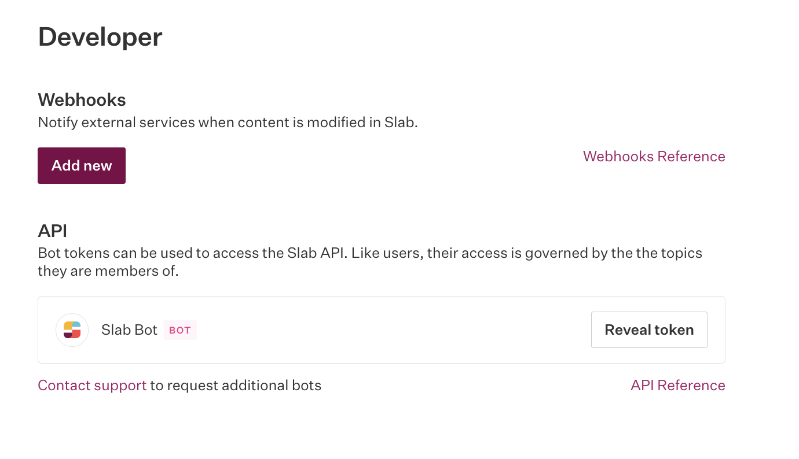

# Slab Connector 

**Slab** is a modern knowledge management and team collaboration platform designed to help organizations create, organize, and share internal documentation efficiently. You can use the Search AI connector for Slab to ingest and index content from your Slab account and set up seamless search capabilities. 

Specifications

<table>
  <tr>
   <td><strong>Type of Repository </strong>
   </td>
   <td>Cloud
   </td>
  </tr>
  <tr>
   <td><strong>Content Supported</strong>
   </td>
   <td>Posts 
   </td>
  </tr>
  <tr>
   <td><strong>RACL Support</strong>
   </td>
   <td>Yes
   </td>
  </tr>
  <tr>
   <td><strong>Content Filtering</strong>
   </td>
   <td>No
   </td>
  </tr>
</table>

## Integration Steps

To enable integration between Search AI and Slab and ingestion of content from Slab, 

* Generate an Access Token in Slab
* Configure the Slab Connector in Search AI

## Generate Access Token in Slab

Search AI communicates with Slab using its APIs.  To enable this communication, an access token is required, which is tied to a special bot-type user associated with the organization. This token is private and should not be shared. To generate this token,

* Go to the **Admin console** on the Slab application. 
* Click the profile name on the top right and go to **Settings**. Go to the **Developer **page from the left menu. 
* **Reveal API Token** for the Slab bot. This token is used to configure the Slab connector in Search AI. 

## Configure Slab Connector in Search AI

Go to the **Authorization page** of the Slab Connector, provide the following configuration fields, and click **Connect**. 

* **Name**- Unique name for the connector.
* **Slab Bot Token**- Provide the API Token here.  

## Ingesting Content

After successfully connecting the Search AI connector to the Slab account, go to the **Configuration** tab and set up content synchronization. For immediate sync, use the **Sync Now** option and the **Schedule Sync** option to set up a scheduler to sync the content in the future. 

Upon sync, Search AI ingests details from the **posts** into the Search AI application. 
