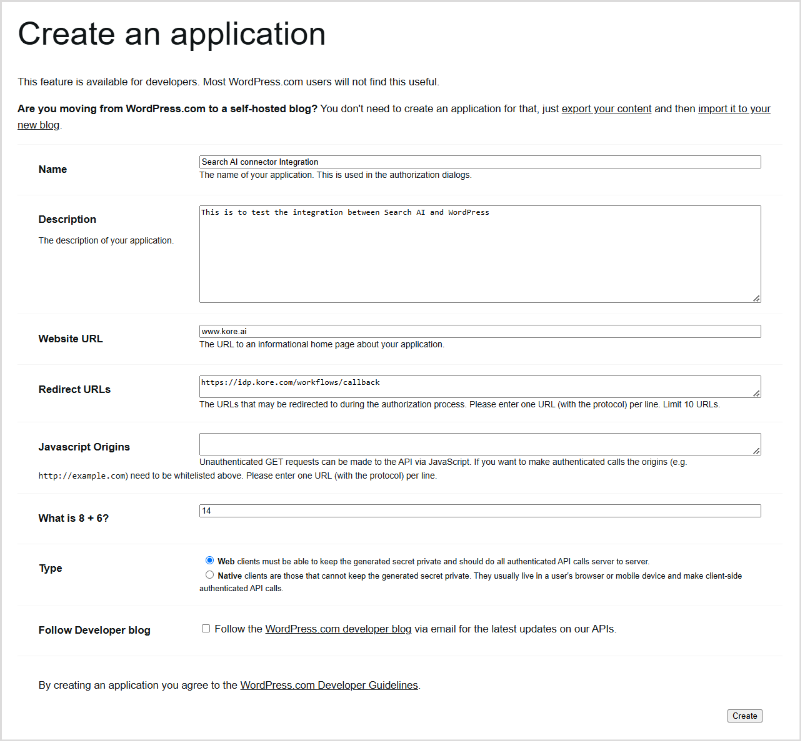
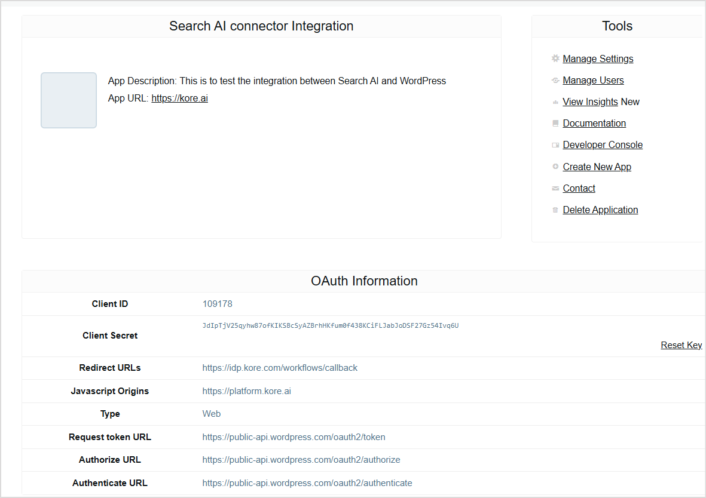
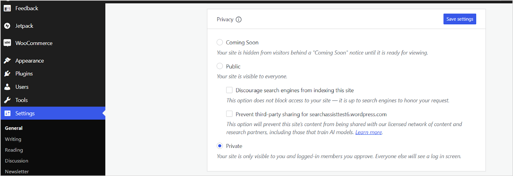
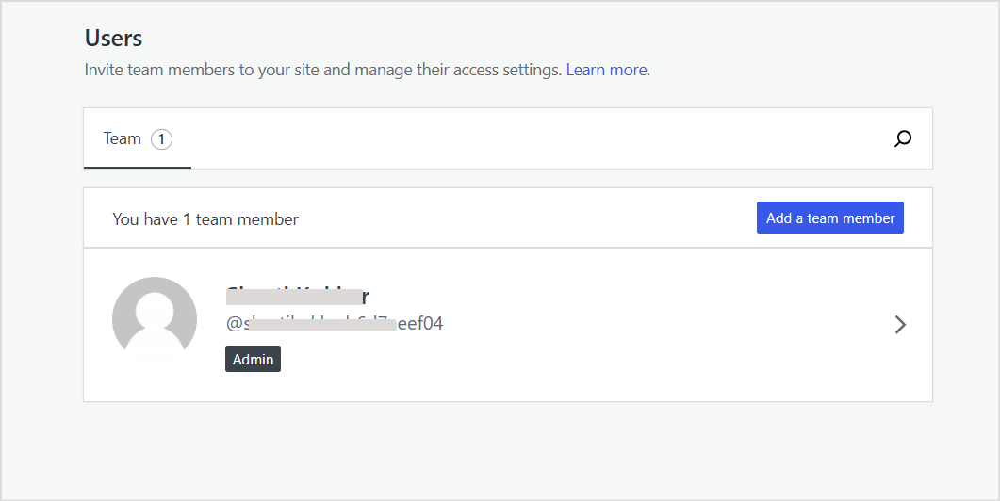

# **WordPress Connector**

To enhance the search capabilities for your content stored in WordPress pages and posts, configure the following connector in Search AI. This integration allows for a streamlined and efficient search experience. 

Specifications

<table>
  <tr>
   <td>Type of Repository 
   </td>
   <td>Cloud
   </td>
  </tr>
  <tr>
   <td>Content Supported
   </td>
   <td>
<ul>

<li>Pages </li>

<li>Posts</li>
</ul>
   </td>
  </tr>
  <tr>
   <td>RACL Support
   </td>
   <td>Yes
   </td>
  </tr>
  <tr>
   <td>Content Filtering
   </td>
   <td>No
   </td>
  </tr>
</table>

## Authorization Support

Search AI supports the ingestion of content from both public and private sites. For private sites, WordPress uses the **OAuth 2.0 authorization code grant type** to access the content. Refer to the [following documentation](https://developer.wordpress.com/docs/oauth2/) to learn more about OAuth support in WordPress. 

## Generating OAuth Client Credentials in WordPress

1. Navigate to the [WordPress developer page](https://developer.wordpress.com/apps).
2. Click on **Create New Application** to create new client application. Provide the following details. 

    1. **Name**: Enter a name for the client (e.g., *My App*).
    2. **Redirect URLs**: Provide the callback URL where authorization responses will be sent. Use one of the following redirect URLs based on your region or deployment. 
    * JP Region Callback URLs: [https://jp-bots-idp.kore.ai/workflows/callback](https://jp-bots-idp.kore.ai/workflows/callback)
    * DE Region Callback URLs: [https://de-bots-idp.kore.ai/workflows/callback](https://de-bots-idp.kore.ai/workflows/callback)
    * Prod Callback URLs: [https://idp.kore.com/workflows/callback](https://idp.kore.com/workflows/callback)
3. Click **Create** to generate the client credentials. 
4. The following page will display the **Client credentials** along with other details of the app. Copy these and keep them secure. These credentials are required for configuration in the Search AI connector. 

## Configuring the WordPress Connector in Search AI

* Go to the **Connectors** page in the Search AI application. 
* Select the **WordPress Connector** and provide the configuration details.
    * Name - Provide a unique name for the connector. 
    * Authorization Type - If the WordPress site is publicly accessible, set this to **public**. If it is a private site, set this to **OAuth 2.0** and additionally provide the **client credentials** to set up communication with the site. 
    * Site URL - URL of the WordPress site from where the content is to be ingested. 
* Click **Connect**. Upon successful authentication, the WordPress Connector is connected to the WordPress account and is ready to ingest pages and posts from the account into the Search AI application. 

## Content Synchronization

Content Synchronization fetches all the **pages and posts** accessible in the WordPress account and ingests them into the Search AI application. 

Go to the **Configuration** tab and click **Sync Now** to synchronize content between the two applications immediately. You can also set up a scheduled sync at a future time using the **Schedule Sync** option.

## Permissions and Security

* A public site is always publicly accessible in Search AI. 
* When a private site is granted public access in Search AI, it is also available to all the users of Search AI, irrespective of the access granted in WordPress.
* When a private site is granted Permission Aware access in Search AI, it is only available to the users of Search AI who have access to the site in WordPress. 

When the permissions are updated from Permission Aware to Public Access in Search AI, the content from the connector is immediately accessible to all. If, however, the access settings are updated from Public Access to Permission Aware, access information is fetched from the connector only on the next sync activity. Manually initiate a synchronization operation for immediate action. 

## Access Control 

When Permission Aware access is enabled for a site, only users who have access to the site can access the corresponding content from Search AI. This depends on the site settings. 

For **public WordPress sites**, the sys_racl field in the content is set to "*". For **private** sites, the identity information of the team members added to the WordPress site is added to the sys_racl field of the corresponding content. To view the team members for a site, go to the **Users** page on the site’s dashboard. 

## Points to Note

* Comments and author information, if available, for a page or post are available as metadata fields in the ingested content. The same information is also appropriately added to the chunkText. 