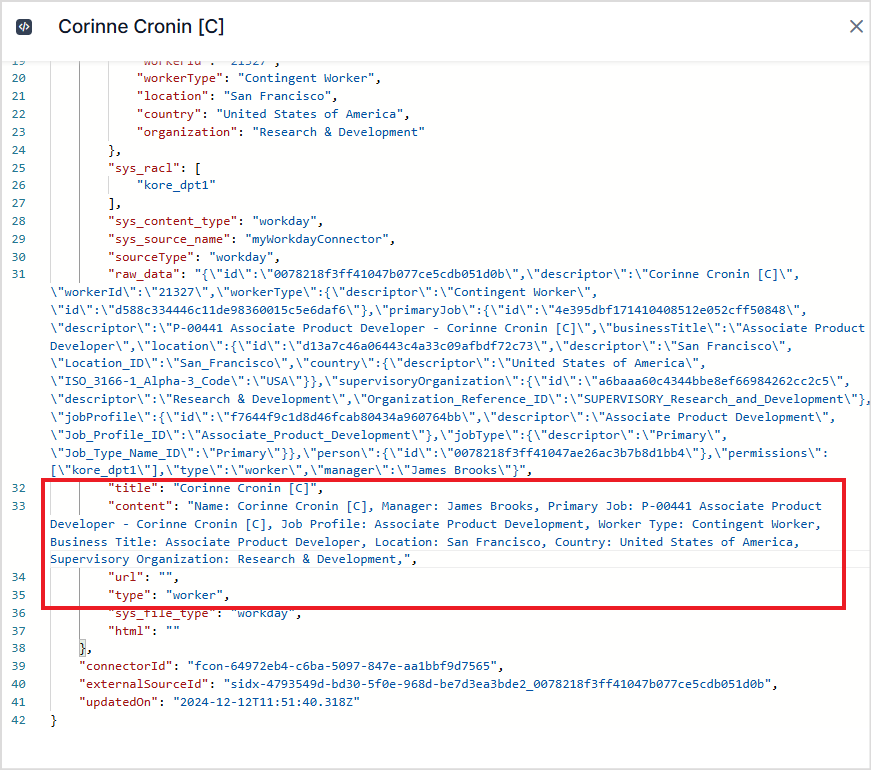

# Workday 

Workday is a cloud-based enterprise application suite designed for Human Capital Management (HCM), Financial Management, and Analytics. It offers a comprehensive range of tools for recruitment and talent acquisition. 

SearchAI significantly enhances these capabilities by providing an intuitive and efficient way to search through **jobs** and **positions**. It enables users to quickly locate job openings, match roles to candidates, and analyze position details with ease, streamlining the recruitment process and supporting workforce planning.

Specifications

<table>
  <tr>
   <td>Type of Repository 
   </td>
   <td>Cloud
   </td>
  </tr>
  <tr>
   <td>Content Supported
   </td>
   <td>Jobs, Positions, Organization Charts
   </td>
  </tr>
  <tr>
   <td>RACL Support
   </td>
   <td>Yes
   </td>
  </tr>
  <tr>
   <td>Content Filtering
   </td>
   <td>No
   </td>
  </tr>
</table>

## Prerequisites

Workday connector interacts with the Workday application via the REST APIs. To enable this communication, it is required to register the Search AI application as an API client in the workday application. To do so, follow the steps listed below. 

* Go to the Workday Console.
* Search for Register API Client. 
* Enter a name for the app.
* Select **Authorization Code Grant** for the grant type 
* Select Bearer as the access token type.
* Choose a Redirection URI based on your deployment or region. 
    * JP Region Callback URL: https://jp-bots-idp.kore.ai/workflows/callback
    * DE Region Callback URL: https://de-bots-idp.kore.ai/workflows/callback
    * Prod Callback URL: https://idp.kore.com/workflows/callback
* Set scope or Functional Areas as the following. 
    * Jobs & Positions (Custom Object)
    * Organizations and Roles (Workday REST API)
    * Staffing (Workday REST API)
* Set other properties as required. Refer to the Workday Documentation for more details. 
* Click OK to generate the client credentials. Save the Client ID, Client Secret, Authorization URLs, and Token URLs. These will be required to configure Workday Connector in Search AI. 

## Configure Workday Connector in Search AI

Go to the **Authorization page** of the connector, provide the following configuration fields, and click **Connect**. 

* **Name**- Unique name for the connector.
* **Tenant Name**- Set this to Token. 
* **Authorization Type** - Set this to OAuth 2.0.
* **Grant Type** - Set this to Authorization Code. 
* **Client ID** - Provide the client ID generated above. 
* **Client Secret** - Provide the client secret generated above.
* **Authorization BaseURL** - Provide the base auth URL generated above. 
* **Token BaseURL** - Provide the token URL generated above. 

## Ingesting Content

After successfully connecting the Search AI connector to the Workday account, go to the **Configuration** tab and set up content synchronization. For immediate sync, use the **Sync Now** option and the **Schedule Sync** option to set up a scheduler to sync the content in the future. 

Upon sync, Search AI ingests details of the Workers, Job Profiles, Job Families, and supervisoryOrganizationChart.

Depending upon the type of data ingested from Workday ( worker, job profile, etc), relevant fields are added to the content field of the ingested content. The type field specifies the content type of the data. 

Go to the **Content** tab to view the ingested content.  

Sample Content: Content corresponding to a worker in Workday is ingested as shown below. All the details of the worker are captured in the content field; the title corresponds to the name of the worker, and the type specifies the content type. 

## RACL Support

Currently, Search AI utilizes the tenant ID to identify users with access to information within the Workday account. As a result, the `sys_racl` field for all types of ingested content is set to the tenant ID, ensuring that access is properly restricted based on the user's assigned tenant.  The tenant ID is typically part of the URL in Workday and appears as a unique identifier following the initial /. For instance, if the workday URL is https://impl.wd12.myworkday.com/kore_dpt1/, the tenant id is `kore_dpt1`. 
