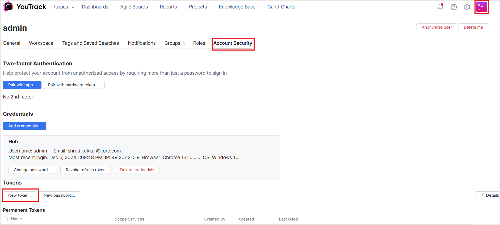
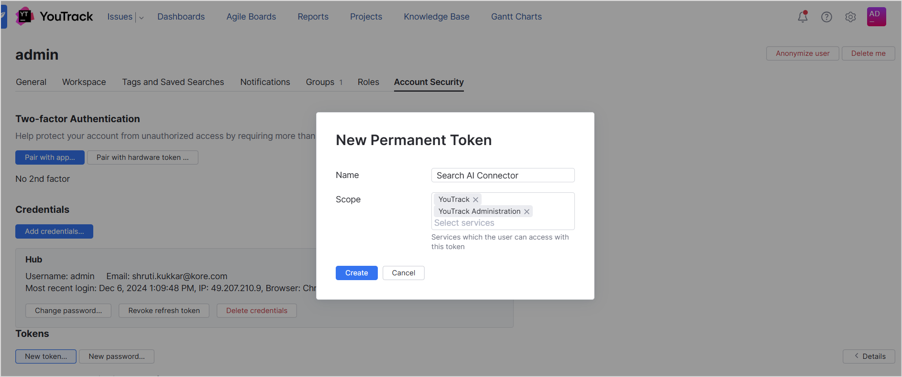

# **YouTrack Connector**

YouTrack is a **project management and issue tracking tool**, primarily designed to streamline software development and agile workflows. 

Specifications

<table>
  <tr>
   <td>Type of Repository 
   </td>
   <td>Cloud
   </td>
  </tr>
  <tr>
   <td>Content Supported
   </td>
   <td>Projects, Issues , Knowledge Articles
   </td>
  </tr>
  <tr>
   <td>RACL Support
   </td>
   <td>Yes
   </td>
  </tr>
  <tr>
   <td>Content Filtering
   </td>
   <td>No
   </td>
  </tr>
</table>

To integrate YouTrack account with Search AI and ingest content from the account, take the following steps:

* Generate Permanent Access Token in YouTrack
* Configure the YouTrack connector in Search AI

## Generate Permanent Access Token

YouTrack connector interacts with YouTrack via the REST APIs. To enable this communication, Search AI uses a Permanent Token Authorization. Follow the steps listed below to generate this token on YouTrack. 

* Go to the **Account Security** tab under the **Profile** page. 
* Click on **New Token** under **Tokens**. 

* Give a name for the token and save the generated token. 

## Configure YouTrack Connector in Search AI

Go to the **Authorization page** of the connector, provide the following configuration fields, and click **Connect**. 

* **Name**- Unique name for the connector.
* **Authorization Type**- Set this to Token. 
* **Permanent Token**- Provide the API Token here.  
* **Host URL** - The base URL of the YouTrack service. 
* **Content Type** - YouTrack supports ingesting knowledge articles and issues from the projects. Select the appropriate content type. 

## Ingesting Content

After successfully connecting the Search AI connector to the YouTrack account, go to the **Configuration** tab and set up content synchronization. For immediate sync, use the **Sync Now** option and the **Schedule Sync** option to set up a scheduler to sync the content in the future. 

Upon sync, Search AI ingests **Issues and Knowledge Articles from Projects** in YouTrack.

The **‘type’** field in the ingested content suggests whether the data is an issue or an article in the project. For the issues, Search AI ingests all the properties of the issue as meta data in the application. The description and comments are added to the content field. Similarly, for articles, the properties of the article are ingested as metadata and the description and comments are ingested into the content field to facilitate search on these fields.

## Filtering Content

SearchAI enables selective ingestion of content from the YouTrack application, allowing you to sync issues and knowledge articles from specific projects.

To configure selective content ingestion, follow these steps:

1. Navigate to **Configurations**tab in the connector interface.
2. Click on the **Sync Specific Content** option and select the **Configure** link.
3. **Select Projects:**
    * On the configuration page, you’ll see a list of all projects available in your YouTrack account.
    * Select the projects you want to ingest content from.
4. **Save Changes:**
    * After selecting the desired projects, click **Save** to apply the changes.

    **Note:** The configured filters will take effect during the next synchronization cycle. Ensure that the sync is scheduled or triggered to reflect the updates.

## RACL Support

YouTrack Connector supports only project-level access to both Issues and Articles ingested from the YouTrack account. It adds the **project ID** to the sys_racl field in the ingested content. Use the Permission Entity APIs to associate users with this project ID.
