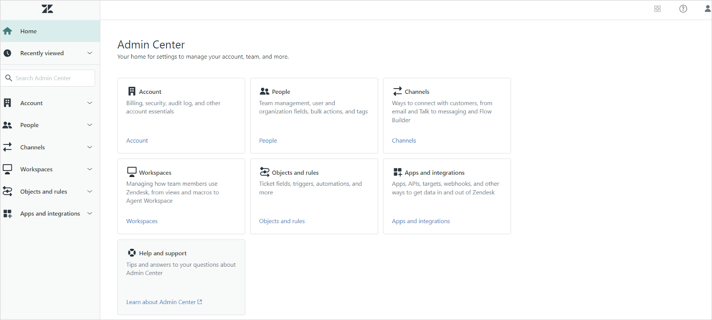

# **Zendesk Connector**

You can easily configure SearchAI to connect to the Zendesk application to enable users to fetch query results using the content in **Zendesk Knowledge Base articles and Tickets**. This integration ensures that Zendesk content is readily accessible, improving user productivity and search efficiency.

<span style="text-decoration:underline;">Specifications</span>


<table>
  <tr>
   <td><strong>Type of Repository </strong>
   </td>
   <td>Cloud
   </td>
  </tr>
  <tr>
   <td><strong>Supported API version</strong>
   </td>
   <td>REST API v2
   </td>
  </tr>
  <tr>
   <td><strong>Content Support</strong>
   </td>
   <td>Zendesk Knowledge Base Articles and Tickets
   </td>
  </tr>
  <tr>
   <td><strong>RACL Support</strong>
   </td>
   <td>Yes
   </td>
  </tr>
  <tr>
   <td><strong>Filtering Support</strong>
   </td>
   <td>No
   </td>
  </tr>
</table>


 


## Authorization Support 

Search AI supports **OAuth 2.0 Authorization Code Grant Type** mechanism for communicating with Zendesk. 


## Integration Steps

To configure Zendesk as a content source, complete the following steps. 

* Add an OAuth client in Zendesk
* Configure the Zendesk connector in Search AI


## Step 1: Setup an OAuth client in Zendesk 
The first step is to set up an OAuth client in Zendesk and generate OAuth credentials that SearchAI can use to authenticate the requests sent to Zendesk.  

1. Go to the **Admin Center** in your Zendesk application. 


2. Under **Apps and Integrations**, go to the **Zendesk API** page.

3. In the **OAuth Client** tab, register Search AI as an OAuth Client. Refer to [this documentation](https://support.zendesk.com/hc/en-us/articles/4408845965210-Using-OAuth-authentication-with-your-application#topic_s21_lfs_qk) for information about the fields required in the configuration.  Set the ***Redirect URLs*** field to point to one of the following callback URLs per your region or deployment.

  * JP Region Callback URLs: https://jp-bots-idp.kore.ai/workflows/callback
  * DE Region Callback URLs: https://de-bots-idp.kore.ai/workflows/callback
  * Prod Callback URLs: https://idp.kore.com/workflows/callback

On saving the details, a pre-populated Secret field appears on the page. This is the **client secret** required to configure the Zendesk Connector in Search AI. 


## Step 2: Configure the Zendesk connector in SearchAI

Go to the ***Connectors*** under the **Sources** page and select ***Zendesk***. Go to the **Authorization** tab, enter the following details, and click **Connect**. 


* **Name** - Unique name for the connector.
* **Authorization Type** - Search AI supports only **OAuth 2.0 authorization** with Zendesk.
* **Grant Type** - Method of obtaining access token in OAuth 2.0 authentication. SearchAI supports the **Authorization Code grant type for Zendesk.** Refer to [this for more information on Grant types](../connectors.md)
* **Client ID** - The client ID generated after registering SearchAI for OAuth authentication. 
* **Client Secret**- The secret generated while configuring the OAuth authentication.  
* **Host URL** - URL pointing to your Zendesk instance. 
* **Content Type** - Select the content to be ingested. 

After a successful connection, the content can be ingested from Zendesk using the **Sync Now** option under the **Configuration** tab. 


## Content Ingestion

After successfully connecting the Search AI connector to the Zendesk app, go to the **Configuration** tab and set up content synchronization. For immediate sync, use the **Sync Now** option and the **Schedule Sync** option to set up a scheduler to sync the content in the future. 

Upon sync, Search AI ingests **Knowledge Base Articles and Tickets** from the Zendesk account. 

All properties of a ticket or knowledge article that are ingested into the `content` field can be readily utilized for search operations. The` type` field in the ingested content suggests whether it is an article or a ticket. 

For **tickets**, the following properties are ingested into the `content` field. Other properties are stored in dedicated fields within the indexed content or as metadata fields. 

* Title
* Content
* Priority 
* Status
* Type
* Assignee
* Requester
* Submitter
* Comments

Similarly, for **articles**, the main textual content, along with the comments on the article, are captured in the `content` field, while additional fields are indexed in their respective fields or stored as metadata.

**JSON view of ingested content for an article**


```json
{
    "_id": "fc-37479a31-bce2-53a7-a341-bd9dcf186282",
    "searchIndexId": "sidx-4793549d-bd30-5f0e-968d-be7d3ea3bde2",
    "streamId": "st-b3c3e04c-567d-5b8c-bee7-719d7fb669a3",
    "createdBy": "u-1e066081-f25d-5b7b-99d5-1b873ea50b09",
    "createdOn": "2025-01-09T08:45:25.000Z",
    "lMod": "2025-01-16T10:58:55.000Z",
    "extractionType": "zendesk",
    "extractionSourceId": "fs-90813a2b-a076-5064-825f-ecf2796132f2",
    "jobId": "fj-7515b09b-5539-5d39-8f0d-f214393389b3",
    "_meta": {
        "state": "approved",
        "isDeleted": false,
        "size": 1363,
        "updateAvailable": false
    },
    "_source": {
        "meta_data": {
            "authorId": 17812183850908,
            "createdOn": "2025-01-09T08:45:25Z",
            "updatedOn": "2025-01-09T08:45:25Z",
            "contentType": "articles"
        },
        "sys_racl": [
            "17831164808092"
        ],
        "sys_content_type": "zendesk",
        "sys_source_name": "myZendeskConnector",
        "sourceType": "zendesk",
        "raw_data": "{\"id\":17831134698268,\"url\":\"https://koreai3814.zendesk.com/api/v2/help_center/en-us/articles/17831134698268.json\",\"html_url\":\"https://koreai3814.zendesk.com/hc/en-us/articles/17831134698268-SAMPLE-ARTICLE-Flat-pack-for-faster-shipping\",\"author_id\":17812183850908,\"comments_disabled\":false,\"draft\":false,\"promoted\":false,\"position\":0,\"vote_sum\":0,\"vote_count\":0,\"section_id\":17831158842524,\"created_at\":\"2025-01-09T08:45:25Z\",\"updated_at\":\"2025-01-09T08:45:25Z\",\"name\":\"SAMPLE ARTICLE: Flat pack for faster shipping\",\"title\":\"SAMPLE ARTICLE: Flat pack for faster shipping\",\"source_locale\":\"en-us\",\"locale\":\"en-us\",\"outdated\":false,\"outdated_locales\":[],\"edited_at\":\"2025-01-09T08:45:25Z\",\"user_segment_id\":null,\"permission_group_id\":17831164808092,\"content_tag_ids\":[],\"label_names\":[],\"body\":\"Homebuy, in line with our commitment to practicality and efficiency, offers Flat Pack Delivery. It's quick, efficient, and streamlined so your delivery can be made simple and fuss-free.<p>Our Flat Pack Delivery means we ship your furniture disassembled in packages. This helps lower shipping costs since items are smaller, easier to manage, and can be loaded more efficiently during transit. </p><p>Upon arrival, it's easy to put together as our proprietary assembly instructions are clearly written and easy-to-follow. All it requires is a little bit of time.</p>\",\"permissions\":[\"17831164808092\"],\"connectorBaseUrl\":\"https://koreai3814.zendesk.com\",\"sourceType\":\"zendesk\"}",
        "base_url": "https://koreai3814.zendesk.com",
        "title": "SAMPLE ARTICLE: Flat pack for faster shipping",
        "content": "Homebuy, in line with our commitment to practicality and efficiency, offers Flat Pack Delivery. It's quick, efficient, and streamlined so your delivery can be made simple and fuss-free.Our Flat Pack Delivery means we ship your furniture disassembled in packages. This helps lower shipping costs since items are smaller, easier to manage, and can be loaded more efficiently during transit. Upon arrival, it's easy to put together as our proprietary assembly instructions are clearly written and easy-to-follow. All it requires is a little bit of time.",
        "url": "https://koreai3814.zendesk.com/hc/en-us/articles/17831134698268-SAMPLE-ARTICLE-Flat-pack-for-faster-shipping",
        "type": "articles",
        "sys_file_type": "articles",
        "html": "Homebuy, in line with our commitment to practicality and efficiency, offers Flat Pack Delivery. It's quick, efficient, and streamlined so your delivery can be made simple and fuss-free.Our Flat Pack Delivery means we ship your furniture disassembled in packages. This helps lower shipping costs since items are smaller, easier to manage, and can be loaded more efficiently during transit. Upon arrival, it's easy to put together as our proprietary assembly instructions are clearly written and easy-to-follow. All it requires is a little bit of time."
    },
    "connectorId": "fcon-3fea53ce-9a30-5d20-a22a-7d4a1fbef523",
    "externalSourceId": "sidx-4793549d-bd30-5f0e-968d-be7d3ea3bde2_17831134698268",
    "updatedOn": "2025-01-09T08:45:25.000Z"
}
```

**JSON view of ingested content for an article**


```json
{
    "_id": "fc-ffcc7e33-b387-550a-b1f1-6e1f1a10bf21",
    "searchIndexId": "sidx-4793549d-bd30-5f0e-968d-be7d3ea3bde2",
    "streamId": "st-b3c3e04c-567d-5b8c-bee7-719d7fb669a3",
    "createdBy": "u-1e066081-f25d-5b7b-99d5-1b873ea50b09",
    "createdOn": "2025-01-09T08:45:27.000Z",
    "lMod": "2025-01-20T11:26:26.000Z",
    "extractionType": "zendesk",
    "extractionSourceId": "fs-90813a2b-a076-5064-825f-ecf2796132f2",
    "jobId": "fj-b172bff0-2adb-59e7-b1f0-840eb2b10ad9",
    "_meta": {
        "state": "approved",
        "isDeleted": false,
        "size": 1578,
        "updateAvailable": false
    },
    "_source": {
        "meta_data": {
            "authorId": 17812183850908,
            "createdOn": "2025-01-09T08:45:27Z",
            "updatedOn": "2025-01-20T11:23:14Z",
            "contentType": "articles",
            "comments": "Comment #1 by dhruv lunawath (2025-01-10T10:33:53.000Z): This article helps a lot",
            "authorName": "dhruv lunawath",
            "section": "Gift cards"
        },
        "sys_racl": [
            "18025455651868"
        ],
        "sys_content_type": "zendesk",
        "sys_source_name": "myZendeskConnector",
        "sourceType": "zendesk",
        "raw_data": "{\"id\":17831134834076,\"url\":\"https://koreai3814.zendesk.com/api/v2/help_center/en-us/articles/17831134834076.json\",\"html_url\":\"https://koreai3814.zendesk.com/hc/en-us/articles/17831134834076-SAMPLE-ARTICLE-Gift-card-expiration-date\",\"author_id\":17812183850908,\"comments_disabled\":false,\"draft\":false,\"promoted\":false,\"position\":0,\"vote_sum\":0,\"vote_count\":0,\"section_id\":17831172303132,\"created_at\":\"2025-01-09T08:45:27Z\",\"updated_at\":\"2025-01-20T11:23:14Z\",\"name\":\"SAMPLE ARTICLE: Gift card expiration date\",\"title\":\"SAMPLE ARTICLE: Gift card expiration date\",\"source_locale\":\"en-us\",\"locale\":\"en-us\",\"outdated\":false,\"outdated_locales\":[],\"edited_at\":\"2025-01-09T08:45:27Z\",\"user_segment_id\":null,\"permission_group_id\":18025455651868,\"content_tag_ids\":[],\"label_names\":[],\"body\":\"Homebuy International Gift Cards have helped decorate many homes across the world. Gift cards are good for 2 years from the date they were sent to the recipient via the Homebuy website or, if you directly emailed the gift card to the recipient, then from its initial date of purchase.<p>This generous time frame provides enough to browse through collections, imagine new furnishings in a space, take measurements, and find the perfect items.</p><p>We understand that, occasionally, timing can be a challenge. If you have a gift card close to its expiration and anticipate a furnishing need just beyond the horizon, don't fret. Connect with us and we can explore options to extend your gift card.</p><p>Our priority is your satisfaction as you craft your dream space with Homebuy Furniture.</p>\",\"permissions\":[\"18025455651868\"],\"authorName\":\"dhruv lunawath\",\"comments\":\"Comment #1 by dhruv lunawath (2025-01-10T10:33:53.000Z): This article helps a lot\",\"section\":\"Gift cards\",\"connectorBaseUrl\":\"https://koreai3814.zendesk.com\",\"sourceType\":\"zendesk\"}",
        "base_url": "https://koreai3814.zendesk.com",
        "title": "SAMPLE ARTICLE: Gift card expiration date",
        "content": "Homebuy International Gift Cards have helped decorate many homes across the world. Gift cards are good for 2 years from the date they were sent to the recipient via the Homebuy website or, if you directly emailed the gift card to the recipient, then from its initial date of purchase.This generous time frame provides enough to browse through collections, imagine new furnishings in a space, take measurements, and find the perfect items.We understand that, occasionally, timing can be a challenge. If you have a gift card close to its expiration and anticipate a furnishing need just beyond the horizon, don't fret. Connect with us and we can explore options to extend your gift card.Our priority is your satisfaction as you craft your dream space with Homebuy Furniture.\nComments: Comment #1 by dhruv lunawath (2025-01-10T10:33:53.000Z): This article helps a lot\nAuthor Name: dhruv lunawath\nSection: Gift cards",
        "url": "https://koreai3814.zendesk.com/hc/en-us/articles/17831134834076-SAMPLE-ARTICLE-Gift-card-expiration-date",
        "type": "articles",
        "sys_file_type": "articles",
        "html": "Homebuy International Gift Cards have helped decorate many homes across the world. Gift cards are good for 2 years from the date they were sent to the recipient via the Homebuy website or, if you directly emailed the gift card to the recipient, then from its initial date of purchase.This generous time frame provides enough to browse through collections, imagine new furnishings in a space, take measurements, and find the perfect items.We understand that, occasionally, timing can be a challenge. If you have a gift card close to its expiration and anticipate a furnishing need just beyond the horizon, don't fret. Connect with us and we can explore options to extend your gift card.Our priority is your satisfaction as you craft your dream space with Homebuy Furniture.\nComments: Comment #1 by dhruv lunawath (2025-01-10T10:33:53.000Z): This article helps a lot\nAuthor Name: dhruv lunawath\nSection: Gift cards"
    },
    "connectorId": "fcon-3fea53ce-9a30-5d20-a22a-7d4a1fbef523",
    "externalSourceId": "sidx-4793549d-bd30-5f0e-968d-be7d3ea3bde2_17831134834076",
    "updatedOn": "2025-01-20T11:23:14.000Z"
}
```

## RACL Support

Search AI provides access control support for tickets and articles ingested from Zendesk. The **sys_racl** field is used to enforce access control by associating relevant identifiers (like email IDs, organization IDs, or group IDs) to the content, ensuring users can only access the content they are authorized to view.

**Tickets**:

For Tickets ingested from Zendesk, the **sys_racl** field includes the following entities to manage content access. 

* Assignee - The email ID of the assignee is added to the sys_racl field.
* Requester - The email ID of the requester of the ticket is aded to the sys_racl field in the ingested content. 
* Submitter - The email ID of the submitter of the ticket is added to the sys_racl field in the ingested content. 
* Followers - email IDs of all the ticket followers are added to the sys_racl field in the ingested content. 
* Collaborators - The email IDs of all the collaborators on the ticket are also added to the sys_racl field. 
* Organization ID - permission entity using the Organization ID of the organization to which the ticket belongs.
* Group ID - If the ticket is assigned to a group, a permission entity is created corresponding to the group that the ticket belongs to. 

For instance, 

```json
  "sys_racl": [
            "peter.mark@kore.com", //assignee of the ticket
            "customer@example.com", //submitter of the ticket
            "support.lead@company.com", //collaborator on the ticket
            "17812171469852" // organization ID
        ],
```

**Articles**:

For articles ingested from Zendesk, `sys_racl` includes permission entities that correspond to the **management permissions** assigned to the articles as well as the **user segments** that have visibility to the article.

For instance, if an article has the management permissions set for ‘Admins’ and visibility is set to ‘Agents’ user segment, Search AI will create two permission entities: one corresponding to the management Permissions and the second corresponding to the user segment.  


```json
 "sys_racl": [
      "17831164808092" //Permission Entity corresponding to the Admin management permission assigned to the article. 
      "134355653233314" //Permission Entity corresponding to Agents user segment.
        ],
```

