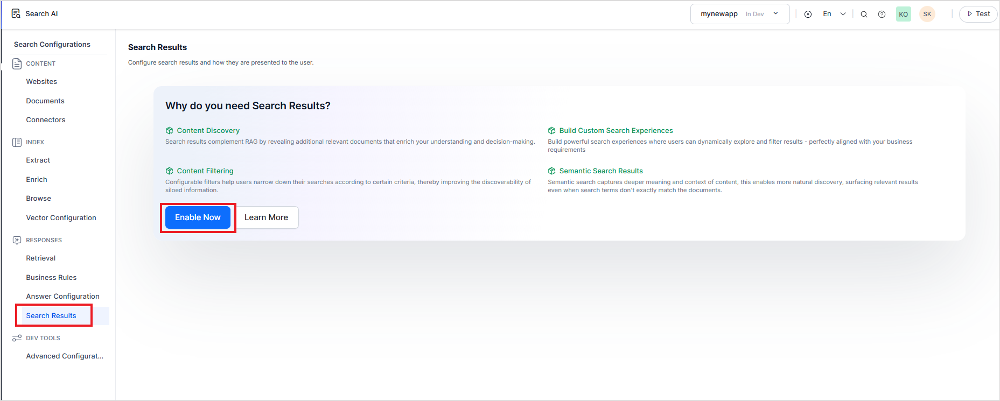

# Search Results

## Overview

Search results refer to a list of documents or chunks displayed in response to a search query, organized by their relevance to the query. Search results provide relevant information presented as a list with a title and a snippet. 

In contrast to an answer that presents the most relevant response, which directly addresses the question and provides a concise and focused response, search results are more useful when broader information is required on a particular topic. Search results are also more helpful when the search queries are complex, involve comparisons, or require descriptive or detailed information. For example, while debugging an issue, it might be more beneficial to fetch relevant information from multiple different sources and learn about potential causes of error. 

## Key Features

* **Content Discovery**: Search results enhance Retrieval-Augmented Generation (RAG) by providing access to additional relevant documents, which aids in understanding and informed decision-making.
* **Content Filtering**: Configurable filters enable users to refine their searches based on specific criteria, thereby increasing the visibility of information that may be siloed.
* **Semantic Search Capabilities**: Semantic search facilitates a deeper understanding of content by capturing its context and meaning, allowing for more intuitive discovery and surfacing of relevant results, even if search queries do not exactly match the document terms.

## Understanding the Generation of Search Results in Search AI

When search results are enabled, the search AI processes the user's query to retrieve the most relevant chunks from the index. These chunks are organized by their corresponding documents and presented to the user, accompanied by the relevant metadata for each chunk. This structured presentation enhances user experience, allowing users to quickly locate the information they need.

In instances where both search results and extractive answers are activated, due to their similar nature, the answer provided matches with the top search result. Hence, to avoid redundancy, the highest-ranking search result is omitted, and the application provides results starting from the next most relevant entries. This ensures users receive distinct and valuable information without unnecessary repetition.

## Enabling and Configuring Search Results 

Go to the Search Results page under Responses and click Enable. 

Do the following configurations. 

**Number of Search Results to Display**: Configure the maximum number of chunks to be displayed as search results. This field can take a maximum value of 100 and a minimum of 1.  By default, this value is set to 20. 

**Filters**: Filters, referred to as facets in the context of search results, play a crucial role in refining search outcomes. They enable users to narrow down results based on specific criteria, making it easier to traverse through a vast array of information. For example, when a user submits a query, the search results may originate from various sources. By implementing a facet that allows users to filter results according to source, they can easily access information from a particular source of interest.

This can be particularly useful when there are a large number of search results, making it easier to sift through the results and refine them effectively.

## Applicability of Filters 

Filters are relevant only within a designated set of results that correspond to the fields specified in the filters. For instance, if you create a filter based on a certain criterion, it will only apply if the search results include data associated with that criterion.

## Default Filters

Every application comes with a default set of filters. Users have the flexibility to update, delete, or disable these filters as their needs evolve.

## Creating a new filter

To create a new filter, provide the following fields:

* Filter name - Provide a unique name for the filter.
* Filter Type - Select one of the following options. 
    * Static -  For filters with fixed, predefined values.
    * Dynamic - For filters that use the field values derived in the search results.
* Field - The field to be used for creating the filter. 
* Filter UI - For a static filter, currently, only Tabs are supported. For Dynamic filters, you can create a single-select or multi-select filter. 
    * The single select filter allows you to select only one value of the field 
    * Multi select allows users to select multiple values of the field concurrently. 

**Points to Note**

* A filter is applicable only if the search results contain content corresponding to the specified field for the filter.
* Only one filter can be enabled at a time with a tab-style filter UI. 
* Only string fields can be used for tab-style UI. 
* Two filters cannot use the same field name concurrently. At a time only one filter can exist in the enabled state with a given field. 

## Search Result Support

Currently, the Search Results can only be accessed via the search API. Refer to [this](../apis/searchai/advance-search.md) to learn more. 
